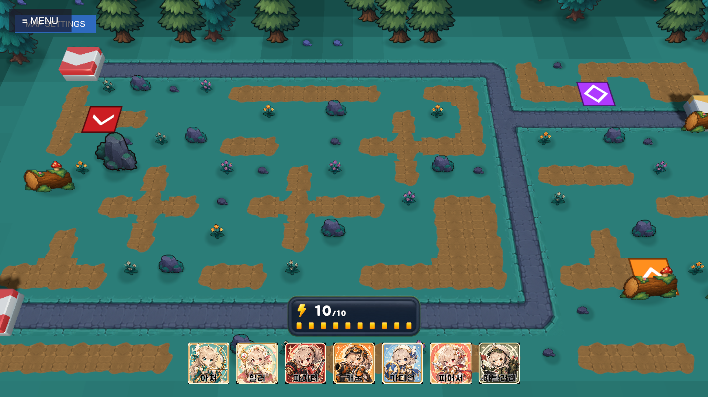
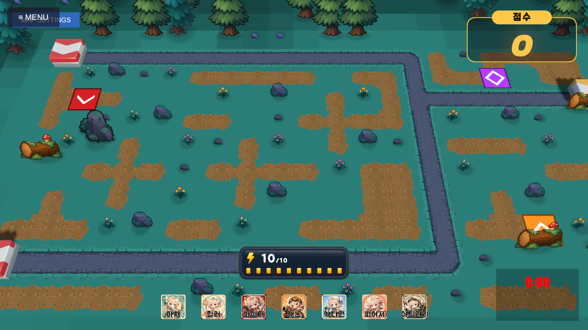
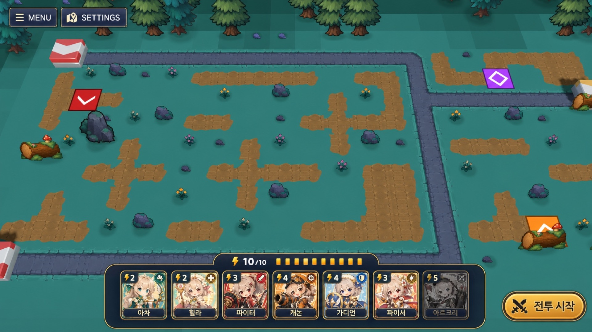

# Battle HUD Layout 리뷰 및 개선 제안

**작성일**: 2026-07-11
**리뷰 대상**: `9e6895fd` (`battle-hud-layout` units 0~2), `7fa51146` (handoff 마감)
**판정**: **중앙 하단 통합 방향은 유지하되, 현재 형태를 최종 HUD로 고정하지 않는다.** 위치 문제는 개선됐지만 비용 판단, 전장 가시성, 모바일 대응은 별도 보강이 필요하다.

## 한 줄 제안

> 떠 있는 코스트 배지와 투명 슬롯 나열을 하나의 **Safe Bottom Action Tray**로 합치고, 각 슬롯에 비용·구매 가능 상태를 붙인다.

## 검토 방식

- 코드·씬·spec·handoff와 실제 1920×1080 Game View를 대조했다.
- 게임기획자, UX/UI 디자이너, 가로 모바일 게이머 관점의 독립 리뷰를 병렬로 진행했다.
- 아래 캡처는 리뷰 중 현재 커밋을 직접 재현한 증거이며, 임의 연출 시안이 아니다.

| Placement 현재안 | Battle 현재안 |
|---|---|
|  |  |

## 현재 변경 평가

### 유지해야 할 결정

1. **bottom-center 축**: 코스트 확인 → 유닛 선택 → 보드 드래그의 시선 흐름이 이전 좌하단보다 짧다.
2. **스트립↔드림캐쳐 핸드 제자리 플립**: 같은 위치에서 문법이 바뀌어 공간 기억이 유지된다.
3. **표시 상태 단일 소유**: `CostDisplay`가 `phaseVisible && !suppressed`를 결합하고 HandView는 신호만 보내는 구조는 전환 순서 경합을 피한다.
4. **페이즈별 밀도 차등 원칙**: Placement에서는 선택지를 강조하고 Battle에서는 전장을 더 보여준다는 방향이 맞다.

### 최종화 전에 해결할 문제

| 우선순위 | 문제 | 근거와 영향 |
|---|---|---|
| P0 | 슬롯별 비용·구매 가능 상태 없음 | 유닛 비용은 1~5인데 슬롯은 초상+이름만 제공한다. 부족한 유닛도 활성처럼 보여 실패 드래그와 규칙 오해를 만든다. 같은 프로젝트의 `SkillBar`는 비용과 affordability dim을 이미 제공한다. |
| P0 | 20:9·Safe Area 미대응 | 런타임 CanvasScaler가 기본 Match Width이고 `Screen.safeArea` 경로가 없다. 2400×1080에서 UI가 약 1.25배 커질 수 있으며 하단 제스처/컷아웃 여백도 보장되지 않는다. |
| P1 | Battle 슬림의 실효가 작음 | 스트립은 120→88로 32px 줄지만 코스트 패널 상단은 y=276에 고정된다. 최고 가림선은 그대로이고 코스트-스트립 간격만 12→44px로 벌어진다. |
| P1 | 유닛 스트립과 카드 핸드의 시각 문법 불일치 | 유닛은 투명 슬롯 나열, 핸드는 어두운 980×232 배킹이다. 위치는 같지만 같은 트레이의 앞뒷면으로 느껴지지 않는다. |
| P1 | 긴 이름·역할 식별성 | 123px 안팎 슬롯에 26px 고정 이름을 쓰며 비용·역할 아이콘이 없다. 캐스터 계열처럼 긴 이름이 연속되면 훑어보기가 어렵다. |
| P1 | 패배 조건의 전투 중 가시성 부족 | 누적 유출 임계치가 즉시 패배를 결정하지만 남은 허용 유출 수가 보이지 않는다. 점수보다 생존 정보를 먼저 읽어야 한다. 이 항목은 하단 트레이와 분리된 후속 HUD scope로 다룬다. |
| P2 | 가로 그립 도달성 미검증 | 중앙은 시각적으로 대칭이지만 양 엄지에서 가장 먼 구간일 수 있다. 중앙안을 바로 폐기할 근거는 없으나 실기 터치 히트맵으로 검증해야 한다. |

## 권장안 — Safe Bottom Action Tray



> 위 이미지는 방향 합의를 위한 AI 편집 시안이다. 실제 배치는 아래 수치 계약과 Unity 16:9/20:9 실기 검증을 우선하며, 전장 픽셀 정합이나 최종 아트 에셋으로 사용하지 않는다.

### 레이아웃 계약

- 공용 `BattleHudSafeAreaRoot` 아래 하단 HUD를 배치한다.
- Canvas 기준은 1920×1080, `matchWidthOrHeight = 1`(Height)로 통일한다.
- 트레이 하단은 `safeArea.bottom + 24`, 화면 엣지 최소 여백은 24로 둔다.
- 유닛 트레이와 드림캐쳐 핸드의 외곽 폭을 **980**으로 통일한다.
- Placement 트레이는 약 `980×136`, Battle은 `980×104`를 시작점으로 삼는다.
- 코스트는 별도 `363×112` 패널이 아니라 트레이 상단에 결합된 약 `264×64` 캡슐/레일로 축소한다.
- 7슬롯 간격은 8, 내부 좌우 패딩은 18을 기준으로 시각 튜닝한다.
- 우하단 START/다음 웨이브 독은 분리 유지하되 같은 Safe Area root에 정렬한다.

### 슬롯 정보 계약

- 좌상단: 번개 아이콘 + 비용 숫자(`36×36` 시작값).
- 우상단: 역할 glyph. 색만 쓰지 않고 방패/활/마법 문양을 함께 사용한다.
- 하단: 높이 30의 반투명 이름 밴드, 한 줄 auto-size `16~22`.
- 비용 부족: 포트레이트 채도/명도 감소 + 비용 칩 강조 + 잠금 또는 부족 아이콘.
- 비용 부족 슬롯은 긴 드래그를 시작시키지 않고 코스트 레일 펄스와 `코스트 부족` 짧은 피드백을 준다.
- 거부 상태는 색만 바꾸지 않고 체크/× 패턴과 `점유`, `배치 불가`, `코스트 부족` 원인을 구분한다.

### Battle 모드

- 코스트 레일이 Battle 크기의 스트립 상단을 함께 따라가도록 하여 44px 분리를 없앤다.
- 1차안은 고정 104px 트레이로 단순하게 검증한다.
- 전장 가림이 여전히 크면 2차 A/B에서 `1.5초 idle → 60~64px 축소, 터치다운 → 즉시 확장`을 시험한다.

### 상단 생존 정보

- `남은 유출 1` 또는 `문 4/5`를 타이머/웨이브와 가까운 상단 정보로 상시 제공한다.
- 정보 우선순위는 **생존 상태 > 즉시 행동 자원·선택지 > 시간·웨이브 > 점수**로 둔다.

## 디자인 토큰 시작값

| 토큰 | 값 |
|---|---|
| `hud-safe-edge` | 24 |
| `hud-gap-xs/sm/md` | 4 / 8 / 16 |
| `tray-radius` | 22 |
| `tray-fill` | `#101827EB` |
| `tray-border` | `#F4C95D` |
| `text-primary` | `#F7F3E8` |
| `text-muted` | `#9AA7B8` |
| `state-valid` | `#3FD8C1` + 체크 패턴 |
| `state-invalid` | `#FF665C` + × 패턴 |
| `slot-press` | 0.96 scale / 80ms |
| `phase-resize` | 160ms ease-out |
| `flip` | 총 220ms |
| reduced motion | 100ms crossfade |

## 구현 권장 순서

현재 spec은 완료 상태이므로 기존 문서를 재개하기보다 새 follow-up spec으로 승격한다.

1. **P0 — 모바일 기반**: `docs/spec/mobile-ui-safe-area/` — CanvasScaler Height 통일, full-bleed/safe root, 16:9/19.5:9/20:9 QA.
2. **P0~P1 — Action Tray**: `docs/spec/battle-hud-action-tray/` — 비용/role/affordability, 통합 배킹·energy rail, hand 정합, 거부 피드백.
3. **별도 후속**: 남은 허용 유출/패배 임계치 HUD. Action Tray와 결합하지 않는다.

구현 순서는 `mobile-ui-safe-area` units 0~4 완료·사용자 확인 후 `battle-hud-action-tray` units 0~5로 진행한다. 각 unit은 별도 확인/커밋 단위다.

첫 세션 3~4슬롯 게이팅은 현재 7픽 검증 조건을 바꾸므로 이 제안의 구현 범위에서 제외한다.

## A/B 검증

| 실험 | A | B | 성공 지표 |
|---|---|---|---|
| 구매 가능성 | 현재 초상+이름 | 비용 칩+dim+부족 피드백 | 비용 부족 드래그 비율, 성공 배치까지 시도 수, 원인 정답률 |
| 전장 가림 | 현재 부유 배지+88px 스트립 | 통합 레일+104px 트레이 | 하단 침투 인지시간, 누수 수, 코스트 읽기 시간 |
| 가로 그립 | 중앙 7슬롯 | 좌 3/우 4 분할 실험안 | 시작점 히트맵, 드래그 거리, 취소율, 3분 후 피로도 |
| Battle 축소 | 88px 고정 | idle 60~64px/터치 확장 | 배치 반응 증가 ≤150ms, 하단 이벤트 인지율 |

## 이미지 생성 프롬프트

시안은 `imagegen` built-in edit 모드로 현재 Placement 캡처를 편집 대상으로 사용한다. 전장·카메라·아트는 보존하고 UI만 바꾼다.

```text
Use case: ui-mockup
Asset type: landscape mobile tower-defense battle HUD proposal
Input images: Image 1: edit target and authoritative battlefield/art reference
Primary request: redesign only the battle HUD into a Safe Bottom Action Tray
Style/medium: shippable polished casual-fantasy game UI, crisp 2D screenshot, not concept art
Composition/framing: preserve the exact battlefield, camera, props, paths, and 1920×1080 framing; edit only screen-space UI
Subject: one unified deep-navy translucent bottom-center tray with thin warm-gold border; seven defender portraits; a compact energy capsule docked into the tray top edge
Text (verbatim): "10/10", "2", "3", "4", "5"
Constraints: each slot has a gold lightning cost chip and small role glyph; dark readable one-line name band; unaffordable examples visibly dimmed; 24px safe margins; compact energy bar; keep top-right score and bottom-right battle controls separate; no giant floating cost panel
Avoid: changing battlefield art; desktop chrome; photorealism; sci-fi HUD; elements touching screen edges; extra characters; watermark
```

## 결론

중앙 이동은 되돌릴 변경이 아니다. 다음 단계는 위치 재논의가 아니라 **“지금 무엇을 살 수 있는가”를 1초 안에 읽게 하고, 그 정보를 전장을 덜 가리는 하나의 모바일 안전 트레이에 묶는 것**이다.
