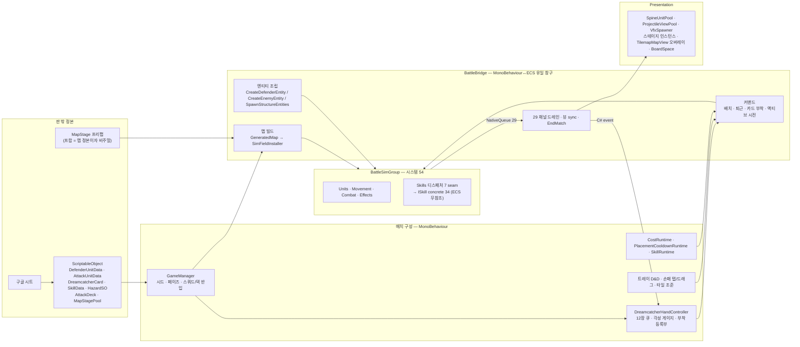
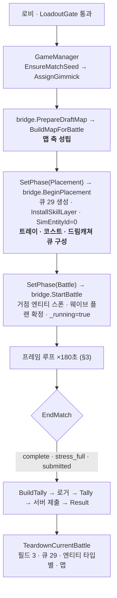

# 전투 핵심 설계도 — 유닛 × 드림캐쳐 × 맵

> **현재 구현의 구조 지도다.** 한 판 안에서 세 축(유닛 · 드림캐쳐 · 맵)이 어디서 태어나
> 어디서 만나고 어디서 죽는지를 한 장으로 잇는다. 경계 원칙과 제약은 `../../CLAUDE.md`, 게임 규칙은
> `ingame-flow.md`, 아키타입별 정거장 체크는 `object-pipeline-map.md` 가 소유한다 — 이 문서는
> 그 셋 사이의 **교차점과 순서**만 담는다. (구 `docs/TRD.md`·`docs/PRD.md` 는 2026-09-03 은퇴.)
>
> 코드 포인터는 줄 번호 없이 **파일·함수 이름**으로만 가리킨다(줄 번호는 한 커밋이면 stale).
> 구현 상세의 정본은 코드이고, 이 문서가 코드와 어긋나면 **그 자리에서 이 문서를 고친다.**
>
> 작성 2026-09-03. 기준 커밋 `6e9acfbb`(인접 시너지 은퇴 직후). 경로는 `Assets/_Project/Scripts/` 기준.

---

## 0. 한 줄

**맵이 경기장을 세우고, 유닛이 그 위에서 싸우고, 드림캐쳐가 유닛의 규칙을 바꾼다.**
셋은 ECS 안에서 직접 만나지 않는다 — 만나는 자리는 전부 `BattleBridge` 아니면 **이벤트 큐**다.



---

## 1. 세 축의 정체 — 런타임에 무엇으로 존재하는가

| | 유닛 (방어 · 적) | 드림캐쳐 (카드) | 맵 |
|---|---|---|---|
| **판 밖 정본** | `Data/DefenderUnitData.cs` · `Data/AttackUnitData.cs` (+`DefenderCatalog`/`EnemyCatalog`). **시트가 덮는다** | `Data/Dreamcatcher/DreamcatcherCard.cs` 한 종류. `type`(Squad/Unit/Active) · `mechanics[]` = **트리거 × 페이로드** 직교 조합(`DcMechanic.cs`) · `attackMods[]` · Active 는 `SkillData` 를 감쌈 | `Core/MapStage/MapStage.cs` 루트 + 프랍 컴포넌트(`SpawnMarker`/`GoalMarker`/`RouteMarker`/`StructureMarker`/`PropFootprint`/`PlacementBlockZone`). `Data/MapStage/MapStagePool.cs` 가 **(stage, deck, plan) 짝**을 시드로 고른다 |
| **매치 구성 시** | `BattleBridge.defenderPool`(= 트레이 슬롯) · `GeneratedWavePlan`(적 로스터 — 저작 플랜 > 인카운터 플랜 > 시드 생성) | `Core/Dreamcatcher/DreamcatcherCycleDeck.cs` **12장** = 저장 덱 10 + 공용 액티브 2. 매치 시드 Fisher-Yates 1회. 각성 게이지 `gaugeStart` | `Data/GeneratedMap.cs` — `tiles`(Walk/Deco) · `placeMask`(셀이 여는 배치 층 비트) · `spawns` · `goals` · `waypointCells/Ranges` · `spawnRoutes` · `structures` · `bonusSpawns` |
| **ECS 안** | `Entity` + 맥락별 컴포넌트 (§5.2 표). 방어유닛은 `PathFollowState` 없음(순찰 소환물 예외), 적은 `IncomingHeal` 없음 | **캐리어 엔티티 없음.** host 유닛 엔티티의 `DcTriggerSlot`(Combat) · `DcAttackModSlot`(Combat) · `DamagedCounter`(Units) 버퍼. **Squad 카드는 ECS 에 존재하지 않는다**(브리지 리스트 + `StatModifierApplyEvent`) | `FlowFieldSingleton`(Effects) — 슬롯 = **목적지 × 통행 마스크**, 슬롯별 BFS · `DefenderFieldSingleton` · `PickupSpawnState` · 거점 엔티티(골 타워 `GoalTowerTag`, 본능 `StructureTag`, Units) |
| **뷰** | `Presentation/SpineUnitPool.cs`(실패 시 `QuadUnitViewPool`) · 오버헤드 HP 는 매 프레임 폴링 | 손패 뷰 · 머리 위 카드 아이콘 스트립 · `DcAuraVisualPool` | **스테이지 인스턴스 자체가 바닥** · `Core/TilemapMapView.cs` 는 오버레이(격자·마커·사거리 링)만 · `Core/BoardSpace.cs` 가 sim↔view 변환 유일 지점 |
| **브리지 등록부** | `_defenderByTile`(앵커 셀 → Entity+SO, **판 위 유닛의 유일한 진실원**) · `_defenderCellOwner`(점유 셀 → 앵커) · `_enemyTypeByEntity`(Entity → SO) | `_activeDcEffects`(Squad) · `_activePlacementSleeps` · HandController `_attachedTo`(entryId → Entity) | `_generatedMap` · `_occupiedTiles`(항상 `_defenderCellOwner` 와 쌍) · `_structureRegistry` · 골/스폰 마커 등록부 |
| **판 안에서 변하는 것** | 배치·사망·퇴근으로 생멸. 스탯은 `ModifierStats` 배율로만 | 부착·회수로 큐가 순환, 게이지 증감 | **`placeMask` 만** 라이브 폐쇄(스폰·골·거점 footprint). 통행은 불변, 동적 장애물은 `ObstacleSingleton` 별도 |

**핵심 비대칭 셋.**
- 유닛은 ECS 의 주어다. 드림캐쳐는 ECS 에 **자기 엔티티가 없다** — 유닛에 얹힌 버퍼와, 그 버퍼가 발화시키는 스킬 레이어로만 존재한다.
- 맵은 ECS 에 **한 번 설치되고 판 내내 읽히기만** 한다(FlowField 는 장애물 시그니처로 부분 재빌드).
- 방어유닛과 적은 **같은 시스템**(`AttackSystem`·`MovementSystem`·`DamageApplicationSystem`)을 탄다. 갈라지는 것은 태그와 `FactionTag` 뿐이다.

---

## 2. 한 판의 생애 — 세 축이 성립하는 순서



| 단계 | 진입점 | 세 축에 일어나는 일 |
|---|---|---|
| **시드** | `GameManager.EnsureMatchSeed` | `matchSeed` 1회 비결정론(디버그 고정 가능). 이후 전부 `Core/MatchSeed.cs` 파생 6계열(§6) |
| **맵 빌드** | `BattleBridge.BuildMapForBattle` | Teardown → 풀 인덱스 4분기(dev 오버라이드 > `fixedMapSeed` > 토너먼트 시드 > 0번) → 스테이지 `Instantiate`(원점·무회전·**스케일 1 강제**) → `MapStageScanner.Scan` → `DioramaMapBuilder.Validate/Assemble` → `MapConnectivity.AllSpawnsReachGoal` (실패 = **하드 실패**, 폴백 맵 은퇴) → 라이브 마스크 폐쇄 → `BoardSpace.Configure` → `BuildFlowField`(적 로스터 통행층 **합집합**을 모아 `SimFieldInstaller.InstallNavFields`) → 거점 프랍. ECS 월드 = `World.DefaultGameObjectInjectionWorld` |
| **배치 진입 신호** | `PlacementPhaseView` → `SetPhase(Placement)` | **페이즈 창이 0초여도 신호는 반드시 발화한다.** 달라지는 건 `duration` 뿐. 구독자: `DefenderSelector`(트레이 = `defenderPool` 배열) · `CostRuntime.ResetToStart` · `CooldownRuntime.ResetAll` · **`DreamcatcherHandController.BuildDeck`**(캐시 없이 매번 새로) |
| **전투 시작** | `BattleBridge.StartBattle` | `SpawnStructureEntities`(골 타워 HP = `AttackDeck.goalStabilityMax`, 본능 HP = `StructureData.health`) · `TryInitializeGeneratedWaves` · `_timerDuration` 확정 · 배치 페이즈 잔여 `ProjectileRequestCarrier` 폐기 |
| **종료** | `BattleBridge.EndMatch(outcome)` | 호출처 **정확히 3곳**: `SyncGoalStability`(`stress_full`) · `SubmitMatch`(`submitted`, 60초 후) · `CheckTimer`(`complete`). 넷째를 만들면 패배 조건 부활. `MatchTally.SubmissionScore == Kills` 가공 없음 |
| **정리** | `BattleBridge.TeardownCurrentBattle` | 런타임 리셋 → 뷰 풀 → `SimFieldInstaller.Teardown` → 인프라/전투 엔티티 타입별 파괴 → 큐 Dispose → `TeardownGeneratedMap`. `?.` 금지(Unity fake-null 로 정리가 중단돼 싱글턴 누수 실측) |

---

## 3. 한 프레임 — 브리지 → 시뮬 → 뷰

라이브 순서는 `MonoBehaviour.Update` → `BattleSimGroup`(플레이어 루프 자동) → `LateUpdate`.
하네스(`StepOneTick`)도 **브리지 먼저, ECS 나중**을 명시로 재현한다 — 뒤집으면 「한 틱 빠른 세상」이 골든에 구워진다.

### 3.1 `BattleBridge.Update` = `TickBattleFrame` (`_running` 일 때만)

```
시간 스케일 push → 전투 시계 누적
→ DrainEnemyKilledEvents        ★ QueueDueWaves 보다 앞 (분열 자식이 여기서 태어난다)
→ QueueDueWaves → 대기 스폰 → TickBonusWave
→ DrainProjectileSpawnRequests (캐리어 엔티티 → 투사체 실체화)
→ 드레인 12종 (사망 · 실드 파열 · 카드 발동 연출 · 넉업 · 공격 연출 · 히트 · 힐 · 실드 · 데미지 넘버 · 로그)
→ 요청 실행 3종 (HazardSpawn · PatrolSpawn · MeteorBarrage)
→ DrainGoalEvents → SyncGoalStability (→ EndMatch "stress_full")
→ TickBonusPullOffer            ★ SyncGoalStability 바로 뒤 (이 프레임 마음 체력으로 판정)
→ CheckTimer                    (→ EndMatch "complete")
```

### 3.2 `BattleSimGroup` — 54 시스템을 밴드로

`RateManager = BattleScaledRateManager` 가 그룹 한 지점에서 dt 를 스케일한다. **슬로모는 뷰 전용이 아니다** — 그룹 안 모든 `SystemAPI.Time.DeltaTime` 이 스케일되고, `scale <= 0` 이면 그룹 전체가 쉰다. 결정론은 스케일이 아니라 **틱 순서**가 지킨다.

| 밴드 | 시스템 (실행 순) | 맥락 | 세 축 관점 |
|---|---|---|---|
| **A. 필드·상태 준비** | `HazardLifetime` · `Obstacle/FlowFieldRebuild` · `DefenderField` · `PatrolField` · `AggroState` · `ModifierApply` · `CcApply` · `ZoneApply` · `AllyBuffField` · `BossPeriodicTrigger` → **[Periodic seam]** | Effects · Combat | 맵(장애물→필드) 과 드림캐쳐(모디파이어 큐 소비, 주기/배치 트리거) 가 유닛 상태에 먼저 도착 |
| **B. 사망 수렴** | `HealthDeath` · `LethalTimer` | Units | `DeadTag` 합류점 |
| **C. AI · 이동** | `TauntAttackGrant` · `EnemyAiState` · `StructureDestination` → **`MovementSystem`** → `AgentSeparation` · `HazardCast` → **[Cast seam]** | Combat → Movement → Effects | 유닛이 맵(FlowField 슬롯, 유닛 통행층별 `NavGrid`)을 읽는 유일한 밴드. 포털 텔레포트·토네이도 당김도 여기 |
| **D. 틱 · 투사체 · 스탯 집계** | `EffectTick` · `ProjectileMove` → `ProjectileHit` · `StatModifierTick` → **`ModifierStatsAggregate`**(유일 writer) → `MaxHealthScale` · `StackModifierTick` · `Heat/FatigueAccrual` · `Pickup*` · `ResignationThreshold` | Effects · Combat · Units | 드림캐쳐가 준 배율이 실효 스탯으로 접히는 자리 |
| **E. 공격 → 피해 → 파괴 → 경계** | **`AttackSystem`** → **[Attack seam]** → **`DamageApplication`** → **[Death seam]** → `ResignationDrop` · `PatrolLifecycle` · `CcClear` · `ProjectileEmitter` · `BarrelExplosion` · `DreamCocoon` · `CcDecay` → **`UnitLifecycle`**(엔티티 파괴 + 골 도달/사망 이벤트) → **[Lifecycle seam]** → `HealthThreshold` → **[Threshold seam]** → `UltimateLeap` → `BlinkApply` | Combat → Units → Movement | 카드 트리거 대부분이 여기서 감지된다(공격마다 · N번째 · 처치 · 피격 · 실드 파열 · 죽음) |
| **(밖) Immediate seam** | `SkillDispatchImmediateSystem` — **브리지가 `Update()` 를 직접 호출** | Skills | 부착 즉발 3종 · 액티브 시전. 부착은 동기 트랜잭션이라 프레임을 기다릴 수 없다 |

실측 총순서 덤프는 `../spec/battle-sim-extraction/order-capture.md`(메뉴 `Wassup/Battle/Sim Order/Dump`) — **현재 stale** (§8). 순서 어트리뷰트가 없는 시스템(`MovementSystem` · `PickupSpawnSystem` · `HitFlashSystem` · `SkillDispatchImmediateSystem`)은 토폴로지 정렬 tie-break 에 얹혀 있다.

### 3.3 `BattleBridge.LateUpdate`

도약/궁극기 뷰 오버라이드 드레인(★ `Update` 로 옮기면 1프레임 팝) → `SyncMonoUnitViews`(적 = `AttackUnitTag` 쿼리, 방어 = `_defenderByTile` 순회, 순찰병 = 별도 `SyncPatrolViews`) → 사거리 마크 · 부착 프리뷰 → 상태 VFX · 픽업 · 사직서 reconcile → 투사체 뷰 sync.

### 3.4 순서가 곧 계약인 지점

| 계약 | 깨면 |
|---|---|
| `DrainEnemyKilledEvents` 가 `QueueDueWaves` 앞 | 분열 부모가 마지막 생존자일 때 자식 생성 전에 「전멸」이 참 → 엘리트를 죽이면 판이 빨라지는 역인센티브 |
| `TickBonusPullOffer` 가 `SyncGoalStability` 바로 뒤 | 한 프레임 묵은 스트레스로 문턱 근처 떨림 |
| 도약 뷰 드레인은 `LateUpdate` | 발동 프레임에 큐가 비어 착지점으로 팝 |
| `SyncGoalStability` 의 `CoreShielded` 구조 변경은 `Update` 안 | `LateUpdate` 로 옮기면 `EntityTypeHandle invalidated` 예외 |
| 하네스 `StepOneTick` = 런타임 3종 tick → `TickBattleFrame` → `group.Update()` | 뒤집으면 라이브가 낸 적 없는 궤적이 골든의 정본이 된다 |
| 배치 활성화에서 `JustDeployed` 부착과 `PendingDeployment` 제거는 **연속 두 줄** | 사이에 시스템이 끼면 배치 스킬 후보에서 자기 자신이 빠진다 |
| 규칙 bake(`DcTriggerSlot`)는 `BakeDefenderDirectionalPattern` **뒤** | `PatternSlot[0]` 소유자가 호출 순서로만 정해져 머신거너 다연발이 배치 스킬 패턴을 쏜다 |

---

## 4. 교차점 매트릭스

### 4.1 유닛 × 맵

| 질문 | 메커니즘 | 위치 |
|---|---|---|
| 어디에 놓을 수 있나 | **`(셀 층 & 유닛 층) != 0` 단일 술어.** 코드는 유닛 클래스를 보지 않고 비트만 본다. 판정 순서 공간 → 유닛 → 풀 → 상한 → 코스트. 고스트 색은 같은 술어 결과를 **재판정 없이** 소비 | `GeneratedMap.PlaceableAt` · `BattleBridge.SpatialPlacementCheck`/`SpatialFootprintCheck`(순수 static) · `CanPlaceDefenderAt` · `GetPlacementCellReasons` |
| 몇 칸을 차지하나 | `DefenderFootprint{anchor,size}` 만 저장, 「대표 셀」 없음. 손가락 셀 = 하단 행 가로 중앙, sim 위치 = **발밑**. 점유 = `_occupiedTiles` + `_defenderCellOwner` **항상 쌍** | `Data/FootprintMath.cs` · `OccupyDefenderFootprint`/`ReleaseDefenderFootprint` |
| 적이 어디로 가나 | `FlowFieldSingleton` 슬롯 = (목적지 × 통행 마스크) BFS. **`cellLayers` 는 `tiles` 에서 파생하지 `placeMask` 가 아니다**(placeMask 를 통행 정본으로 삼았다가 통로 23칸이 사라진 실측 사고). 벽은 **유닛 통행층마다** `NavGrid` 재조립. 경로 우선순위 적 SO > 웨이브 컨셉 > 레인 기본 | `Bridge/SimFieldInstaller.cs` · `Battle/Effects/TraversalSlots.cs`(정의식) · `Battle/Movement/MovementCellTrim.BuildNavGrid` · `NavGrid.IsBlocked` · `WaypointRouting.ResolvePathIndex` |
| 맵이 판 중에 바뀌나 | 저작본은 불변. `placeMask` 만 `CloseCellLayers`(스폰·골·거점 footprint). 배치 유닛·방벽은 `ObstacleSingleton` → `FlowFieldRebuildSystem` 이 `blockedSignature` 로 부분 재빌드 | `BuildMapForBattle` 후처리 · `ObstacleLifetimeSystem` |
| 골에 닿으면 | `MovementSystem` → `PastGoalTag` → `UnitLifecycleSystem` → `GoalReachedEvent{canSiege}`. 돌격형은 마음에 `stabilityDamage` 를 `IncomingDamage` 로, 공성형(`targetMask & DefenderCore`)은 살아서 거점을 팬다. `SyncGoalStability` 가 `_structureRegistry` 를 폴링해 스트레스를 미러하고 **첫 붕괴 = `stress_full`** | `DrainGoalEvents` · `EnqueueGoalTowerDamage` · `SyncGoalStability` |
| 죽으면 | `DefenderDeathEvent{cell}` → footprint 해제 → 트레이 사망 쿨타임. 적은 `EnemyKilledEvent` (유출된 적은 이 이벤트가 없어 점수·각성·마음 회복 셋을 동시에 못 번다) | `DrainDefenderDeathEvents` · `DrainEnemyKilledEvents` |
| 좌표는 어디서 만나나 | sim 좌표는 타일 격자 원점 0, `BoardSpace.ToView` 가 grid 로컬로 접는다. **sim-Y 는 화면 세로에 더하지 않는다.** 대상 위치 표시는 반드시 `ToView` 를 지난다(안 지나면 스테이지마다 최대 1.95칸 어긋남) | `Core/BoardSpace.cs` · `Battle/Movement/GridMath.cs` |

### 4.2 드림캐쳐 × 유닛

**부착 = host 엔티티에 직접 쓴다.** 별도 캐리어 없음. 상한 3 은 **Mono 만 안다**(`HandController._attachedTo` 전수 카운트).

| 카드 종류 | ECS 에 남는 것 | 어디에 |
|---|---|---|
| `Unit` (트리거 × 페이로드) | `DcTriggerSlot` 버퍼 원소 (`skillId` 는 `DcSkillRouting.SkillIdFor(trigger, payload)`) | host, Combat 소유 |
| `Unit` + `OnDamagedN` | + `DamagedCounter` 버퍼 (피해를 받는 곳이 센다) | host, Units 소유 |
| `Unit` + `attackMods` | `DcAttackModSlot` 버퍼 · `FrontmostAttackLock` | host, Combat 소유 |
| `Unit` + `trigger == None` (마지막 불꽃 · 호접몽 · 살찌운 제물) | 슬롯 없음 — **Immediate seam 즉발** | — |
| `Squad` | **없음.** `_activeDcEffects` 리스트 + `StatModifierApplyEvent`(지속 1e9). 신규 배치 유닛은 `ApplyActiveDcEffectsTo` 로 상속. 철회 = 배율 1.0 재적용(중화) | 브리지 |
| `Active` | 없음 — 시전 즉시 Immediate seam | — |

**같은 레일 위의 비-카드 사용자.** 적/보스 `AttackUnitData.nightmareMechanics` · 방어유닛 배치 스킬 `UnitSkillAbility.mechanics` · 가디언 해저드/실드 캐스트 · 액티브 · 퇴근 페이로드 — 전부 `BattleBridge.BakeUnitMechanics`(진영 중립) 로 **같은 `DcTriggerSlot`** 을 굽고 **같은 라우팅 표**를 쓴다. 카드 전용 화이트리스트는 은퇴했다(두 벌로 두는 것 자체가 위험).

**발화 경로 (감지는 분산, 실행은 단일).**

```
감지자 8곳 (사건이 나는 시스템)                     seam
  AttackSystem RESOLVE           AttackN            Attack
  BossPeriodicTriggerSystem      PeriodicTimer · OnPlace   Periodic
  HealthThresholdSystem          HealthThreshold    Threshold
  DamageApplicationSystem        OnDamagedN · OnShieldBreak · OnKill   Death
  UnitLifecycleSystem (파괴 뒤)   OnDeath            Lifecycle
  HazardCastSystem               캐스트 성사         Cast
  브리지 (퇴근)                   OnRetire           Lifecycle
  브리지 (부착 즉발 · 액티브)      —                  Immediate
        ↓ SkillFiredEvent{Seam, 값 스냅샷, CasterFaction}  →  SkillFiredEventsSingleton (큐 1개)
        ↓ SkillDispatch{Seam}System — 자기 seam 만 꺼내고 남의 것은 꼬리로, budget = queue.Count
        ↓ SkillRegistry(skillId → ISkill) → concrete.Execute(caster, target, params, ctx)
        ↓ ctx.Emit(SimIntent)  — concrete 는 상태를 바꾸지 않는다
        ↓ EcsSkillContext 어댑터 → 소유 맥락 채널 (IncomingDamage 버퍼 · Cc/Dot/Stat/Stack 큐 · HazardSpawnRequests · ECB 캐리어)
```

- 예 **비수**(`AttackN × ProjectileToTarget`): `AttackSystem` 슬롯 루프 → Attack seam → `TargetProjectileSkill` → `SpawnProjectile` intent → ECB 캐리어 → 같은 프레임 Playback → 브리지 `DrainProjectileSpawnRequests` 가 뷰를 붙인다.
- 예 **잿불**(`OnKill × SpawnHazard`): `DamageApplicationSystem` 킬러 슬롯 순회 → Death seam(파괴 **앞**이라 대상이 아직 있다) → `DeathSiteHazardSkill` → `SpawnZoneCarrier` intent → `HazardSpawnRequests` 큐 → 브리지가 `HazardSO` + 뷰로 실체화.
- 왜 seam 이 7개인가: 감지자마다 same-frame 하류 계약(예: 공격 seam 은 `DamageApplication` 앞, 죽음 seam 은 `UnitLifecycle` 앞)이 있고 그 구간이 겹치지 않아 **단일 드레인이 산술적으로 불가능**하다. 정본은 `SkillSeam` enum 이지 문서의 숫자가 아니다.

**자원과 회수.**

| 사건 | 각성 게이지 | 큐 | 근거 |
|---|---|---|---|
| 적 처치 | `EnemyKilledEvent.awakeningReward`(표식 배율 baked) | 표식 카드 회수 | 마음 회복은 **SO 원값** — 표식 배율이 두 축을 겸직하지 않게 |
| 아군 사망 | `DefenderUnitData.awakeningReward` | host 의 카드 전부 큐 **뒤** | 죽음 = 자원 |
| 퇴근 | **0** | 큐 뒤. 「인수인계」 카드가 있으면 그 유닛의 **다른** 카드는 큐 **앞** | 주면 배치↔퇴근이 게이지 파밍 |
| 액티브 사용 | 비용 차감 | 즉시 큐 뒤 | CR식 순환 |

**퇴근은 sim 사건이 아니다.** `RetireDefender` 가 `DeadTag` 없이 `DestroyEntity` — 그 한 줄이 사직서 드랍·작별 선물·각성 지급을 **배제 코드 0줄**로 막는다. 되돌릴 수 없는 sim 변경(파괴)을 뷰 처리보다 **먼저** 끝낸다.

### 4.3 드림캐쳐 × 맵

| 질문 | 메커니즘 | 위치 |
|---|---|---|
| 타일 조준은 어떻게 셀이 되나 | `BoardSpace.RaycastPlane` → `ToSim` → `GridMath.WorldToCellUnclamped` → bounds. **보드 밖 = 취소**(clamp 하는 `TryScreenToCell` 은 조준 커밋에 쓰지 않는다) | `BattleBridge.TryScreenToCellStrict` |
| 액티브는 어디로 가나 | `CastSkillAtTile` → concrete 6종(스탯 버스트 · 당김장 · 메테오 · 아군 장판 · 포탈 2셀) → `CastActiveSkillAtTile` → **Immediate seam**, `Caster = Entity.Null`(진영은 `CasterRef.Player` 로 접힘) | `BattleBridge.CastSkillAtTile`/`CastPortal` |
| 장판은 누가 만드나 | 카드는 「어떤 불씨를」만 말한다. 지속·반경·모양·틱·뷰는 `HazardSO` 소유. concrete → `HazardSpawnRequests` 큐 → **브리지가 SO 조회 + 뷰 실체화**(SO lookup 은 브리지 소관). 필드 캐리어(아군 장판·당김장·포탈)는 `EffectSpawner` **즉시 스폰**(뷰 등록부가 매 프레임 맞추므로 ECB 지연 불가) | `EcsSkillContext.Emit(SpawnZoneCarrier/SpawnFieldCarrier)` · `DrainHazardSpawnRequests` |
| 통행 층은 어떻게 따라가나 | `SkillFiredEvent.TargetTraversalLayers` → `SkillParams` → concrete **fail-closed** 가드(0 = 무제한 통과가 아니라 「안 깐다」) | `Skills/Concrete/DeathSiteHazardSkill.cs` |
| 범위 프리뷰 도형은 | `DcRangeCatalog.Resolve`(concrete → 도형·반경) ↔ `TilemapMapView` 링/마크. 판정과 표시가 같은 반경을 읽는다 | `Core/Dreamcatcher/DcRangeCatalog.cs` |
| 효과 타일 | **ECS 로 가지 않는다** — Mono dict + 타일맵 페인트. 배치 시 1회 `StatModifierApplyEvent`, 회수 경로 없음 | `AddEffectTile` · `ApplyEffectTileOnce` |

### 4.4 삼자가 한 메서드에서 만나는 곳 (브리지 안 최밀집 지점)

| 메서드 | 만나는 것 | 왜 여기 |
|---|---|---|
| `DrainEnemyKilledEvents` | 점수 · HUD · `_enemyTypeByEntity` · 보너스 킬 카운터 · **마음 회복** · **분열 스폰(맵 좌표)** · **각성 게이지 + 흡수 비행** · 표식 회수 · 로그 | 킬 하나가 세 축 자원을 전부 건드린다. **가장 밀도 높은 교차점** |
| `PlaceDefenderAs` / `TryBeginDefenderDeployment` | 맵 마스크 × 유닛 층 · 코스트 · footprint 점유 · 엔티티 조립 · 배치 스킬(`OnPlace`) · 효과 타일 | 배치 = 유닛이 맵에 결합되고 카드 레일에 오르는 순간 |
| `CastSkillAtTile` | 스킬 SO · 타일 → 월드 · 사거리 내 적 수 · Immediate seam | 액티브 = 드림캐쳐가 맵을 통해 유닛을 건드리는 유일한 경로 |
| `DrainHazardSpawnRequests` | 요청의 통행층(맵) · 시전자 존재(유닛) · SO 레지스트리(스킬) | 장판 = 셋의 합작 |
| `SyncGoalStability` | 거점 `Health` 폴링(유닛) · 셀 붕괴(맵) · 스트레스 미러 · `CoreShielded` 구조 변경 · `EndMatch` | 판정 권한이 여기 모여 있다 |
| `DrainGoalEvents` | 골 귀속 셀 · 공성/돌격 분기 · 뷰 회수 · 집계 · 표식 회수 | 유출 = 유닛이 맵을 끝까지 통과한 사건 |

---

## 5. 채널 지도 — 29 큐가 무엇을 나르나

전부 `BattleBridge.EnsureQueriesAndQueues` 가 만들고(3점 세트: Dispose → new → 싱글턴 엔티티) `TeardownCurrentBattle` 이 지운다. 단일 스트림으로 합치지 않는다(`battle-sim-extraction` 계약: 내부 phase 큐 / semantic / presentation 3분리).

| 방향 | 채널 | 생산 맥락 → 소비 | 성격 |
|---|---|---|---|
| **ECS → 브리지** (17) | `EnemyKilled` · `GoalReached` · `DefenderDeath` · `DamageNumber` · `HealApplied` · `ShieldBreak` | Units → 점수/게이지/뷰/페이로드 | 판 규칙 + 연출 |
| | `UnitAttackVisual` · `ProjectileHit` · `KnockupVisual` · `DcTriggerFired` · `AttackOutputLog` | Combat → 뷰/로그 | **연출·로그 전용** (`DcTriggerFired` 는 방어유닛 host 만 — 적 카드 연출 오발 방지) |
| | `ShieldGranted` · `BossLeapVisual` · `UltimateLeapVisual` | Skills/Combat → 뷰 오버라이드 | 시퀀스는 sim 이 소유, 뷰는 예고 시간을 **복제하지 않는다** |
| | `HazardRuntime` · `HazardDestroyed` · `GoalCollapsed` | Effects/Units → 로그/프랍 | `GoalCollapsed` 는 **생산자 0**(휴면 — 붕괴는 등록부 폴링) |
| **ECS → 브리지 실행 요청** (2) | `HazardSpawnRequests` · `MeteorBarrageRequests` | Effects/Combat/Skills → 브리지가 SO 조회 + 스폰 | sim 은 「무엇을」만, 실체화는 브리지 |
| **엔티티 캐리어** (2) | `ProjectileSpawnRequest` · `PatrolSpawnRequest` | Combat/Skills → 브리지 드레인 후 파괴 | 큐 대신 수명 1프레임 엔티티 관용구 |
| **ECS → ECS** (10) | `EnemyCc` · `DotApply` · `CcClear` · `StatModifierApply` · `StackModifierApply` · `AggroAcquire` | 다 → Effects | 브리지는 lifecycle 만. `StatModifier` 생산자 9곳의 **유일 소비자**는 `ModifierApplySystem` |
| | `ThreatHit` · `BlinkRequest` · `CastEvents` | Combat → Combat/Movement, Effects → Combat | 맥락 간 쓰기 금지의 우회로 |
| | `SkillFiredEvents` | 감지자 8 → 디스패처 7 | **유일하게 이벤트가 자기 seam 을 싣는다** |

---

## 6. 정본 계층과 결정론

**값의 정본은 판 밖에 있고, 판 안으로는 한 방향으로만 흐른다.**

```
구글 시트 ──(임포터: 로비 진입마다)──▶ SO ──(브리지 bake)──▶ 컴포넌트/버퍼 ──▶ 시스템
```

- 임포터 3종의 의미가 다르다(`Data/StatImport/DcSheetApplier.cs`): `RebuildEffects`/`RebuildAttackMods` 는 **시트가 정본**(배열 재구축), `OverlayMechanics` 는 **Unity 가 정본**(투사체 SO 참조를 들고 있어 값만 덮음). SO 만 고치면 로비 진입이 되돌린다.
- 데이터 계층 enum(`DcCcKind`/`DcStackKind`)은 Battle 타입을 참조할 수 없어 bake 가 번역한다. `DcTriggerKind`/`DcPayloadKind` 는 시트가 **값**으로 왕복하므로 append-only.
- `MatchConfigSnapshot`(SHA-256 16자)이 판의 「조건」을 접는다 — 골든이 갈렸을 때 코드 회귀인지 값 드리프트인지 먼저 가른다. 뷰 전용 knob 과 아트 참조는 담지 않는다(의도).

**시드 6계열** (`Core/MatchSeed.cs`, salt 로 decorrelate, 0 을 반환하지 않음):

| 파생 | 소비 | 파생 | 소비 |
|---|---|---|---|
| `DeriveMapSeed` | 맵 풀 인덱스(비토너먼트) | `DerivePickupSeed` | 픽업 스폰 셀 |
| `DeriveWaveSeed` | `WavePatternGenerator`(단일 RNG 스트림) | `DeriveGimmickSeed` | 기믹 배정 |
| `DeriveVisualSeed` | 투사체 지터(뷰) | `DeriveMeteorSeed` | 메테오 착탄 셀 |

**시드를 타지 않거나 다른 축을 쓰는 것** — 설계도에 박아 둘 예외:
1. 토너먼트 맵 선택은 **서버 시드**(`MapPoolSelect.SelectIndexFromTournamentSeed`) — 전원 같은 (맵, 덱).
2. 드림캐쳐 큐 셔플은 `GameManager.MatchSeed` **원값**(`Derive*` 미경유).
3. 효과 타일은 `GeneratedMap.seed` 를 쓰는데 디오라마 맵은 **-1 고정** → 같은 맵의 효과 타일은 매판 동일.
4. dev 맵 슬롯은 시드 결정론에 **불가시**(`MapStagePool.Count` 에 미포함).
5. 분산·지터는 RNG 보다 **구조 결정론**을 선호한다 — 자석 스냅 row-major first-win, 스폰 측면 오프셋 순번, 보너스 포탈 `i % portalCount`, 빌더 정렬 규약 4종.

**고정 스텝 하네스**(`SimHarnessClock` + `BattleBridge.StepOneTick`): `TimeManager.DeltaTime` 한 줄이 모든 델타 소비처를 `StepDt`(1/60) 로 옮긴다. 골든 코퍼스 8종(`Editor/Battle/SimHarnessRunner.cs`)이 세 축의 A/B 기준선이다 — `summoner` 시나리오만 「연속 이동 아군 × 적」 조합을 세운다.

---

## 7. 설계 불변식 — 되돌리면 안 되는 것

각 항목은 한 번 잘못 갔다가 돌아온 자리다. 근거 spec 을 함께 적는다.

1. **`BattleBridge` 밖에서 `EntityManager` 금지, 그리고 브리지 진입은 최후 수단.** 값의 소유자가 노출하고 있는지 먼저 본다 — `CLAUDE.md` 제약 1·12.
2. **Component 쓰기는 소유 맥락만. 맥락 간은 큐/버퍼.** `Health` 는 Units 만, `ModifierStats` 는 `ModifierStatsAggregateSystem` 만, `EnemyAiState` 는 `EnemyAiStateSystem` 만 — `CLAUDE.md` 제약 2.
3. **스킬 concrete 는 ECS 를 모른다.** `Wassup.Skills` asmdef 가 Entities 를 참조하지 않아 컴파일이 강제한다. 쓰기는 `ctx.Emit` 만, 직접 쓰기 예외는 폐쇄 목록 4건 — `skill-layer-foundation` 계약 1·3.
4. **감지는 분산, 실행은 단일.** 통합하면 매 프레임 전 유닛 재스캔이 된다. seam 수는 규칙이 정하지 문서가 정하지 않는다 — `skill-layer-foundation` 계약 6·7.
5. **이벤트는 값 스냅샷이다.** 죽음 계열은 드레인 시점에 host 가 없다 — `CasterFaction` 까지 실어야 했던 이유 — 계약 8.
6. **배치 판정은 층 비트 하나.** 클래스 분기 금지. 통행층 파생은 `tiles` 에서, `placeMask` 로 통행을 판정하지 않는다 — `placement-mask` · `traversal-layers` unit 5.
7. **유닛의 몸은 원, 격자는 0.** `HitRadius` 조건부 부착 금지(갈리면 판정이 두 갈래). sim 위치 = 발밑 — `distance-based-range`.
8. **「이 유닛은 어느 셀에 있나」를 재도입하지 않는다.** footprint 는 앵커 + 크기만 — `defender-footprint`.
9. **`EndMatch` 호출처는 3곳.** 넷째는 패배 조건의 부활 — `three-minute-kill-race` · `heart-stress-axis`.
10. **점수 = 처치 수, 제출은 생값.** 안정도·시간을 다시 섞지 않는다 — `battle-score-formula`.
11. **퇴근은 `DeadTag` 를 달지 않는다.** 그것이 clock-out 계약 전부 — `defender-clock-out`.
12. **드림캐쳐는 규칙을 바꾸고 스탯을 올리지 않는다.** 체급은 드림스톤 — `ingame-flow.md` 지향 5.
13. **`DotOrigin`/`DotElement` 두 축을 한 필드로 겸직시키지 않는다.** 화염을 스택으로 만드는 순간 과피해가 재현된다 — `dot-effect-extraction`.
14. **`OnUpdate` 의 `GetComponentLookup` 을 지우면 Burst 가 조용히 깨진다.** 명시 필드 + `OnCreate` — 프로젝트 재발 5회.
15. **`DcSkillRouting.SkillIdFor` 는 bake 와 프리뷰가 같은 함수를 부른다.** 미러를 두 벌 두면 「붙는데 무효」가 돌아온다 — `dreamcatcher-attach-range-preview`.
16. **`_aliveAttackersQuery` 에 필터를 걸지 않는다**(11곳 공유). 전멸 판정은 전용 쿼리 — `BattleBridge.NoQueuedAttackersRemain` 주석.
17. **`SimEntityId` 는 스폰 지점 한 곳에서만 부여**하고 프로세스 밖으로 나가는 유일한 ID 다. `Entity.Index` 를 기록에 싣지 않는다 — `battle-sim-extraction` unit 1.

---

## 8. 이번 재구축에서 드러난 문서 드리프트

코드가 정본이다. 아래는 문서가 뒤처진 자리이며 **별도 커밋에서** 고친다.

| 문서 | 어긋난 것 | 실제 |
|---|---|---|
| ~~`../TRD.md`~~ | 상태 기계 `Draft/Placement/Combat/Result` · 「Meteor 해결」 · Phase 0~4 로드맵 | **문서 자체를 은퇴시켜 해소**(2026-09-03). 실제 페이즈는 `GamePhase { None, Draft, Placement, Battle, Result, Tally, Gimmick }` — 값 순서 ≠ 시간 순서, 에셋에 int 직렬화라 중간 삽입 금지 |
| `CLAUDE.md` Combat 항목 | 「Meteor 해결」 | `MeteorResolutionSystem`·`MeteorPending`·`MeteorBurstEventsSingleton` 코드 0건 — 메테오는 투사체(`SkyFall × TileAoe`) |
| `../spec/battle-sim-extraction/order-capture.md` | 시스템 48, `ShieldCastSystem` 포함 | **54** — `ShieldCastSystem` 삭제(주기 슬롯으로 흡수), `SkillDispatch*` 7 추가. 재덤프 필요(디스패처 3계 미등재는 spec 도 알고 있다) |
| `object-pipeline-map.md` 「스킬 해저드 — Tornado/Meteor/Portal」 | `MeteorPending` · `MeteorResolutionSystem` · `MeteorBurstEventsSingleton` · `ApplyTornado/ApplyMeteor/ApplyPortal` | 전부 은퇴. 액티브는 concrete(`PullFieldSkill`/`PortalSkill`/`TileMeteorSkill`) → Immediate seam |
| `object-pipeline-map.md` 거점 표 | `Data/MapGrid/MapDocument.cs` `structures[]` · `MapDocument.bonusSpawns` | `MapDocument` 클래스 **없음**. 저작은 `StructureMarker`/`BonusSpawnMarker` 프랍, 런타임은 `GeneratedMap.structures/bonusSpawns` |
| `CLAUDE.md` `GoalCollapsedEventsSingleton` 설명 | 「공성 게이트가 매 프레임 `GoalPoint` 쿼리로 판정」 | `GoalPoint` 코드 0건. 골 = `GoalTowerTag` 거점 엔티티, 붕괴 관측 = `_structureRegistry` 폴링. 채널 생산자 0 |
| `../spec/battle-sim-extraction/README.md` | 「28채널」 | 29 (`SkillFiredEventsSingleton` 추가) |

---

## 9. 이어서 읽을 곳

| 축 | 먼저 열 파일 | 그 다음 |
|---|---|---|
| 유닛 | `Bridge/BattleBridge.cs` `CreateDefenderEntity` · `CreateEnemyEntity` (조립 본문 단일 지점) | `Battle/Combat/AttackSystem.cs` · `Battle/Units/DamageApplicationSystem.cs` · `UnitLifecycleSystem.cs` · `Data/FootprintMath.cs` |
| 드림캐쳐 | `Data/Dreamcatcher/DcMechanic.cs` · `Core/Dreamcatcher/DcSkillRouting.cs` · `Bridge/BattleBridge.Dreamcatcher.cs` `ApplyDreamcatcherCardToUnit` | `Battle/Skills/SkillDispatchSeams.cs` · `SkillDispatchSystem.cs` · `EcsSkillContext.cs` · `Skills/ISkillContext.cs` · `Core/Dreamcatcher/DreamcatcherHandController.cs` |
| 맵 | `Data/GeneratedMap.cs` · `Data/PlacementLayer.cs` · `Bridge/SimFieldInstaller.cs` | `Data/MapStage/DioramaMapBuilder.cs` · `Battle/Effects/FlowFieldSingleton.cs` · `Battle/Movement/MovementCellTrim.cs` · `Core/BoardSpace.cs` · `Core/MatchSeed.cs` |
| 프레임 | `Bridge/BattleBridge.cs` `TickBattleFrame` · `StepOneTick` | `Battle/BattleScaledRateManager.cs` · `Core/TimeControl/TimeManager.cs` |

| 궁금한 것 | 문서 |
|---|---|
| 경계 원칙 · 절대 제약 12 · 추가 제약 | `../../CLAUDE.md` |
| 게임 규칙 · 동사 4개 · 드림캐쳐 사용법 | `ingame-flow.md` |
| 새 플레이 오브젝트의 정거장 체크 | `object-pipeline-map.md` |
| 스킬 레이어 계약 12 · seam 규칙 | `../spec/skill-layer-foundation/README.md` · `../spec/skill-layer-migration/README.md` |
| 적 이동 알고리즘 · 쓰지 않은 것 | `enemy-movement-algorithm.md` |
| 맵 저작 규칙 · 하드 실패 목록 | `map-stage-authoring.md` |
| 결정론 · 골든 · 하네스 | `../spec/battle-sim-extraction/README.md` · `harness-determinism.md` |
| 점수 · 종료 통로 | `score-formula.md` |

## 유지 규칙

- 갱신 트리거: 축 간 **교차점**이 생기거나 사라질 때(새 큐 · 새 seam · 새 등록부 · 순서 계약 추가/철회), 세 축의 런타임 형태(§1 표)가 바뀔 때.
- 시스템 개수·채널 개수 같은 숫자는 **코드가 소유**한다. 이 문서의 숫자가 코드와 다르면 문서를 고친다.
- 개별 아키타입의 정거장·수치·필드 설명을 여기 늘리지 않는다 — `object-pipeline-map.md` 와 spec 의 몫이다.
