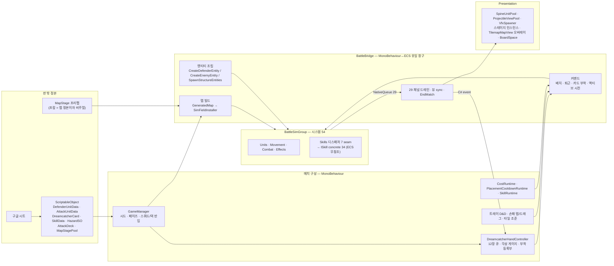

# 전투 핵심 설계도 — 유닛 × 드림캐쳐 × 맵

> **두 층으로 읽는다.**
> **§1 은 아키텍처 중립 설계 아웃라인**이다 — 판 위에 무엇이 존재하고, 어떤 축을 갖고, 어떤 규칙으로
> 맞물리는지를 ECS/Mono 구분 없이 적는다. 다른 아키텍처(예: Mono 재구현)의 도면을 그릴 때 **입력으로
> 쓰는 층**이다. 값(숫자)은 적지 않는다 — 값은 SO·시트가 소유하고, 이 층은 축과 규칙만 갖는다.
> **§2 이하는 현행 구현의 구조 지도**다 — 세 축이 지금 코드에서 어디서 태어나 어떤 순서로 돌고
> 어디서 만나는지. as-is 대조용이며 ECS 고유 개념(맥락·큐·시스템 순서)이 여기 산다.
>
> 경계 원칙과 제약은 `../../CLAUDE.md`, 게임 규칙은 `ingame-flow.md`, 아키타입별 정거장 체크는
> `object-pipeline-map.md` 가 소유한다. 코드 포인터는 줄 번호 없이 **파일·함수 이름**으로만 가리킨다.
> 구현 상세의 정본은 코드이고, 이 문서가 코드와 어긋나면 **그 자리에서 이 문서를 고친다.**
>
> 작성 2026-09-03 · §1 추가 2026-09-04. 기준 커밋 `6fb096d6`. 경로는 `Assets/_Project/Scripts/` 기준.
> (구 `docs/TRD.md`·`docs/PRD.md` 는 2026-09-03 은퇴.)

---

## 0. 한 줄

**맵이 경기장을 세우고, 유닛이 그 위에서 싸우고, 드림캐쳐가 유닛의 규칙을 바꾼다.**
셋은 시뮬 안에서 직접 만나지 않는다 — 만나는 자리는 전부 `BattleBridge` 아니면 **이벤트 큐**다.



---

## 1. 전투 설계 아웃라인 — 아키텍처 중립

> 이 절의 문장은 「무엇이·어떤 축으로·어떤 규칙에 따라」까지다. 「어떻게 계산하나」는 코드와 spec 의 몫.
> 오른쪽 열의 코드 이름은 현행 구현에서 그 개념을 **찾아가는 포인터**일 뿐, 설계의 일부가 아니다.

### 1.1 판 위에 존재하는 것 (개체 종류)

| 개체 | 설계상 정의 | 현행 포인터 |
|---|---|---|
| **방어유닛** | 플레이어가 코스트를 내고 배치하는 고정 개체. 클래스 5(Ranger·Guardian·Fighter·Caster·Support). footprint(W×H 칸)를 점유하고 몸은 그 내접원 | `Data/DefenderUnitData.cs` · `DefenderClass` |
| **적** | 웨이브가 스폰하고 골(마음)을 향해 이동하는 개체. 클래스 4(Tanker·Runner·Bruiser·Shooter) × 등급 3(Normal·Elite·Boss). 몸은 크기 티어에서 파생 | `Data/AttackUnitData.cs` · `EnemyClass` · `EnemyTier` |
| **순찰 소환물** | 아군이지만 이동하는 유일한 개체. 소환사의 담당 구역(사거리) 안을 순찰. 배치 점유·각성·사직서·죽음 보상을 **갖지 않는다** | `SummonPatrolAbility` · `CreatePatrolEntity` |
| **거점** | 움직이지 않고 공격받는 개체. 방어 마음(=골 타워, HP 는 덱 소유) · 본능(맵 저작, 3×3 점유, 편 소속, 공격할 수 있음) · 적 마음/본능(진영 비트 존재, 현 저작 규칙은 본능만 허용). 유닛 태그를 갖지 않아 배치·카드·코스트 규칙에 걸리지 않는다 | `SpawnStructureEntities` · `StructureData` · `GoalTowerTag`/`StructureTag` |
| **투사체** | 궤적 × 페이로드로 정의되는 발사체(§1.4). 발사 명세(패턴)가 「누구를·몇 발·어떤 간격」을 정한다 | `ProjectileData` · `ProjectilePatternData` |
| **장판(해저드)** | 칸 기반 지속 효과. 존형(모양 × 효과 목록 × 수명) / 차단형(통행을 막는 방벽, 체력 있음) | `HazardSO` · `BlockingHazardSO` |
| **필드 캐리어** | 위치를 가진 규칙 개체. 아군 버프장 · 당김장(토네이도) · 포탈 링크 | `EffectSpawner` |
| **픽업 · 드랍** | 시즌 기믹이 판에 놓는 개체(§1.14). 레드불 픽업(밟으면 소비) · 사직서(사망 드랍, 임계 도달 시 소멸) | `Pickup` · `Resignation` |

**모든 개체가 공유하는 성질**: **진영**(Faction 비트 = 편 × 종류: Defender/Enemy/Neutral × Unit/Core/Instinct + BlockingHazard), **몸**(원 반지름 — 격자 판정은 0), **체력**(+ 실드 슬롯), **위치**, **매치 내 유일 ID**(스폰 순번, 재사용 없음).

### 1.2 유닛 프로파일 — 설계 필드 축

| 축 | 방어유닛 | 적 |
|---|---|---|
| **정체** | 클래스 · 희귀도 · 능력 목록(§1.3 변종) | 클래스 · 등급(Boss 면 CC·어그로 면역 + 위협 귀속 + 등장 경보) |
| **몸·공간** | footprint → 내접원 반지름 · **배치 층 마스크**(Ground/Path/Air 비트) · 통행 층(순찰용) | 크기 티어 → 반지름 · **통행 층**(Air 면 지상 차단물을 장애물로 보지 않음) · `flightLift`(뷰 전용 높이) |
| **생존** | 체력 · 사망 각성 보상 · 사망 쿨타임 · 퇴근 쿨타임(사망의 비율) · 보드 상한 | 체력 · 처치 각성 보상 · 안정도 피해(돌격형이 마음에 주는) · 분열(사망 시 자식) |
| **공격** | 사거리(연속 반지름) · 쿨다운 · 히트 딜레이 · 배치 딜레이 · 대상 수 · 타겟 진영 마스크 · 타겟 통행층 · `targetAllies`(힐러) · **출력 목록**(§1.3) · 투사체 | 공격 방식(None/Melee/Projectile) · 타겟 모드(Nearest/FocusUntilDead) · 교전 이동(Halt/Advance/Pulse) · 타겟 진영/클래스 우선 · 출력 목록 · 투사체 · 어그로 전용 공격 프로파일 |
| **이동** | 없음(순찰 소환물 예외) | 이동 속도 · 경로 축(적 SO 경로 > 웨이브 컨셉 > 레인 기본) · 방어유닛 사냥(`huntsDefenders`) |
| **경제** | 코스트 · 배치 쿨타임 | 웨이브 편성 knob(최소 등장 웨이브 · 웨이브당 상한) |
| **규칙 슬롯** | 배치 스킬(`OnPlace` 트리거) · 능력 6종(방향 다연발 · 폭탄 투척 · 해저드 캐스트 · 실드 캐스트 · 소환 · 규칙 스킬) | **악몽 메커닉** = 트리거 × 페이로드 목록 — 카드와 **같은 어휘**(§1.10~1.11) |
| **특수** | 어그로 수용량(가디언 = 존재가 곧 표식) | 보스 위협표 · 사냥꾼 태그 |

### 1.3 공격 파이프라인 — 한 번의 공격이 거치는 단계

방어유닛과 적이 **같은 파이프라인**을 탄다. 갈라지는 것은 진영과 프로파일 값뿐.

1. **후보 수집** — 타겟 진영 마스크 ∩ 타겟 통행층 ∩ 상태 필터(배치 중·도약 중 제외). 거점도 일반 후보(타입 우선순위 없음).
2. **사거리** — 몸과 몸 사이 거리: `d ≤ 사거리 + 내 반지름 + 상대 반지름`. 격자 보정항 없음.
3. **선정기** — Nearest / Frontmost(진행도) / LowestHealth(힐) · 어그로·도발이 걸려 있으면 그 대상 우선 · **지속 락**(한 번 잡은 대상은 사거리 이탈·사망까지 유지).
4. **쿨다운** — CC 중에도 계속 감소(풀리면 즉시 공격). **행동 잠금**(Stun·Sleep·Impulse 또는 도약 비행) 이면 START 불가, 진행 중 스윙의 RESOLVE 는 완료.
5. **START** — 애니 신호 · 쿨다운 리셋 · 히트 딜레이 시작.
6. **RESOLVE** — 대상 재판정 → **출력 목록** 적용: `Damage` / `Heal` / `ApplyStat`(스탯 모디파이어) / `ApplyStack`(스택). 근접은 피해 인박스에 직접, 원거리는 투사체 요청. 다중 대상(대상 수 상한) · 카드 공격 변조(튕김·최전열·수면 특효) · 넉백 CC · 가디언이면 맞은 적 어그로 획득(획득 범위 = 공격 사거리) · **공격 트리거 카운트**(§1.11 Attack seam).

**변종**: 캐스트형(사거리 0 → 캐스트 성사가 곧 그 유닛의 공격 사건) · 방향 지정 다연발(발사 명세, 배치 시 방향 1회 기록) · 폭탄 투척(최근접 적의 **칸**에 던짐, 유도 아님) · 지속 빔(뷰가 고속 틱을 세션으로 뭉침 — 심 개념 아님) · 소환(순찰 소환물 생성).

### 1.4 투사체 · 발사 명세

**투사체의 생애** = 발사 요청(값 스냅샷) → 비행(궤적이 위치와 「도착」을 소유) → 착탄 해결(페이로드가 「무슨 일이」를 소유) → 소멸. 사수는 발사 시점에 쿨다운만 소비하고, 이후 탄은 **자기 수명을 산다** — 대상이 죽어도 셀 고정 탄은 날아가고, 궤도 탄만 주인 소실 = 소멸(「누구 주위를 돈다」가 정의라서).

| 축 | 값 | 규칙 |
|---|---|---|
| **궤적**(9) × **바인딩**(3) | **엔티티 바인딩**: HomingToEntity · BezierHomingToEntity(곡선 추적, 재조준 불가) · SkyFallOnEntity(적을 겨누는 낙하). **셀 바인딩**: BallisticArcToPoint · SkyFall(예고 후 낙하, 위치 이동 없음) · GrenadeToCell(굴러가서 퓨즈) · OrbitAroundPoint(고정점 궤도). **방향 바인딩**: DirectionalLinear(최대 거리) · BoomerangReturn(왕복) | **도착 조건은 궤적이 소유**(임계 거리 / 비행 시간 / 왕복 완료 / 거리 소진). 발사 명세는 바인딩 클래스(엔티티냐 셀이냐 방향이냐)만 보고 궤적 수학을 모른다 — 기존 바인딩으로 분류되는 새 궤적은 발사 코드 변경 0. **한 탄에 조준이 둘이면 안 된다**(궤적=칸·페이로드=적 으로 갈리면 예고 시간만큼 어긋나 헛방) |
| **페이로드**(4) | SingleSplash(직접 대상 + 스플래시 보너스) · TileAoe(착탄 칸 반경 전원, 대상 상한, CC 동반 가능, **진영 대칭** — 거점 포함) · PathHit(매 프레임 경로 스윕, 피해자당 **창 1회** — 창은 재타격 쿨다운, 관통 예산) · SpawnBlocker(착탄 칸에 차단물, 피해 0) | PathHit 에서 「도착」은 착탄이 아니라 **비행 종료**다(직선·궤도·부메랑 공유). 스플래시·튕김·경로 스윕의 피해자 풀은 적 유닛만 |
| **요청이 싣는 것** | 궤적·페이로드 · 원점 · 피해(flat 값 또는 사수의 **출력 목록** 복사) · 속도/비행시간/아크 높이/퓨즈 · 대상 엔티티 or 착탄점 or 방향+최대거리 · 판정 임계 · **타겟 통행층** · 진영(Enemy/Defender) · 온히트 효과(Poison/Fire/Splash/Slow + 크기·지속) · 스플래시(반경·배율) · TileAoe 반경·상한·CC · 관통 예산·재타격 쿨다운 · 튕김(잔여 횟수·탐색 반경·감쇠) · 재조준 반경 · 우선 대상+배율 · 강타 배율 · 소유자 · 예고 반경 · 시각 인덱스 | 값 스냅샷이다 — 발사 뒤 사수 스탯이 변해도 탄은 안 변한다. 넉백은 **사수의 성질**이라 탄 SO 가 아니라 사수 저작에서 온다 |
| **착탄 부가 규칙** | 온히트 효과 적용 · 넉백 · **튕김 재조준**(방금 맞은 대상 제외, 몸 사이 거리로 최근접 생존 후보, 피해 감쇠) · 죽었지만 미파괴인 대상은 시체라 재조준 창이 필요 · 우선 대상(최전열 락) 배율 · 강타 배율 | 피해 귀속은 소유자(사수) — 킬 귀속 · OnKill 트리거 · 위협 누적이 이 축을 쓴다 |
| **저작 언어** | `ProjectileFlightMode`(Homing · BallisticToCell · Directional · BezierHoming · SkyFall · Boomerang · SkyFallOnTarget · BallisticBlocker) 8종 | 저작은 1축, 런타임은 (궤적, 페이로드) 2축으로 **번역**된다. 메테오 = SkyFall × TileAoe, 배럴 = BallisticArc × SpawnBlocker — 전용 개념 없음 |
| **발사 명세(패턴)** | 「누구를(선정 규칙 RoundRobin · DeterministicShuffle · None · Nearest) · 반경(스코프, host 주변) · 몇 발(샷 스텝 배열: 간격 · 정규화 방향→부채각) · 랜덤화(샷 수·간격) · 재선택 · 예고 · 전원 팬아웃+지연 · 잠금 대상」 | **탄의 성질을 복제하지 않는다** — 새 효과는 탄에 붙인다. 슬롯 = 명세 + 템플릿 요청 + **발사 카운터**(난수 축 = 사수 ID × 카운터). 트리거가 인스턴스를 arm 하면 발사기가 틱마다 발사 명령(후보 **index** 로 대상 지칭, 엔티티 모름)을 만들어 요청으로 번역. 선정 순위 축은 ID 오름차순(구조 결정론) |
| **요청을 만드는 곳** | 기본 공격 RESOLVE(원거리) · 스킬 의도(SpawnProjectile / EmitPattern / SpawnOrbitProjectile) · 폭탄 투척 · 캐스트 사건 · 배럴 폭발 · 발사기 틱 · 판 규칙 직접(퇴근 페이로드 · 실드 파열 폭발 · 사직서 메테오 barrage · 보스 도약 착지) | 요청 → 실체화(상태 + ID + 뷰 + PathHit 기록 버퍼 + 출력 버퍼)는 **한 지점**. 요청을 만드는 쪽은 실체화를 모른다 |

### 1.5 피해 · 체력 · 실드 · 사망

- **피해 인박스** → **실드 흡수**(슬롯 합) → 체력 감소 → 0 이면 사망 표시. 실드 합이 양수에서 0 이 되는 순간 = **실드 파열 사건**(트리거).
- 받는 피해 배율 · 최대 체력 배율 · 초당 재생은 스탯 모디파이어(§1.6). 재생은 연출 없이 조용히, 펄스 힐만 연출.
- **힐** = 출력 `Heal` 또는 재생. 대상은 아군 유닛만(거점 제외).
- **사망 통로**: 체력 0 / 시한부 타이머 만료(자폭) / 적의 **골 도달 유출**. 유출은 처치가 아니다 — 점수·각성·마음 회복 셋 다 없다. 분열 적은 사망 자리에 자식을 낳는다.
- **퇴근(회수)은 사망이 아니다.** 각성·드랍·죽음 보상 없음. 대가는 코스트 환급 없음 + 재배치 쿨타임(시간). 부착 카드는 큐로 돌아간다.

### 1.6 상태 효과 3계층 + 실드

| 계층 | 축 | 규칙 |
|---|---|---|
| **스탯 모디파이어** | 스탯 7(DamageMul · AttackSpeedMul · DmgTakenMul · RegenPerSec · MoveSpeedMul · DamageVsCcMul · MaxHealthMul) × 결합(Multiplicative · Additive · Override) × 출처(ModifierOrigin: OnPlace · Skill · Dreamcatcher · Dreamstone · Tile · Zone · Boss · HealthThreshold · OnHit · Stack · Gimmick · Burnout …) | 출처별 슬롯(stackId)에 얹히고 TTL 로 만료. 같은 슬롯은 갱신, 상한 축 있음(광란). 슬롯 집계 → **실효 스탯** 매 프레임 재계산. 철회 = 배율 1.0 재적용(중화). 소스: 공격 출력 · 투사체 · 장판 · 필드 · 픽업 · 스택 임계 · 스킬 · Squad 카드 · 효과 타일 · 드림스톤(판 밖) |
| **스택** | 종류(Fire · Ice · Bleed · Poison · Fatigue) × 최대 스택 × **임계 규칙**(atStack × 모드 Edge/Consume → 파생 효과 ApplyDot / ApplyStun / ApplyStat) | Edge 는 **올라가는 길에만** 발화(최대 중첩에서 꺼진다 — 광란이 스택을 못 쓴 이유), Consume 은 임계에서 스택을 소모. 피로는 시즌 기믹이 쌓는다 |
| **CC** | Slow · Impulse(벡터 넉백) · Stun · Sleep | **행동 잠금** = Stun·Sleep·Impulse(출처 불문). Sleep 은 피격 시 해제(wake-on-hit). 감쇠는 이동 **후**. 보스는 면역. 넉업은 짧은 Stun 의 연출 이름 |
| **지속 피해** | 슬롯 키 = **출처(Stack · Zone · OnPlace) × 원소(Bleed · Fire · Ice · Poison)** 2축 · 틱 간격 | CC 가 아니라 별도 계층. 두 축을 한 필드로 겸직시키지 않는다(장판 화염과 중첩 화염이 서로 덮는 과피해 재현) |
| **실드** | 슬롯 합 · 부여 필터(Self · All · MinHealth) | 피해보다 먼저 깎임. 적도 받는다(보스 호위) |

### 1.7 이동 · 경로 (적 · 순찰 소환물)

- **목적지 종류**: 골(여러 개면 전부 소스) · 웨이포인트(경로의 다음 점) · 거점 footprint(가장 가까운 벽면에 도착). 목적지 × **통행 마스크** 조합마다 방향장(flow) + 거리장(dist, 도달불가 표시)을 미리 깐다.
- **프레임 결정 순서**: 포털 텔레포트 → 셀 산출·골 도달 판정 → 당김장 변위(이동을 대체하지 않는 후처리) → 교전 중이면 교전 이동 정책(Halt/Advance/Pulse) → 스텝 소스 선택(순찰 박스 / 사냥 필드 / 골 필드) → 방향 평활화 → **충돌 trim**(유닛 통행층별 벽 + 동적 장애물) → **분리**(겹침 해소, 별도 패스라 순서 의존 없음).
- **어그로**: 가디언이 **히트로** 획득(수용량 · 선점 게이트) → 적은 가디언 인접 셀을 추격. 도발은 같은 채널. 사냥꾼(`huntsDefenders`)은 방어유닛 지향 필드를 따르고 골을 지나쳐도 유출하지 않는다. 보스 블링크 목적지 = 밀집 셀 질의(위협표는 누적만, 소비자 없음).
- **골 도달**: 돌격형(마음을 칠 마스크가 없음) = 마음에 안정도 피해 후 소멸(유출) / 공성형 = 살아서 거점을 공격. 도달 판정은 1회 고정.
- **군집 규칙**: 통과 여유 < 밀어냄 폭이면 교착 — 몸 반지름은 군집 통과로 검산한다(단독 통과 아님).

### 1.8 맵 모델

- **셀** = 종류(Walk / Deco) + **배치 층 비트**(Ground · Path · Air). 배치 가능 = `(셀 층 & 유닛 층) != 0` 하나. 통행 가능 = 종류에서 파생한 층 ∩ 유닛 통행층 — **배치 마스크로 통행을 판정하지 않는다**(둘은 직교).
- **저작 요소**: 스폰(레인 번호 = 웨이브 결정론 키) · 골(1~4) · 루트(웨이포인트 순서) · 거점(본능 3×3, 편) · 보너스 포탈(0 또는 2) · 차단 footprint · 배치 금지 구역 · 효과 타일(배치 시 1회 스탯 부여, 회수 없음).
- **불변 조건**: 전 스폰 → 골 도달 가능(실패 = 판 불가, 폴백 맵 없음). 스폰·골·거점 칸은 배치 폐쇄.
- **판 중 변화**: 배치 유닛·차단 해저드 = 동적 장애물(필드 재빌드). 저작본은 불변.
- **좌표**: 시뮬은 격자 원점 0 의 평면 좌표. 뷰 변환은 한 곳, 시뮬 높이는 화면 세로에 더하지 않는다.

### 1.9 웨이브 모델

- **덱**(적 편성) = 적 풀 + 웨이브 수·규모·간격 knob + 보스(풀 · 주기 · 호위 수) + 당김 상한 + 제한시간 + 마음 HP + 보너스 웨이브 데이터. 맵과 (stage, deck, plan) 짝으로 잠긴다.
- **생성**(시드 1 스트림): 웨이브 수 → 컨셉 블록(가중 룰렛 · 게이트: 최소 웨이브·레인 수·직전 배제) → 레인 배정(같은 laneGroup = 같은 레인) → 지수 총량 분배 → 보스 후처리(N 웨이브마다 삽입 + 호위). 저작 플랜은 RNG 미사용.
- **펼침**: RoundRobin(라운드마다 그룹 순서로 1기) / PerGroupTimeline(저작).
- **큐잉**: 시드 플랜은 **사건 구동**(첫 웨이브 · 전멸 · 상한 도달), 저작 플랜은 시각 구동. **당김** = 다음 웨이브 즉시 투입, 타이머는 안 당겨진다, 「정리한 뒤로 N회」 상한.
- **보너스 웨이브**(당기기 제안) = 포탈 칸(맵) × 킬 임계(유닛) × 스트레스 게이트(마음) → 일반 웨이브와 **다른 경로**.
- **경로 우선순위**: 적 SO 경로 > 웨이브 컨셉 > 레인 기본(비행 적의 경로는 강을 건너는 수단이라 컨셉이 SO 를 못 이긴다).

### 1.10 드림캐쳐 모델

- **카드** 한 종류 = `type`(Squad / Unit / Active) + `mechanics[]`(트리거 × 페이로드, §1.11) + `attackMods[]`(ProjectileBounce · FrontmostTarget · DamageVsSleeping) + `effects[]`(Squad 스탯 배율, 수혜 축 ClassRanger/ClassGuardian/Cost1/All) + `skill`(Active 가 감싸는 스킬) + 부착 제한(Class / UnitId) + 비용(type 별) + 유출 허용치.
- **트리거 게이트 축**: HpBelow × 대상(Self / EventTarget). 배선 조합은 화이트리스트.
- **큐** = 저장 덱 + 이번 판 공용 액티브(전원 동일), 매치 시드 셔플 1회. **손패** = 큐 앞 N 의 뷰. **순환**: 부착형은 host 소멸 시 큐 **뒤** / 액티브 사용 즉시 **뒤** / 「인수인계」 카드가 붙어 있으면 그 유닛의 **다른** 카드는 큐 **앞**. 실패한 부착은 차감·순환 없음.
- **부착 상한**(유닛당) — 판 규칙이 아니라 손패 규칙(시뮬은 모른다).
- **각성 게이지**: 소스 2 — 적 처치(표식 배율 baked 값) · 아군 사망(SO 값). 상한 초과분은 소멸. 시간 충전 없음. 비용은 type 별.
- **적용성**(붙일 수 있나): host 프로파일(아키타입 Standard/FacingVolley/BombThrow/HazardCast · 적을 때리는가 · 피해 출력이 있는가 · 시한부/고치 상태) → 거절 사유. bake 와 UI 프리플라이트가 **같은 함수**.
- **세 type 의 실체**: Squad = 매치 지속 스탯 배율(신규 배치 상속, 철회 = 중화) / Unit = host 의 규칙 슬롯 / Active = 타일 조준 스킬(쿨다운).
- **설계 지향**: 규칙·행동을 바꾸고 스탯을 올리지 않는다. 체급은 **드림스톤**(판 밖 스탯 배율, 등급 있음)이 공급한다.

### 1.11 스킬 모델 — 규칙 슬롯의 공통 실행 어휘

**한 어휘, 다섯 사용자.** 카드(Unit) · 적 악몽 메커닉 · 방어유닛 배치 스킬 · 가디언 캐스트(해저드·실드) · 액티브 · 퇴근 페이로드가 전부 같은 「트리거 × 페이로드 → 스킬」 레일을 탄다. 진영 개방은 트리거 단위(배치·퇴근은 적에게 사건 자체가 없다).

- **트리거**(10): None(부착 즉발) · AttackN(N번째 공격) · OnDamagedN · OnDeath · PeriodicTimer · HealthThreshold · OnKill · OnShieldBreak · OnRetire · OnPlace.
- **페이로드**(33) → **라우팅** → 스킬 id. 대부분 페이로드만으로 정해지고, 소수는 트리거에 따라 갈린다(예: 죽음·처치·퇴근 계열의 광역은 「실려 온 자리」 스킬, 살아 있는 계열은 「자기 발밑」 스킬). 라우팅 표는 bake 와 범위 프리뷰가 **같은 함수**를 부른다.
- **발화 시점(seam) 7** = 감지자가 다른 사건 창을 가질 때마다 하나: 주기·배치 / 공격 해결 / 체력 경계 / 피격·처치·실드 파열(파괴 **앞**) / 자기 죽음·퇴근(파괴 **뒤** — 시전자가 없다) / 캐스트 성사 / 즉시(부착·액티브, 동기). **감지는 분산, 실행은 단일.**
- **스킬** = 무상태 concrete(34) : `(시전자[없을 수 있음], 대상[유닛|셀|위치], 값 스냅샷, 컨텍스트) → 의도 방출`. 상태를 직접 바꾸지 않는다. 진영은 시전자 상대적(호출자 = 소유자), 플레이어 시전은 시전자 없음.
- **의도 어휘**(24 + 메타 2): 피해·회복(DealDamage · Heal) / 상태(ApplyStatModifier · ApplyStack · ApplyCc · ApplyDot · ClearCc · GrantShield) / 표적(Taunt · CreditThreat · ScaleKillReward) / 이동(Blink · BeginUltimateLeap) / 생성(SpawnProjectile · EmitPattern · SpawnOrbitProjectile · SpawnZoneCarrier · SpawnFieldCarrier) / 진행형 개시(BeginDreamCocoon · StartLethalTimer · GrantCharge · DelaySelfAttack) / 관측(Report · PlayVisual) / 자원(GainCost · ReduceSkillCooldown).
- **컨텍스트 질의**: 자리(위치·셀·셀 중심·타일 크기·바라보는 방향) · 정체(진영·체력·실효 스탯·술어 8종·통행층·실드) · 후보(Opponents/Allies + 필터 7) · 격자 판단(밀집 셀·착지 셀) · 발사 명세 조준 필요 여부.
- **진행형 상태**는 스킬이 아니라 개체의 상태다(도약 비행 · 수면 완주 감시 · 시한부 · 궤도 탄) — 스킬은 개시와 수치까지.

### 1.12 경제 · 자원

| 자원 | 얻는 곳 | 쓰는 곳 | 규칙 |
|---|---|---|---|
| **코스트** | 시작값 · 초당 재생 · 스킬(GainCost) | 배치 | 상한 있음. 퇴근 환급 없음, 재배치 재지불 |
| **배치 쿨타임** | 유닛별 저작 | 같은 유닛 재배치 | 사망 쿨타임 · 퇴근 쿨타임(사망의 비율)이 별도로 겹친다. 보드 상한 |
| **각성** | 처치 · 아군 사망 | 카드 사용(type 별 비용) | 초과 소멸, 시간 충전 없음, 퇴근은 0 |
| **액티브 쿨다운** | 시간 · 스킬(ReduceSkillCooldown) | 액티브 카드 | 카드마다 |
| **당김 크레딧** | 「정리한 뒤로 N회」 | 웨이브 즉시 투입 | 필드를 비우면 리셋. 상한은 덱 소유(전원 동일) |
| **유출 허용치** | 카드 선불 | 부착 조건 | 부착 시 결제 |

### 1.13 마음 · 판정 · 점수

- **마음** = 방어 거점의 체력. **스트레스** = `(1 − hp/max) × 100`(읽기 어휘일 뿐, 판정은 체력 0). 돌격형 도달이 깎고, 처치가 회복한다(적 SO 의 각성 보상값 — 표식 배율은 겸직 안 함). 본능이 살아 있으면 마음 무적(공성 우선 대상).
- **종료 통로 3**: 제한시간 만료(`complete`) · 첫 마음 붕괴(`stress_full`, 남은 시간 몰수) · 유저 제출(`submitted`, 개방 시점 이후). **넷째를 만들면 패배 조건의 부활.**
- **점수** = 처치 수(개체 1킬 = 1점, 보스·분열체도 1). 유출 감점 없음. 제출은 생값. 마음은 판정에 관여하되 점수에 관여하지 않는다.

### 1.14 시즌 기믹 — 판 규칙 수식자

시즌 = 맵 테마 + 기믹. 기믹은 판 전체에 얹히는 규칙이고, 스킬 어휘 밖이다(자기 시스템 + self-gate).

| 기믹 | 규칙 |
|---|---|
| 과로(레드불) | 주기 스폰 픽업. 밟으면 공속 버프 + 최대 체력 컷(라스트런) |
| 번아웃 | 배치 유닛에 주기적으로 피로 스택 → 임계에서 파생 효과 |
| 사직서 | 방어유닛 자연 사망 시 드랍. 임계 도달 시 소모 → 메테오 barrage |
| 온천 | 전 유닛에 열기 누적 → 회복/손실 |

### 1.15 결정론 계약 (설계 요건)

- 매치 시드 1 → salt 파생 계열(맵 · 웨이브 · 뷰 지터 · 픽업 · 기믹 · 메테오). 토너먼트는 맵·덱 선택을 **서버 시드**로.
- 개체 ID 는 스폰 순번, 재사용 없음, 프로세스 밖으로 나가는 유일한 축(엔티티 핸들은 기록에 싣지 않는다).
- 분산·지터는 RNG 보다 **구조 결정론**(순번 · row-major · 정렬 규약) 선호.
- 고정 스텝으로 완주 가능해야 하고, 판의 「조건」은 해시로 접어 골든과 함께 저장한다.
- 값의 정본은 판 밖(시트 → SO)이고 판 안으로 한 방향으로만 흐른다.

---

## 2. 세 축의 런타임 정체 — 현행 구현에서 무엇으로 존재하는가

| | 유닛 (방어 · 적) | 드림캐쳐 (카드) | 맵 |
|---|---|---|---|
| **판 밖 정본** | `Data/DefenderUnitData.cs` · `Data/AttackUnitData.cs` (+`DefenderCatalog`/`EnemyCatalog`). **시트가 덮는다** | `Data/Dreamcatcher/DreamcatcherCard.cs` 한 종류. `type`(Squad/Unit/Active) · `mechanics[]` = **트리거 × 페이로드** 직교 조합(`DcMechanic.cs`) · `attackMods[]` · Active 는 `SkillData` 를 감쌈 | `Core/MapStage/MapStage.cs` 루트 + 프랍 컴포넌트(`SpawnMarker`/`GoalMarker`/`RouteMarker`/`StructureMarker`/`PropFootprint`/`PlacementBlockZone`). `Data/MapStage/MapStagePool.cs` 가 **(stage, deck, plan) 짝**을 시드로 고른다 |
| **매치 구성 시** | `BattleBridge.defenderPool`(= 트레이 슬롯) · `GeneratedWavePlan`(적 로스터 — 저작 플랜 > 인카운터 플랜 > 시드 생성) | `Core/Dreamcatcher/DreamcatcherCycleDeck.cs` **12장** = 저장 덱 10 + 공용 액티브 2. 매치 시드 Fisher-Yates 1회. 각성 게이지 `gaugeStart` | `Data/GeneratedMap.cs` — `tiles`(Walk/Deco) · `placeMask`(셀이 여는 배치 층 비트) · `spawns` · `goals` · `waypointCells/Ranges` · `spawnRoutes` · `structures` · `bonusSpawns` |
| **ECS 안** | `Entity` + 맥락별 컴포넌트(축은 §1.2). 방어유닛은 `PathFollowState` 없음(순찰 소환물 예외), 적은 `IncomingHeal` 없음 | **캐리어 엔티티 없음.** host 유닛 엔티티의 `DcTriggerSlot`(Combat) · `DcAttackModSlot`(Combat) · `DamagedCounter`(Units) 버퍼. **Squad 카드는 ECS 에 존재하지 않는다**(브리지 리스트 + `StatModifierApplyEvent`) | `FlowFieldSingleton`(Effects) — 슬롯 = **목적지 × 통행 마스크**, 슬롯별 BFS · `DefenderFieldSingleton` · `PickupSpawnState` · 거점 엔티티(골 타워 `GoalTowerTag`, 본능 `StructureTag`, Units) |
| **뷰** | `Presentation/SpineUnitPool.cs`(실패 시 `QuadUnitViewPool`) · 오버헤드 HP 는 매 프레임 폴링 | 손패 뷰 · 머리 위 카드 아이콘 스트립 · `DcAuraVisualPool` | **스테이지 인스턴스 자체가 바닥** · `Core/TilemapMapView.cs` 는 오버레이(격자·마커·사거리 링)만 · `Core/BoardSpace.cs` 가 sim↔view 변환 유일 지점 |
| **브리지 등록부** | `_defenderByTile`(앵커 셀 → Entity+SO, **판 위 유닛의 유일한 진실원**) · `_defenderCellOwner`(점유 셀 → 앵커) · `_enemyTypeByEntity`(Entity → SO) | `_activeDcEffects`(Squad) · `_activePlacementSleeps` · HandController `_attachedTo`(entryId → Entity) | `_generatedMap` · `_occupiedTiles`(항상 `_defenderCellOwner` 와 쌍) · `_structureRegistry` · 골/스폰 마커 등록부 |
| **판 안에서 변하는 것** | 배치·사망·퇴근으로 생멸. 스탯은 `ModifierStats` 배율로만 | 부착·회수로 큐가 순환, 게이지 증감 | **`placeMask` 만** 라이브 폐쇄(스폰·골·거점 footprint). 통행은 불변, 동적 장애물은 `ObstacleSingleton` 별도 |

**핵심 비대칭 셋.**
- 유닛은 ECS 의 주어다. 드림캐쳐는 ECS 에 **자기 엔티티가 없다** — 유닛에 얹힌 버퍼와, 그 버퍼가 발화시키는 스킬 레이어로만 존재한다.
- 맵은 ECS 에 **한 번 설치되고 판 내내 읽히기만** 한다(FlowField 는 장애물 시그니처로 부분 재빌드).
- 방어유닛과 적은 **같은 시스템**(`AttackSystem`·`MovementSystem`·`DamageApplicationSystem`)을 탄다. 갈라지는 것은 태그와 `FactionTag` 뿐이다.

---

## 3. 한 판의 생애 — 세 축이 성립하는 순서


| 단계 | 진입점 | 세 축에 일어나는 일 |
|---|---|---|
| **시드** | `GameManager.EnsureMatchSeed` | `matchSeed` 1회 비결정론(디버그 고정 가능). 이후 전부 `Core/MatchSeed.cs` 파생 6계열(§7) |
| **맵 빌드** | `BattleBridge.BuildMapForBattle` | Teardown → 풀 인덱스 4분기(dev 오버라이드 > `fixedMapSeed` > 토너먼트 시드 > 0번) → 스테이지 `Instantiate`(원점·무회전·**스케일 1 강제**) → `MapStageScanner.Scan` → `DioramaMapBuilder.Validate/Assemble` → `MapConnectivity.AllSpawnsReachGoal` (실패 = **하드 실패**, 폴백 맵 은퇴) → 라이브 마스크 폐쇄 → `BoardSpace.Configure` → `BuildFlowField`(적 로스터 통행층 **합집합**을 모아 `SimFieldInstaller.InstallNavFields`) → 거점 프랍. ECS 월드 = `World.DefaultGameObjectInjectionWorld` |
| **배치 진입 신호** | `PlacementPhaseView` → `SetPhase(Placement)` | **페이즈 창이 0초여도 신호는 반드시 발화한다.** 달라지는 건 `duration` 뿐. 구독자: `DefenderSelector`(트레이 = `defenderPool` 배열) · `CostRuntime.ResetToStart` · `CooldownRuntime.ResetAll` · **`DreamcatcherHandController.BuildDeck`**(캐시 없이 매번 새로) |
| **전투 시작** | `BattleBridge.StartBattle` | `SpawnStructureEntities`(골 타워 HP = `AttackDeck.goalStabilityMax`, 본능 HP = `StructureData.health`) · `TryInitializeGeneratedWaves` · `_timerDuration` 확정 · 배치 페이즈 잔여 `ProjectileRequestCarrier` 폐기 |
| **종료** | `BattleBridge.EndMatch(outcome)` | 호출처 **정확히 3곳**: `SyncGoalStability`(`stress_full`) · `SubmitMatch`(`submitted`, 60초 후) · `CheckTimer`(`complete`). 넷째를 만들면 패배 조건 부활. `MatchTally.SubmissionScore == Kills` 가공 없음 |
| **정리** | `BattleBridge.TeardownCurrentBattle` | 런타임 리셋 → 뷰 풀 → `SimFieldInstaller.Teardown` → 인프라/전투 엔티티 타입별 파괴 → 큐 Dispose → `TeardownGeneratedMap`. `?.` 금지(Unity fake-null 로 정리가 중단돼 싱글턴 누수 실측) |

---

## 4. 한 프레임 — 브리지 → 시뮬 → 뷰

라이브 순서는 `MonoBehaviour.Update` → `BattleSimGroup`(플레이어 루프 자동) → `LateUpdate`.
하네스(`StepOneTick`)도 **브리지 먼저, ECS 나중**을 명시로 재현한다 — 뒤집으면 「한 틱 빠른 세상」이 골든에 구워진다.

### 4.1 `BattleBridge.Update` = `TickBattleFrame` (`_running` 일 때만)

```
시간 스케일 push → 전투 시계 누적
→ DrainEnemyKilledEvents        ★ QueueDueWaves 보다 앞 (분열 자식이 여기서 태어난다)
→ QueueDueWaves → 대기 스폰 → TickBonusWave
→ DrainProjectileSpawnRequests (캐리어 엔티티 → 투사체 실체화)
→ 드레인 12종 (사망 · 실드 파열 · 카드 발동 연출 · 넉업 · 공격 연출 · 히트 · 힐 · 실드 · 데미지 넘버 · 로그)
→ 요청 실행 3종 (HazardSpawn · PatrolSpawn · MeteorBarrage)
→ DrainGoalEvents → SyncGoalStability (→ EndMatch "stress_full")
→ TickBonusPullOffer            ★ SyncGoalStability 바로 뒤 (이 프레임 마음 체력으로 판정)
→ CheckTimer                    (→ EndMatch "complete")
```

### 4.2 `BattleSimGroup` — 54 시스템을 밴드로

`RateManager = BattleScaledRateManager` 가 그룹 한 지점에서 dt 를 스케일한다. **슬로모는 뷰 전용이 아니다** — 그룹 안 모든 `SystemAPI.Time.DeltaTime` 이 스케일되고, `scale <= 0` 이면 그룹 전체가 쉰다. 결정론은 스케일이 아니라 **틱 순서**가 지킨다.

| 밴드 | 시스템 (실행 순) | 맥락 | 세 축 관점 |
|---|---|---|---|
| **A. 필드·상태 준비** | `HazardLifetime` · `Obstacle/FlowFieldRebuild` · `DefenderField` · `PatrolField` · `AggroState` · `ModifierApply` · `CcApply` · `ZoneApply` · `AllyBuffField` · `BossPeriodicTrigger` → **[Periodic seam]** | Effects · Combat | 맵(장애물→필드) 과 드림캐쳐(모디파이어 큐 소비, 주기/배치 트리거) 가 유닛 상태에 먼저 도착 |
| **B. 사망 수렴** | `HealthDeath` · `LethalTimer` | Units | `DeadTag` 합류점 |
| **C. AI · 이동** | `TauntAttackGrant` · `EnemyAiState` · `StructureDestination` → **`MovementSystem`** → `AgentSeparation` · `HazardCast` → **[Cast seam]** | Combat → Movement → Effects | 유닛이 맵(FlowField 슬롯, 유닛 통행층별 `NavGrid`)을 읽는 유일한 밴드. 포털 텔레포트·토네이도 당김도 여기 |
| **D. 틱 · 투사체 · 스탯 집계** | `EffectTick` · `ProjectileMove` → `ProjectileHit` · `StatModifierTick` → **`ModifierStatsAggregate`**(유일 writer) → `MaxHealthScale` · `StackModifierTick` · `Heat/FatigueAccrual` · `Pickup*` · `ResignationThreshold` | Effects · Combat · Units | 드림캐쳐가 준 배율이 실효 스탯으로 접히는 자리 |
| **E. 공격 → 피해 → 파괴 → 경계** | **`AttackSystem`** → **[Attack seam]** → **`DamageApplication`** → **[Death seam]** → `ResignationDrop` · `PatrolLifecycle` · `CcClear` · `ProjectileEmitter` · `BarrelExplosion` · `DreamCocoon` · `CcDecay` → **`UnitLifecycle`**(엔티티 파괴 + 골 도달/사망 이벤트) → **[Lifecycle seam]** → `HealthThreshold` → **[Threshold seam]** → `UltimateLeap` → `BlinkApply` | Combat → Units → Movement | 카드 트리거 대부분이 여기서 감지된다(공격마다 · N번째 · 처치 · 피격 · 실드 파열 · 죽음) |
| **(밖) Immediate seam** | `SkillDispatchImmediateSystem` — **브리지가 `Update()` 를 직접 호출** | Skills | 부착 즉발 3종 · 액티브 시전. 부착은 동기 트랜잭션이라 프레임을 기다릴 수 없다 |

실측 총순서 덤프는 `../spec/battle-sim-extraction/order-capture.md`(메뉴 `Wassup/Battle/Sim Order/Dump`) — **현재 stale** (§9). 순서 어트리뷰트가 없는 시스템(`MovementSystem` · `PickupSpawnSystem` · `HitFlashSystem` · `SkillDispatchImmediateSystem`)은 토폴로지 정렬 tie-break 에 얹혀 있다.

### 4.3 `BattleBridge.LateUpdate`

도약/궁극기 뷰 오버라이드 드레인(★ `Update` 로 옮기면 1프레임 팝) → `SyncMonoUnitViews`(적 = `AttackUnitTag` 쿼리, 방어 = `_defenderByTile` 순회, 순찰병 = 별도 `SyncPatrolViews`) → 사거리 마크 · 부착 프리뷰 → 상태 VFX · 픽업 · 사직서 reconcile → 투사체 뷰 sync.

### 4.4 순서가 곧 계약인 지점

| 계약 | 깨면 |
|---|---|
| `DrainEnemyKilledEvents` 가 `QueueDueWaves` 앞 | 분열 부모가 마지막 생존자일 때 자식 생성 전에 「전멸」이 참 → 엘리트를 죽이면 판이 빨라지는 역인센티브 |
| `TickBonusPullOffer` 가 `SyncGoalStability` 바로 뒤 | 한 프레임 묵은 스트레스로 문턱 근처 떨림 |
| 도약 뷰 드레인은 `LateUpdate` | 발동 프레임에 큐가 비어 착지점으로 팝 |
| `SyncGoalStability` 의 `CoreShielded` 구조 변경은 `Update` 안 | `LateUpdate` 로 옮기면 `EntityTypeHandle invalidated` 예외 |
| 하네스 `StepOneTick` = 런타임 3종 tick → `TickBattleFrame` → `group.Update()` | 뒤집으면 라이브가 낸 적 없는 궤적이 골든의 정본이 된다 |
| 배치 활성화에서 `JustDeployed` 부착과 `PendingDeployment` 제거는 **연속 두 줄** | 사이에 시스템이 끼면 배치 스킬 후보에서 자기 자신이 빠진다 |
| 규칙 bake(`DcTriggerSlot`)는 `BakeDefenderDirectionalPattern` **뒤** | `PatternSlot[0]` 소유자가 호출 순서로만 정해져 머신거너 다연발이 배치 스킬 패턴을 쏜다 |

---

## 5. 교차점 매트릭스

### 5.1 유닛 × 맵

| 질문 | 메커니즘 | 위치 |
|---|---|---|
| 어디에 놓을 수 있나 | **`(셀 층 & 유닛 층) != 0` 단일 술어.** 코드는 유닛 클래스를 보지 않고 비트만 본다. 판정 순서 공간 → 유닛 → 풀 → 상한 → 코스트. 고스트 색은 같은 술어 결과를 **재판정 없이** 소비 | `GeneratedMap.PlaceableAt` · `BattleBridge.SpatialPlacementCheck`/`SpatialFootprintCheck`(순수 static) · `CanPlaceDefenderAt` · `GetPlacementCellReasons` |
| 몇 칸을 차지하나 | `DefenderFootprint{anchor,size}` 만 저장, 「대표 셀」 없음. 손가락 셀 = 하단 행 가로 중앙, sim 위치 = **발밑**. 점유 = `_occupiedTiles` + `_defenderCellOwner` **항상 쌍** | `Data/FootprintMath.cs` · `OccupyDefenderFootprint`/`ReleaseDefenderFootprint` |
| 적이 어디로 가나 | `FlowFieldSingleton` 슬롯 = (목적지 × 통행 마스크) BFS. **`cellLayers` 는 `tiles` 에서 파생하지 `placeMask` 가 아니다**(placeMask 를 통행 정본으로 삼았다가 통로 23칸이 사라진 실측 사고). 벽은 **유닛 통행층마다** `NavGrid` 재조립. 경로 우선순위 적 SO > 웨이브 컨셉 > 레인 기본 | `Bridge/SimFieldInstaller.cs` · `Battle/Effects/TraversalSlots.cs`(정의식) · `Battle/Movement/MovementCellTrim.BuildNavGrid` · `NavGrid.IsBlocked` · `WaypointRouting.ResolvePathIndex` |
| 맵이 판 중에 바뀌나 | 저작본은 불변. `placeMask` 만 `CloseCellLayers`(스폰·골·거점 footprint). 배치 유닛·방벽은 `ObstacleSingleton` → `FlowFieldRebuildSystem` 이 `blockedSignature` 로 부분 재빌드 | `BuildMapForBattle` 후처리 · `ObstacleLifetimeSystem` |
| 골에 닿으면 | `MovementSystem` → `PastGoalTag` → `UnitLifecycleSystem` → `GoalReachedEvent{canSiege}`. 돌격형은 마음에 `stabilityDamage` 를 `IncomingDamage` 로, 공성형(`targetMask & DefenderCore`)은 살아서 거점을 팬다. `SyncGoalStability` 가 `_structureRegistry` 를 폴링해 스트레스를 미러하고 **첫 붕괴 = `stress_full`** | `DrainGoalEvents` · `EnqueueGoalTowerDamage` · `SyncGoalStability` |
| 죽으면 | `DefenderDeathEvent{cell}` → footprint 해제 → 트레이 사망 쿨타임. 적은 `EnemyKilledEvent` (유출된 적은 이 이벤트가 없어 점수·각성·마음 회복 셋을 동시에 못 번다) | `DrainDefenderDeathEvents` · `DrainEnemyKilledEvents` |
| 좌표는 어디서 만나나 | sim 좌표는 타일 격자 원점 0, `BoardSpace.ToView` 가 grid 로컬로 접는다. **sim-Y 는 화면 세로에 더하지 않는다.** 대상 위치 표시는 반드시 `ToView` 를 지난다(안 지나면 스테이지마다 최대 1.95칸 어긋남) | `Core/BoardSpace.cs` · `Battle/Movement/GridMath.cs` |

### 5.2 드림캐쳐 × 유닛

**부착 = host 엔티티에 직접 쓴다.** 별도 캐리어 없음. 상한 3 은 **Mono 만 안다**(`HandController._attachedTo` 전수 카운트).

| 카드 종류 | ECS 에 남는 것 | 어디에 |
|---|---|---|
| `Unit` (트리거 × 페이로드) | `DcTriggerSlot` 버퍼 원소 (`skillId` 는 `DcSkillRouting.SkillIdFor(trigger, payload)`) | host, Combat 소유 |
| `Unit` + `OnDamagedN` | + `DamagedCounter` 버퍼 (피해를 받는 곳이 센다) | host, Units 소유 |
| `Unit` + `attackMods` | `DcAttackModSlot` 버퍼 · `FrontmostAttackLock` | host, Combat 소유 |
| `Unit` + `trigger == None` (마지막 불꽃 · 호접몽 · 살찌운 제물) | 슬롯 없음 — **Immediate seam 즉발** | — |
| `Squad` | **없음.** `_activeDcEffects` 리스트 + `StatModifierApplyEvent`(지속 1e9). 신규 배치 유닛은 `ApplyActiveDcEffectsTo` 로 상속. 철회 = 배율 1.0 재적용(중화) | 브리지 |
| `Active` | 없음 — 시전 즉시 Immediate seam | — |

**같은 레일 위의 비-카드 사용자.** 적/보스 `AttackUnitData.nightmareMechanics` · 방어유닛 배치 스킬 `UnitSkillAbility.mechanics` · 가디언 해저드/실드 캐스트 · 액티브 · 퇴근 페이로드 — 전부 `BattleBridge.BakeUnitMechanics`(진영 중립) 로 **같은 `DcTriggerSlot`** 을 굽고 **같은 라우팅 표**를 쓴다. 카드 전용 화이트리스트는 은퇴했다(두 벌로 두는 것 자체가 위험).

**발화 경로 (감지는 분산, 실행은 단일).**

```
감지자 8곳 (사건이 나는 시스템)                     seam
  AttackSystem RESOLVE           AttackN            Attack
  BossPeriodicTriggerSystem      PeriodicTimer · OnPlace   Periodic
  HealthThresholdSystem          HealthThreshold    Threshold
  DamageApplicationSystem        OnDamagedN · OnShieldBreak · OnKill   Death
  UnitLifecycleSystem (파괴 뒤)   OnDeath            Lifecycle
  HazardCastSystem               캐스트 성사         Cast
  브리지 (퇴근)                   OnRetire           Lifecycle
  브리지 (부착 즉발 · 액티브)      —                  Immediate
        ↓ SkillFiredEvent{Seam, 값 스냅샷, CasterFaction}  →  SkillFiredEventsSingleton (큐 1개)
        ↓ SkillDispatch{Seam}System — 자기 seam 만 꺼내고 남의 것은 꼬리로, budget = queue.Count
        ↓ SkillRegistry(skillId → ISkill) → concrete.Execute(caster, target, params, ctx)
        ↓ ctx.Emit(SimIntent)  — concrete 는 상태를 바꾸지 않는다
        ↓ EcsSkillContext 어댑터 → 소유 맥락 채널 (IncomingDamage 버퍼 · Cc/Dot/Stat/Stack 큐 · HazardSpawnRequests · ECB 캐리어)
```

- 예 **비수**(`AttackN × ProjectileToTarget`): `AttackSystem` 슬롯 루프 → Attack seam → `TargetProjectileSkill` → `SpawnProjectile` intent → ECB 캐리어 → 같은 프레임 Playback → 브리지 `DrainProjectileSpawnRequests` 가 뷰를 붙인다.
- 예 **잿불**(`OnKill × SpawnHazard`): `DamageApplicationSystem` 킬러 슬롯 순회 → Death seam(파괴 **앞**이라 대상이 아직 있다) → `DeathSiteHazardSkill` → `SpawnZoneCarrier` intent → `HazardSpawnRequests` 큐 → 브리지가 `HazardSO` + 뷰로 실체화.
- 왜 seam 이 7개인가: 감지자마다 same-frame 하류 계약(예: 공격 seam 은 `DamageApplication` 앞, 죽음 seam 은 `UnitLifecycle` 앞)이 있고 그 구간이 겹치지 않아 **단일 드레인이 산술적으로 불가능**하다. 정본은 `SkillSeam` enum 이지 문서의 숫자가 아니다.

**자원과 회수.**

| 사건 | 각성 게이지 | 큐 | 근거 |
|---|---|---|---|
| 적 처치 | `EnemyKilledEvent.awakeningReward`(표식 배율 baked) | 표식 카드 회수 | 마음 회복은 **SO 원값** — 표식 배율이 두 축을 겸직하지 않게 |
| 아군 사망 | `DefenderUnitData.awakeningReward` | host 의 카드 전부 큐 **뒤** | 죽음 = 자원 |
| 퇴근 | **0** | 큐 뒤. 「인수인계」 카드가 있으면 그 유닛의 **다른** 카드는 큐 **앞** | 주면 배치↔퇴근이 게이지 파밍 |
| 액티브 사용 | 비용 차감 | 즉시 큐 뒤 | CR식 순환 |

**퇴근은 sim 사건이 아니다.** `RetireDefender` 가 `DeadTag` 없이 `DestroyEntity` — 그 한 줄이 사직서 드랍·작별 선물·각성 지급을 **배제 코드 0줄**로 막는다. 되돌릴 수 없는 sim 변경(파괴)을 뷰 처리보다 **먼저** 끝낸다.

### 5.3 드림캐쳐 × 맵

| 질문 | 메커니즘 | 위치 |
|---|---|---|
| 타일 조준은 어떻게 셀이 되나 | `BoardSpace.RaycastPlane` → `ToSim` → `GridMath.WorldToCellUnclamped` → bounds. **보드 밖 = 취소**(clamp 하는 `TryScreenToCell` 은 조준 커밋에 쓰지 않는다) | `BattleBridge.TryScreenToCellStrict` |
| 액티브는 어디로 가나 | `CastSkillAtTile` → concrete 6종(스탯 버스트 · 당김장 · 메테오 · 아군 장판 · 포탈 2셀) → `CastActiveSkillAtTile` → **Immediate seam**, `Caster = Entity.Null`(진영은 `CasterRef.Player` 로 접힘) | `BattleBridge.CastSkillAtTile`/`CastPortal` |
| 장판은 누가 만드나 | 카드는 「어떤 불씨를」만 말한다. 지속·반경·모양·틱·뷰는 `HazardSO` 소유. concrete → `HazardSpawnRequests` 큐 → **브리지가 SO 조회 + 뷰 실체화**(SO lookup 은 브리지 소관). 필드 캐리어(아군 장판·당김장·포탈)는 `EffectSpawner` **즉시 스폰**(뷰 등록부가 매 프레임 맞추므로 ECB 지연 불가) | `EcsSkillContext.Emit(SpawnZoneCarrier/SpawnFieldCarrier)` · `DrainHazardSpawnRequests` |
| 통행 층은 어떻게 따라가나 | `SkillFiredEvent.TargetTraversalLayers` → `SkillParams` → concrete **fail-closed** 가드(0 = 무제한 통과가 아니라 「안 깐다」) | `Skills/Concrete/DeathSiteHazardSkill.cs` |
| 범위 프리뷰 도형은 | `DcRangeCatalog.Resolve`(concrete → 도형·반경) ↔ `TilemapMapView` 링/마크. 판정과 표시가 같은 반경을 읽는다 | `Core/Dreamcatcher/DcRangeCatalog.cs` |
| 효과 타일 | **ECS 로 가지 않는다** — Mono dict + 타일맵 페인트. 배치 시 1회 `StatModifierApplyEvent`, 회수 경로 없음 | `AddEffectTile` · `ApplyEffectTileOnce` |

### 5.4 삼자가 한 메서드에서 만나는 곳 (브리지 안 최밀집 지점)

| 메서드 | 만나는 것 | 왜 여기 |
|---|---|---|
| `DrainEnemyKilledEvents` | 점수 · HUD · `_enemyTypeByEntity` · 보너스 킬 카운터 · **마음 회복** · **분열 스폰(맵 좌표)** · **각성 게이지 + 흡수 비행** · 표식 회수 · 로그 | 킬 하나가 세 축 자원을 전부 건드린다. **가장 밀도 높은 교차점** |
| `PlaceDefenderAs` / `TryBeginDefenderDeployment` | 맵 마스크 × 유닛 층 · 코스트 · footprint 점유 · 엔티티 조립 · 배치 스킬(`OnPlace`) · 효과 타일 | 배치 = 유닛이 맵에 결합되고 카드 레일에 오르는 순간 |
| `CastSkillAtTile` | 스킬 SO · 타일 → 월드 · 사거리 내 적 수 · Immediate seam | 액티브 = 드림캐쳐가 맵을 통해 유닛을 건드리는 유일한 경로 |
| `DrainHazardSpawnRequests` | 요청의 통행층(맵) · 시전자 존재(유닛) · SO 레지스트리(스킬) | 장판 = 셋의 합작 |
| `SyncGoalStability` | 거점 `Health` 폴링(유닛) · 셀 붕괴(맵) · 스트레스 미러 · `CoreShielded` 구조 변경 · `EndMatch` | 판정 권한이 여기 모여 있다 |
| `DrainGoalEvents` | 골 귀속 셀 · 공성/돌격 분기 · 뷰 회수 · 집계 · 표식 회수 | 유출 = 유닛이 맵을 끝까지 통과한 사건 |

---

## 6. 채널 지도 — 29 큐가 무엇을 나르나

전부 `BattleBridge.EnsureQueriesAndQueues` 가 만들고(3점 세트: Dispose → new → 싱글턴 엔티티) `TeardownCurrentBattle` 이 지운다. 단일 스트림으로 합치지 않는다(`battle-sim-extraction` 계약: 내부 phase 큐 / semantic / presentation 3분리).

| 방향 | 채널 | 생산 맥락 → 소비 | 성격 |
|---|---|---|---|
| **ECS → 브리지** (17) | `EnemyKilled` · `GoalReached` · `DefenderDeath` · `DamageNumber` · `HealApplied` · `ShieldBreak` | Units → 점수/게이지/뷰/페이로드 | 판 규칙 + 연출 |
| | `UnitAttackVisual` · `ProjectileHit` · `KnockupVisual` · `DcTriggerFired` · `AttackOutputLog` | Combat → 뷰/로그 | **연출·로그 전용** (`DcTriggerFired` 는 방어유닛 host 만 — 적 카드 연출 오발 방지) |
| | `ShieldGranted` · `BossLeapVisual` · `UltimateLeapVisual` | Skills/Combat → 뷰 오버라이드 | 시퀀스는 sim 이 소유, 뷰는 예고 시간을 **복제하지 않는다** |
| | `HazardRuntime` · `HazardDestroyed` · `GoalCollapsed` | Effects/Units → 로그/프랍 | `GoalCollapsed` 는 **생산자 0**(휴면 — 붕괴는 등록부 폴링) |
| **ECS → 브리지 실행 요청** (2) | `HazardSpawnRequests` · `MeteorBarrageRequests` | Effects/Combat/Skills → 브리지가 SO 조회 + 스폰 | sim 은 「무엇을」만, 실체화는 브리지 |
| **엔티티 캐리어** (2) | `ProjectileSpawnRequest` · `PatrolSpawnRequest` | Combat/Skills → 브리지 드레인 후 파괴 | 큐 대신 수명 1프레임 엔티티 관용구 |
| **ECS → ECS** (10) | `EnemyCc` · `DotApply` · `CcClear` · `StatModifierApply` · `StackModifierApply` · `AggroAcquire` | 다 → Effects | 브리지는 lifecycle 만. `StatModifier` 생산자 9곳의 **유일 소비자**는 `ModifierApplySystem` |
| | `ThreatHit` · `BlinkRequest` · `CastEvents` | Combat → Combat/Movement, Effects → Combat | 맥락 간 쓰기 금지의 우회로 |
| | `SkillFiredEvents` | 감지자 8 → 디스패처 7 | **유일하게 이벤트가 자기 seam 을 싣는다** |

---

## 7. 정본 계층과 결정론

**값의 정본은 판 밖에 있고, 판 안으로는 한 방향으로만 흐른다.**

```
구글 시트 ──(임포터: 로비 진입마다)──▶ SO ──(브리지 bake)──▶ 컴포넌트/버퍼 ──▶ 시스템
```

- 임포터 3종의 의미가 다르다(`Data/StatImport/DcSheetApplier.cs`): `RebuildEffects`/`RebuildAttackMods` 는 **시트가 정본**(배열 재구축), `OverlayMechanics` 는 **Unity 가 정본**(투사체 SO 참조를 들고 있어 값만 덮음). SO 만 고치면 로비 진입이 되돌린다.
- 데이터 계층 enum(`DcCcKind`/`DcStackKind`)은 Battle 타입을 참조할 수 없어 bake 가 번역한다. `DcTriggerKind`/`DcPayloadKind` 는 시트가 **값**으로 왕복하므로 append-only.
- `MatchConfigSnapshot`(SHA-256 16자)이 판의 「조건」을 접는다 — 골든이 갈렸을 때 코드 회귀인지 값 드리프트인지 먼저 가른다. 뷰 전용 knob 과 아트 참조는 담지 않는다(의도).

**시드 6계열** (`Core/MatchSeed.cs`, salt 로 decorrelate, 0 을 반환하지 않음):

| 파생 | 소비 | 파생 | 소비 |
|---|---|---|---|
| `DeriveMapSeed` | 맵 풀 인덱스(비토너먼트) | `DerivePickupSeed` | 픽업 스폰 셀 |
| `DeriveWaveSeed` | `WavePatternGenerator`(단일 RNG 스트림) | `DeriveGimmickSeed` | 기믹 배정 |
| `DeriveVisualSeed` | 투사체 지터(뷰) | `DeriveMeteorSeed` | 메테오 착탄 셀 |

**시드를 타지 않거나 다른 축을 쓰는 것** — 설계도에 박아 둘 예외:
1. 토너먼트 맵 선택은 **서버 시드**(`MapPoolSelect.SelectIndexFromTournamentSeed`) — 전원 같은 (맵, 덱).
2. 드림캐쳐 큐 셔플은 `GameManager.MatchSeed` **원값**(`Derive*` 미경유).
3. 효과 타일은 `GeneratedMap.seed` 를 쓰는데 디오라마 맵은 **-1 고정** → 같은 맵의 효과 타일은 매판 동일.
4. dev 맵 슬롯은 시드 결정론에 **불가시**(`MapStagePool.Count` 에 미포함).
5. 분산·지터는 RNG 보다 **구조 결정론**을 선호한다 — 자석 스냅 row-major first-win, 스폰 측면 오프셋 순번, 보너스 포탈 `i % portalCount`, 빌더 정렬 규약 4종.

**고정 스텝 하네스**(`SimHarnessClock` + `BattleBridge.StepOneTick`): `TimeManager.DeltaTime` 한 줄이 모든 델타 소비처를 `StepDt`(1/60) 로 옮긴다. 골든 코퍼스 8종(`Editor/Battle/SimHarnessRunner.cs`)이 세 축의 A/B 기준선이다 — `summoner` 시나리오만 「연속 이동 아군 × 적」 조합을 세운다.

---

## 8. 설계 불변식 — 되돌리면 안 되는 것

각 항목은 한 번 잘못 갔다가 돌아온 자리다. 근거 spec 을 함께 적는다.

1. **`BattleBridge` 밖에서 `EntityManager` 금지, 그리고 브리지 진입은 최후 수단.** 값의 소유자가 노출하고 있는지 먼저 본다 — `CLAUDE.md` 제약 1·12.
2. **Component 쓰기는 소유 맥락만. 맥락 간은 큐/버퍼.** `Health` 는 Units 만, `ModifierStats` 는 `ModifierStatsAggregateSystem` 만, `EnemyAiState` 는 `EnemyAiStateSystem` 만 — `CLAUDE.md` 제약 2.
3. **스킬 concrete 는 ECS 를 모른다.** `Wassup.Skills` asmdef 가 Entities 를 참조하지 않아 컴파일이 강제한다. 쓰기는 `ctx.Emit` 만, 직접 쓰기 예외는 폐쇄 목록 4건 — `skill-layer-foundation` 계약 1·3.
4. **감지는 분산, 실행은 단일.** 통합하면 매 프레임 전 유닛 재스캔이 된다. seam 수는 규칙이 정하지 문서가 정하지 않는다 — `skill-layer-foundation` 계약 6·7.
5. **이벤트는 값 스냅샷이다.** 죽음 계열은 드레인 시점에 host 가 없다 — `CasterFaction` 까지 실어야 했던 이유 — 계약 8.
6. **배치 판정은 층 비트 하나.** 클래스 분기 금지. 통행층 파생은 `tiles` 에서, `placeMask` 로 통행을 판정하지 않는다 — `placement-mask` · `traversal-layers` unit 5.
7. **유닛의 몸은 원, 격자는 0.** `HitRadius` 조건부 부착 금지(갈리면 판정이 두 갈래). sim 위치 = 발밑 — `distance-based-range`.
8. **「이 유닛은 어느 셀에 있나」를 재도입하지 않는다.** footprint 는 앵커 + 크기만 — `defender-footprint`.
9. **`EndMatch` 호출처는 3곳.** 넷째는 패배 조건의 부활 — `three-minute-kill-race` · `heart-stress-axis`.
10. **점수 = 처치 수, 제출은 생값.** 안정도·시간을 다시 섞지 않는다 — `battle-score-formula`.
11. **퇴근은 `DeadTag` 를 달지 않는다.** 그것이 clock-out 계약 전부 — `defender-clock-out`.
12. **드림캐쳐는 규칙을 바꾸고 스탯을 올리지 않는다.** 체급은 드림스톤 — `ingame-flow.md` 지향 5.
13. **`DotOrigin`/`DotElement` 두 축을 한 필드로 겸직시키지 않는다.** 화염을 스택으로 만드는 순간 과피해가 재현된다 — `dot-effect-extraction`.
14. **`OnUpdate` 의 `GetComponentLookup` 을 지우면 Burst 가 조용히 깨진다.** 명시 필드 + `OnCreate` — 프로젝트 재발 5회.
15. **`DcSkillRouting.SkillIdFor` 는 bake 와 프리뷰가 같은 함수를 부른다.** 미러를 두 벌 두면 「붙는데 무효」가 돌아온다 — `dreamcatcher-attach-range-preview`.
16. **`_aliveAttackersQuery` 에 필터를 걸지 않는다**(11곳 공유). 전멸 판정은 전용 쿼리 — `BattleBridge.NoQueuedAttackersRemain` 주석.
17. **`SimEntityId` 는 스폰 지점 한 곳에서만 부여**하고 프로세스 밖으로 나가는 유일한 ID 다. `Entity.Index` 를 기록에 싣지 않는다 — `battle-sim-extraction` unit 1.

---

## 9. 이번 재구축에서 드러난 문서 드리프트

코드가 정본이다. 아래는 문서가 뒤처진 자리이며 **별도 커밋에서** 고친다.

| 문서 | 어긋난 것 | 실제 |
|---|---|---|
| ~~`../TRD.md`~~ | 상태 기계 `Draft/Placement/Combat/Result` · 「Meteor 해결」 · Phase 0~4 로드맵 | **문서 자체를 은퇴시켜 해소**(2026-09-03). 실제 페이즈는 `GamePhase { None, Draft, Placement, Battle, Result, Tally, Gimmick }` — 값 순서 ≠ 시간 순서, 에셋에 int 직렬화라 중간 삽입 금지 |
| `CLAUDE.md` Combat 항목 | 「Meteor 해결」 | `MeteorResolutionSystem`·`MeteorPending`·`MeteorBurstEventsSingleton` 코드 0건 — 메테오는 투사체(`SkyFall × TileAoe`) |
| `../spec/battle-sim-extraction/order-capture.md` | 시스템 48, `ShieldCastSystem` 포함 | **54** — `ShieldCastSystem` 삭제(주기 슬롯으로 흡수), `SkillDispatch*` 7 추가. 재덤프 필요(디스패처 3계 미등재는 spec 도 알고 있다) |
| `object-pipeline-map.md` 「스킬 해저드 — Tornado/Meteor/Portal」 | `MeteorPending` · `MeteorResolutionSystem` · `MeteorBurstEventsSingleton` · `ApplyTornado/ApplyMeteor/ApplyPortal` | 전부 은퇴. 액티브는 concrete(`PullFieldSkill`/`PortalSkill`/`TileMeteorSkill`) → Immediate seam |
| `object-pipeline-map.md` 거점 표 | `Data/MapGrid/MapDocument.cs` `structures[]` · `MapDocument.bonusSpawns` | `MapDocument` 클래스 **없음**. 저작은 `StructureMarker`/`BonusSpawnMarker` 프랍, 런타임은 `GeneratedMap.structures/bonusSpawns` |
| `CLAUDE.md` `GoalCollapsedEventsSingleton` 설명 | 「공성 게이트가 매 프레임 `GoalPoint` 쿼리로 판정」 | `GoalPoint` 코드 0건. 골 = `GoalTowerTag` 거점 엔티티, 붕괴 관측 = `_structureRegistry` 폴링. 채널 생산자 0 |
| `../spec/battle-sim-extraction/README.md` | 「28채널」 | 29 (`SkillFiredEventsSingleton` 추가) |

---

## 10. 이어서 읽을 곳

| 축 | 먼저 열 파일 | 그 다음 |
|---|---|---|
| 유닛 | `Bridge/BattleBridge.cs` `CreateDefenderEntity` · `CreateEnemyEntity` (조립 본문 단일 지점) | `Battle/Combat/AttackSystem.cs` · `Battle/Units/DamageApplicationSystem.cs` · `UnitLifecycleSystem.cs` · `Data/FootprintMath.cs` |
| 드림캐쳐 | `Data/Dreamcatcher/DcMechanic.cs` · `Core/Dreamcatcher/DcSkillRouting.cs` · `Bridge/BattleBridge.Dreamcatcher.cs` `ApplyDreamcatcherCardToUnit` | `Battle/Skills/SkillDispatchSeams.cs` · `SkillDispatchSystem.cs` · `EcsSkillContext.cs` · `Skills/ISkillContext.cs` · `Core/Dreamcatcher/DreamcatcherHandController.cs` |
| 맵 | `Data/GeneratedMap.cs` · `Data/PlacementLayer.cs` · `Bridge/SimFieldInstaller.cs` | `Data/MapStage/DioramaMapBuilder.cs` · `Battle/Effects/FlowFieldSingleton.cs` · `Battle/Movement/MovementCellTrim.cs` · `Core/BoardSpace.cs` · `Core/MatchSeed.cs` |
| 스탯·상태 | `Battle/Effects/Modifiers/ModifierTypes.cs`(StatKind·CombineOp·ModifierOrigin·StackKind) · `Data/StackModifierSO.cs`(임계 규칙) | `ModifierApplySystem.cs` · `ModifierStatsAggregateSystem.cs` · `Battle/Effects/CcEffect.cs` · `DotEffect` · `Battle/Units/ShieldSlot` |
| 프레임 | `Bridge/BattleBridge.cs` `TickBattleFrame` · `StepOneTick` | `Battle/BattleScaledRateManager.cs` · `Core/TimeControl/TimeManager.cs` |

| 궁금한 것 | 문서 |
|---|---|
| 경계 원칙 · 절대 제약 12 · 추가 제약 | `../../CLAUDE.md` |
| 게임 규칙 · 동사 4개 · 드림캐쳐 사용법 | `ingame-flow.md` |
| 새 플레이 오브젝트의 정거장 체크 | `object-pipeline-map.md` |
| 스킬 레이어 계약 12 · seam 규칙 | `../spec/skill-layer-foundation/README.md` · `../spec/skill-layer-migration/README.md` |
| 적 이동 알고리즘 · 쓰지 않은 것 | `enemy-movement-algorithm.md` |
| 맵 저작 규칙 · 하드 실패 목록 | `map-stage-authoring.md` |
| 결정론 · 골든 · 하네스 | `../spec/battle-sim-extraction/README.md` · `harness-determinism.md` |
| 점수 · 종료 통로 | `score-formula.md` |
| 카드 스키마 필드 상세 | `dreamcatcher-card-schema.md` |

## 유지 규칙

- **§1(설계 아웃라인)** 갱신 트리거: 개체 종류 · 축(enum 값) · 규칙이 추가·은퇴될 때. 값(숫자)은 절대 쓰지 않는다 — 값이 바뀌어도 이 절은 안 바뀌어야 한다.
- **§2~§6(구조)** 갱신 트리거: 축 간 **교차점**이 생기거나 사라질 때(새 큐 · 새 seam · 새 등록부 · 순서 계약 추가/철회), 세 축의 런타임 형태(§2 표)가 바뀔 때.
- 시스템 개수·채널 개수 같은 숫자는 **코드가 소유**한다. 이 문서의 숫자가 코드와 다르면 문서를 고친다.
- 개별 아키타입의 정거장·수치·필드 설명을 여기 늘리지 않는다 — `object-pipeline-map.md` 와 spec 의 몫이다.
