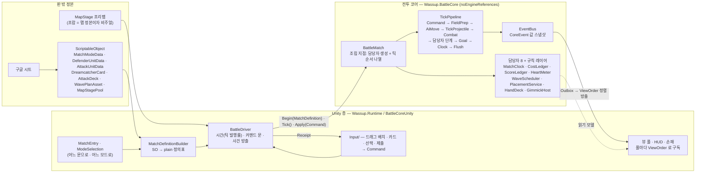
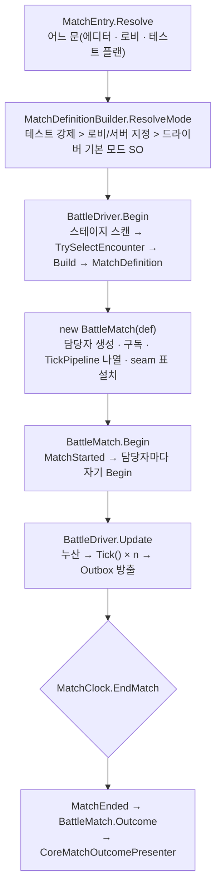

# 전투 핵심 설계도 — 유닛 × 드림캐쳐 × 맵

> **두 층으로 읽는다.**
> **§1 은 아키텍처 중립 설계 아웃라인**이다 — 판 위에 무엇이 존재하고, 어떤 축을 갖고, 어떤 규칙으로
> 맞물리는지를 구현 구분 없이 적는다. 다른 아키텍처의 도면을 그릴 때 **입력으로 쓰는 층**이다.
> 값(숫자)은 적지 않는다 — 값은 SO·시트가 소유하고, 이 층은 축과 규칙만 갖는다.
> **§2 이하는 현행 구현 = 순수 C# 「전투 코어」(`Wassup.BattleCore`)와 그 Unity 층의 구조 지도**다 —
> 누가 무엇을 소유하고, 한 틱이 어떤 순서로 돌고, 사건이 어떤 차례로 뷰에 닿는지.
> 옛 ECS 구현(맥락·큐·시스템 순서)은 `battle-core-rebuild` unit 9 에서 제거됐다 — §9 와 git 이력.
>
> 경계 원칙과 제약은 `../../CLAUDE.md`(「새 전투 코어 — 절대 제약」), 전환 계약은
> `../spec/battle-core-rebuild/README.md`(Feature-wide 계약 13), 게임 규칙은 `ingame-flow.md`,
> 아키타입별 정거장 체크는 `object-pipeline-map.md` 가 소유한다. 코드 포인터는 줄 번호 없이
> **파일·타입·함수 이름**으로만 가리킨다. 구현 상세의 정본은 코드이고, 이 문서가 코드와 어긋나면
> **그 자리에서 이 문서를 고친다.**
>
> 작성 2026-09-03 · §1 추가 2026-09-04 · 전면 재정합 2026-09-21 · **§2~§10 을 전투 코어 구조 지도로 교체 2026-09-25**
> (`battle-core-rebuild` unit 9). 경로는 `Assets/_Project/Scripts/` 기준.

---

## 0. 한 줄

**맵이 경기장을 세우고, 유닛이 그 위에서 싸우고, 드림캐쳐가 유닛의 규칙을 바꾼다.**
셋은 코어 안에서 서로를 직접 부르지 않는다 — 각자 **담당자**가 소유하고, 담당자 사이의 순서는
**사건 구독 순서**(`EventOrder`)와 **틱 단계 목록**(`TickPipeline`)이 정한다. 매니저·브리지는 없다.


```mermaid
flowchart LR
    subgraph OUT["판 밖 정본"]
        SHEET["구글 시트"] --> SO["ScriptableObject<br/>MatchModeData · DefenderUnitData · AttackUnitData<br/>DreamcatcherCard · AttackDeck · WavePlanAsset · MapStagePool"]
        STAGE["MapStage 프리팹<br/>(프랍 = 맵 정본이자 비주얼)"]
    end
    subgraph UL["Unity 층 — Wassup.Runtime / BattleCoreUnity"]
        ENTRY["MatchEntry · ModeSelection<br/>(어느 문으로 · 어느 모드로)"]
        BUILD["MatchDefinitionBuilder<br/>SO → plain 정의표"]
        DRV["BattleDriver<br/>시간(틱 발행률) · 커맨드 문 · 사건 방출"]
        INPUT["Input/ — 드래그 배치 · 카드 · 선택 · 제출<br/>→ Command"]
        VIEW["뷰 풀 · HUD · 손패<br/>풀마다 ViewOrder 로 구독"]
    end
    subgraph CORE["전투 코어 — Wassup.BattleCore (noEngineReferences)"]
        BM["BattleMatch<br/>조립 지점: 담당자 생성 + 틱 순서 나열"]
        OWN["담당자 8 + 규칙 레이어<br/>MatchClock · CostLedger · ScoreLedger · HeartMeter<br/>WaveScheduler · PlacementService · HandDeck · GimmickHost"]
        PIPE["TickPipeline<br/>Command → FieldPrep → AiMove → TickProjectile → Combat<br/>→ 담당자 단계 → Goal → Clock → Flush"]
        BUS["EventBus<br/>CoreEvent 값 스냅샷"]
    end
    SO --> BUILD
    STAGE --> DRV
    ENTRY --> BUILD
    BUILD --> DRV
    DRV -- "Begin(MatchDefinition) · Tick() · Apply(Command)" --> BM
    INPUT --> DRV
    BM --> OWN
    BM --> PIPE
    PIPE --> BUS
    DRV -- "Receipt" --> INPUT
    BUS -- "Outbox → ViewOrder 정렬 방출" --> VIEW
    OWN -. "읽기 모델" .-> VIEW
```

---

## 1. 전투 설계 아웃라인 — 아키텍처 중립

> 이 절의 문장은 「무엇이·어떤 축으로·어떤 규칙에 따라」까지다. 「어떻게 계산하나」는 코드와 spec 의 몫.
> 오른쪽 열의 코드 이름은 현행 구현에서 그 개념을 **찾아가는 포인터**일 뿐, 설계의 일부가 아니다.

### 1.1 판 위에 존재하는 것 (개체 종류)

| 개체 | 설계상 정의 | 현행 포인터 |
|---|---|---|
| **방어유닛** | 플레이어가 코스트를 내고 배치하는 고정 개체. 클래스 5(Ranger·Guardian·Fighter·Caster·Support). footprint(W×H 칸)를 점유하고 몸은 그 **가로 반폭**(세로 깊이는 몸에 기여하지 않는다 — 적은 정면에서 오고 유닛의 크기는 레인을 가로막는 폭이다) | `Data/DefenderUnitData.cs` · `DefenderClass` |
| **적** | 웨이브가 스폰하고 골(마음)을 향해 이동하는 개체. 클래스 4(Tanker·Runner·Bruiser·Shooter) × 등급 3(Normal·Elite·Boss). 몸은 크기 티어에서 파생 | `Data/AttackUnitData.cs` · `EnemyClass` · `EnemyTier` |
| **순찰 소환물** | 아군이지만 이동하는 유일한 개체. 소환사의 담당 구역(사거리) 안을 순찰. 배치 점유·각성·사직서·죽음 보상을 **갖지 않는다** | `SummonPatrolAbility` · 코어 `CombatPhase.SpawnPatrol` · `UnitKind.Patrol` |
| **거점** | 움직이지 않고 공격받는 개체. 방어 마음(=골 타워, HP 는 덱 소유) · 본능(맵 저작, 3×3 점유, 편 소속, 공격할 수 있음) · 적 마음/본능(진영 비트 존재, 현 저작 규칙은 본능만 허용). 유닛 태그를 갖지 않아 배치·카드·코스트 규칙에 걸리지 않는다 | 코어 `BattleWorld.SpawnStructure` — 세우는 자: 본능·적 마음 = `FieldPrepPhase.Begin` · 방어 마음 = `HeartMeter` · `StructureData` · `UnitKind.Structure` |
| **투사체** | 궤적 × 페이로드로 정의되는 발사체(§1.4). 발사 명세(패턴)가 「누구를·몇 발·어떤 간격」을 정한다 | `ProjectileData` · `ProjectilePatternData` |
| **장판(해저드)** | 칸 기반 지속 효과. 존형(모양 × 효과 목록 × 수명) / 차단형(통행을 막는 방벽, 체력 있음) | `HazardSO` · `BlockingHazardSO` |
| **필드 캐리어** | 위치를 가진 규칙 개체. 아군 버프장 · 당김장(토네이도) · 포탈 링크 | `EffectSpawner` |
| **픽업 · 드랍** | 시즌 기믹이 판에 놓는 개체(§1.14). 레드불 픽업(밟으면 소비) · 사직서(사망 드랍, 임계 도달 시 소멸) | `Pickup` · `Resignation` |

**모든 개체가 공유하는 성질**: **진영**(Faction 비트 = 편 × 종류: Defender/Enemy/Neutral × Unit/Core/Instinct + BlockingHazard), **몸**(원 반지름 — 격자 판정은 0), **체력**(+ 실드 슬롯), **위치**, **매치 내 유일 ID**(스폰 순번, 재사용 없음).

### 1.2 유닛 프로파일 — 설계 필드 축

| 축 | 방어유닛 | 적 |
|---|---|---|
| **정체** | 클래스 · 희귀도 · 능력 목록(§1.3 변종) | 클래스 · 등급(Boss 면 CC·어그로 면역 + 위협 귀속 + 등장 경보) |
| **몸·공간** | footprint → **가로 반폭**(저작 필드 없는 파생식) · **배치 층 마스크**(Ground/Path/Air 비트) · 통행 층(순찰용) | 크기 티어 → 반지름(보스만 개별 저작) · **통행 층**(Air 면 지상 차단물을 장애물로 보지 않음) · `flightLift`(뷰 전용 높이) |
| **생존** | 체력 · 사망 각성 보상 · 사망 쿨타임 · 퇴근 쿨타임(사망의 비율) · 보드 상한 | 체력 · 처치 각성 보상 · 안정도 피해(돌격형이 마음에 주는) · 분열(사망 시 자식) |
| **공격** | 사거리(연속 반지름) · 쿨다운 · 히트 딜레이 · 대상 수 · **공격 도형**(전방위 / 주 대상 쪽 부채꼴 / 주 대상 쪽 띠 — 부가 타격에만 걸린다, §1.3 6단계) · 타겟 진영 마스크 · 타겟 통행층 · `targetAllies`(힐러) · **출력 목록**(§1.3) · 투사체 | 공격 방식(None/Melee/Projectile) · 타겟 모드(Nearest/FocusUntilDead) · 교전 이동(Halt/Advance/Pulse) · 타겟 진영/클래스 우선 · 어그로 전용 공격 프로파일 · **나머지(사거리·쿨다운·히트 딜레이·대상 수·공격 도형·출력 목록·투사체)는 방어유닛과 같은 축** |
| **이동** | 없음(순찰 소환물 예외) | 이동 속도 · 경로 축(적 SO 경로 > 웨이브 컨셉 > 레인 기본) · **감지 반경**(`detectionRange`: 0 없음 / >0 반경 / <0 무제한 사냥) |
| **경제** | 코스트 · 배치 쿨타임 · **배치 페이즈 길이**(저작 초가 아니라 **배치 모션 자체**에서 파생 — 모션이 없으면 0) | 웨이브 편성 knob(최소 등장 웨이브 · 웨이브당 상한) |
| **규칙 슬롯** | **소유 줄**(`bindings` — 트리거 × 주체 × 게이트 × 발동 상한 → 효과 id, §1.11): 배치 스킬 = `OnPlace` 줄 · 실드 캐스트 = 주기 × 실드 부여 줄 · 평타 경로 능력은 따로(방향 다연발 · 폭탄 투척 · 소환 — 해저드 캐스트 타입은 남았지만 굽기가 읽지 않는다: 캐스터 제거) | **소유 줄**(`bindings`) — 카드 · 방어유닛과 **같은 형식 · 같은 효과 표**(§1.10~1.11) |
| **특수** | 어그로 수용량(가디언 = 존재가 곧 표식) | 보스 위협표 · 사냥꾼 태그 |

### 1.3 공격 파이프라인 — 한 번의 공격이 거치는 단계

방어유닛과 적이 **같은 파이프라인**을 탄다. 갈라지는 것은 진영과 프로파일 값뿐.

1. **후보 수집** — 타겟 진영 마스크 ∩ 타겟 통행층 ∩ 상태 필터. 판에서 빠지는 것은 **배치 중**(놓였지만 아직 참여 전) · **사망 대기**(파괴 직전) · **판 밖으로 이탈한 도약자**(궁극기의 예고 구간) 셋이다 — **일반 도약은 비행 중에도 후보로 남는다**(공중의 유닛도 맞는다). 마음은 본능이 살아 있는 동안 후보에서 빠진다(§1.13). 거점도 일반 후보(타입 우선순위 없음).
2. **사거리** — 몸과 몸 사이 거리: `d ≤ 사거리 + 내 반지름 + 상대 반지름`. 격자 보정항 없음. **획득·유지·정지는 언제나 이 원 하나다** — 방향 도형은 이 단계에 없고 6단계의 부가 타격에만 붙는다(사거리 안인데 가만히 선 유닛을 만들지 않는 것이 이 분리의 이유).
3. **선정기** — Nearest / Frontmost(진행도) / LowestHealth(힐) · 어그로·도발이 걸려 있으면 그 대상 우선 · **지속 락**(한 번 잡은 대상은 사거리 이탈·사망까지 유지).
4. **쿨다운 · 행동 상태** — 쿨다운은 CC 중에도 계속 감소한다(풀리면 즉시 공격). 「이 유닛이 지금 무엇을 하고 있나」는 **이름 붙은 한 상태**가 답하고, 큰 랭크가 이긴다: **배치 중**(판에 없다) **> 잠김**(기절·수면 또는 도약 비행) **> 교전 중**(스윙을 시작해 타격 판정을 기다린다) **> 유지 중**(소환사가 자기 소환물이 살아 있는 동안) **> 대기**. 공격을 **시작할 수 있는 것은 대기와 유지 중 둘뿐**이다(유지 중도 시도한다 — 소환물이 살아 있으면 스폰을 건너뛰고 쿨만 리셋하는 것이 오늘의 규칙이라, 그 리셋이 없으면 소환물이 죽는 즉시 재소환이 된다). 사망 대기는 이 상태의 입력이 아니라 **1단계에서 이미 판에서 빠지는** 축이다. 「잠김」은 **START 만** 막는다 — 이미 시작한 스윙의 RESOLVE 는 어느 랭크에서도 완료된다. 넉백은 **외력**이라 이 표에 없다(자기주도 행동을 막지 않는다). 「타겟이 있나」는 이 상태가 **모른다** — 타겟 스캔을 복제하지 않으려고 일부러 뺐고, 그건 공격 단계가 자기 결과로 안다.
5. **START** — 애니 신호 · 쿨다운 리셋 · 히트 딜레이 시작.
6. **RESOLVE** — 대상 재판정 → **출력 목록** 적용: `Damage` / `Heal` / `ApplyStat`(스탯 모디파이어) / `ApplyStack`(스택). 근접은 피해 인박스에 직접, 원거리는 투사체 요청. **다중 대상**(대상 수 상한 — 주 대상은 2단계의 원에서 뽑고, **부가 타격만** 「주 대상을 향한 실제 방향」을 축으로 세운 도형 안에서 고른다. 도형 미저작 = 전방위 = 항등원이라 대상 수가 1이면 도형은 아무 일도 하지 않는다) · 카드 공격 변조(튕김·최전열·수면 특효) · 넉백 CC · 가디언이면 **맞은 적**이 곧 어그로 대상(별도 획득 반경이 따로 있는 게 아니다) · **공격 트리거 카운트**(§1.11 Attack seam).

**변종**: 캐스트형(사거리 0 → 캐스트 성사가 곧 그 유닛의 공격 사건) · 방향 지정 다연발(발사 명세, 배치 시 방향 1회 기록) · 폭탄 투척(최근접 적의 **칸**에 던짐, 유도 아님) · 지속 빔(뷰가 고속 틱을 세션으로 뭉침 — 심 개념 아님) · 소환(순찰 소환물 생성).

### 1.4 투사체 · 발사 명세

**투사체의 생애** = 발사 요청(값 스냅샷) → 비행(궤적이 위치와 「도착」을 소유) → 착탄 해결(페이로드가 「무슨 일이」를 소유) → 소멸. 사수는 발사 시점에 쿨다운만 소비하고, 이후 탄은 **자기 수명을 산다** — 대상이 죽어도 셀 고정 탄은 날아가고, 궤도 탄만 주인 소실 = 소멸(「누구 주위를 돈다」가 정의라서).

| 축 | 값 | 규칙 |
|---|---|---|
| **궤적**(9) × **바인딩**(3) | **엔티티 바인딩**: HomingToEntity · BezierHomingToEntity(곡선 추적, 재조준 불가) · SkyFallOnEntity(적을 겨누는 낙하). **셀 바인딩**: BallisticArcToPoint · SkyFall(예고 후 낙하, 위치 이동 없음) · GrenadeToCell(굴러가서 퓨즈) · OrbitAroundPoint(고정점 궤도). **방향 바인딩**: DirectionalLinear(최대 거리) · BoomerangReturn(왕복) | **도착 조건은 궤적이 소유**(임계 거리 / 비행 시간 / 왕복 완료 / 거리 소진). 발사 명세는 바인딩 클래스(엔티티냐 셀이냐 방향이냐)만 보고 궤적 수학을 모른다 — 기존 바인딩으로 분류되는 새 궤적은 발사 코드 변경 0. **한 탄에 조준이 둘이면 안 된다**(궤적=칸·페이로드=적 으로 갈리면 예고 시간만큼 어긋나 헛방) |
| **페이로드**(4) | SingleSplash(직접 대상 + 스플래시 보너스) · TileAoe(착탄 칸 반경 전원, 대상 상한, CC 동반 가능, **진영 대칭** — 거점 포함) · PathHit(매 프레임 경로 스윕, 피해자당 **창 1회** — 창은 재타격 쿨다운, 관통 예산) · SpawnBlocker(착탄 칸에 차단물, 피해 0) | PathHit 에서 「도착」은 착탄이 아니라 **비행 종료**다(직선·궤도·부메랑 공유). 스플래시·튕김·경로 스윕의 피해자 풀은 적 유닛만 |
| **요청이 싣는 것** | 궤적·페이로드 · 원점 **+ 그 자리의 「주인」 몸 반경**(0 = 주인 없는 착탄점 = 칸 반폭) · 피해(flat 값 또는 사수의 **출력 목록** 복사) · 속도/비행시간/아크 높이/퓨즈 · 대상 엔티티 or 착탄점 or 방향+최대거리 · 판정 임계 · **타겟 통행층** · 진영(Enemy/Defender) · 온히트 효과(Poison/Fire/Splash/Slow + 크기·지속) · 스플래시(반경·배율) · TileAoe 반경·상한·CC · 튕김(잔여 횟수·탐색 반경·감쇠) · 재조준 반경 · 우선 대상+배율 · 강타 배율 · 소유자 · 예고 반경 · 시각 인덱스 · **per-shot 값**(베지어 스윙 순번 · 궤도 위상 · 세울 차단물) | 값 스냅샷이다 — 발사 뒤 사수 스탯이 변해도 탄은 안 변한다. **모든 축이 요청에서 오는 것은 아니다**: 관통 예산·재타격 쿨다운은 드레인이 **탄 SO** 에서, 넉백은 **사수 저작**에서 채운다(넉백은 탄의 성질이 아니라 사수의 성질이라서). 반대로 같은 탄 SO 로 **서로 다른** 발을 쏘게 하는 값(스윙 순번 · 궤도 위상)은 요청에 산다 — SO 에 두면 한 유닛의 구슬 넷이 전부 같은 위상으로 겹친다. ⚠ **원점의 몸은 경계를 넘어 실려야 한다**: 즉발 폭발이 이 파이프라인을 타면 착탄 지점의 국소 문맥에서는 「어떤 착탄점」으로 보여 칸 반폭이 옳아 보이지만, 그 자리는 트리거 대상의 몸 중심이다. 실을 값이 없으면 0 을 남긴다 — 「0 = 그 자리는 칸이다」가 §8 불변식 7 의 두 형 구분이 배선에서 갖는 표현이다 |
| **착탄 부가 규칙** | 온히트 효과 적용 · 넉백 · **튕김 재조준**(방금 맞은 대상 제외, 몸 사이 거리로 최근접 생존 후보, 피해 감쇠) · 죽었지만 미파괴인 대상은 시체라 재조준 창이 필요 · 우선 대상(최전열 락) 배율 · 강타 배율 | 피해 귀속은 소유자(사수) — 킬 귀속 · OnKill 트리거 · 위협 누적이 이 축을 쓴다 |
| **저작 언어** | `ProjectileFlightMode`(Homing · BallisticToCell · Directional · BezierHoming · SkyFall · Boomerang · SkyFallOnTarget · BallisticBlocker) 8종 | 저작은 1축, 런타임은 (궤적, 페이로드) 2축으로 **번역**된다. 메테오 = SkyFall × TileAoe, 배럴 = BallisticArc × SpawnBlocker — 전용 개념 없음. ⚠ **번역은 전사(全射)가 아니다**: 8 토큰이 7 궤적으로 가고(배럴과 곡사가 같은 궤적을 공유), **수류탄·궤도 2 궤적은 저작 토큰이 아예 없다** — 그 둘은 탄 SO 가 아니라 요청을 만드는 코드 경로(폭탄 투척 · 궤도탄 의도)가 직접 고른다. 새 궤적을 여는 사람은 「저작에서 닿게 할 것인가」를 따로 정해야 한다 |
| **발사 명세(패턴)** | 「누구를(선정 규칙 RoundRobin · DeterministicShuffle · None · Nearest) · 반경(스코프, host 주변) · 몇 발(샷 스텝 배열: 간격 · 정규화 방향→부채각) · 랜덤화(샷 수·간격) · 재선택 · 예고 · 전원 팬아웃+지연 · 잠금 대상」 | **탄의 성질을 복제하지 않는다** — 새 효과는 탄에 붙인다. 슬롯 = 명세 + 템플릿 요청 + **발사 카운터**(난수 축 = 사수 ID × 카운터). 트리거가 인스턴스를 arm 하면 발사기가 틱마다 발사 명령(후보 **index** 로 대상 지칭, 엔티티 모름)을 만들어 요청으로 번역. 선정 순위 축은 ID 오름차순(구조 결정론) |
| **요청을 만드는 곳** | 기본 공격 RESOLVE(원거리) · 스킬 의도(SpawnProjectile / EmitPattern / SpawnOrbitProjectile) · 폭탄 투척 · 캐스트 사건 · 배럴 폭발 · 발사기 틱 · 판 규칙 직접(퇴근 페이로드 · 실드 파열 폭발 · 사직서 메테오 barrage · **착지 슬램 2종 — 보스 도약 · 궁극기 강습**) | 요청 → 실체화(상태 + ID + 뷰 + PathHit 기록 버퍼 + 출력 버퍼)는 **한 지점**. 요청을 만드는 쪽은 실체화를 모른다 |

### 1.5 피해 · 체력 · 실드 · 사망

- **피해 인박스** → **실드 흡수**(슬롯 합) → 체력 감소 → 0 이면 사망 표시. 실드 합이 양수에서 0 이 되는 순간 = **실드 파열 사건**(트리거).
- 받는 피해 배율 · 최대 체력 배율 · 초당 재생은 스탯 모디파이어(§1.6). 재생은 연출 없이 조용히, 펄스 힐만 연출.
- **힐** = 출력 `Heal` 또는 재생. 대상은 아군 유닛만(거점 제외).
- **사망 통로**: 체력 0 / 시한부 타이머 만료(자폭) / 적의 **골 도달 유출**. 유출은 처치가 아니다 — 점수·각성·마음 회복 셋 다 없다. 분열 적은 사망 자리에 자식을 낳는다.
- **퇴근(회수)은 사망이 아니다.** 각성·드랍·죽음 보상 없음. 대가는 코스트 환급 없음 + 재배치 쿨타임(시간). 부착 카드는 큐로 돌아간다.

### 1.6 상태 효과 3계층 + 실드

| 계층 | 축 | 규칙 |
|---|---|---|
| **스탯 모디파이어** | 스탯 7(DamageMul · AttackSpeedMul · DmgTakenMul · RegenPerSec · MoveSpeedMul · DamageVsCcMul · MaxHealthMul) × 결합(Multiplicative · Additive · Override) × 출처(`ModifierOrigin` **14 — 생산자 있는 12**: OnPlace · Skill · Dreamcatcher · Dreamstone · Tile · Zone · Boss · HealthThreshold · OnHit · Stack · Gimmick · Burnout / **생산자 0 둘**: 기본값 · 은퇴한 인접 시너지 — **번호만 보존**한다. 지우면 뒤 값이 밀려 도메인→ECS 숫자 캐스트가 조용히 어긋난다) | **병합 키는 4축**(누가 걸었나 · 어느 스탯 · 어느 결합 · 슬롯 번호)이고 TTL 로 만료한다 — 「출처 분류」가 키가 아니므로 **서로 다른 둘이 건 같은 종류의 버프는 덮지 않고 각자 산다**(장판 둘·카드 둘이 한 칸을 다투지 않는다). `Override` 가 하나라도 있으면 그 값들의 **최댓값이 이긴다**(적용 순서와 무관 — 열거 번호가 우승자를 정하지 않는다). 같은 키는 **갱신(덮어쓰기)이 기본**이고, **상한을 실으면 갱신이 「누적」으로 바뀐다**(새 값 = min(상한, 기존 + 새 값)) — 광란이 쌓이는 이유다. ⚠ **철회에는 상한을 실으면 안 된다**: 이 엔진의 회수는 슬롯 삭제가 아니라 **항등값 덮어쓰기**(중화)라, 상한이 실리면 min(상한, 기존 + 항등) = 기존 이 되어 **지우기가 조용히 실패한다.** 슬롯 집계 → **실효 스탯** 매 프레임 재계산(집계 결과는 바닥·천장으로 clamp — 곱이 0 이나 무한으로 달아나지 않게). 철회 = 배율 1.0 재적용(중화). 소스: 공격 출력 · 투사체 · 장판 · 필드 · 픽업 · 스택 임계 · 스킬 · Squad 카드 · 효과 타일 · 드림스톤(판 밖) |
| **스택** | 종류(Fire · Ice · Bleed · Poison · Fatigue) × 최대 스택 × **임계 규칙**(atStack × 모드 Edge/Consume → 파생 효과 ApplyDot / ApplyStun / ApplyStat) | Edge 는 **올라가는 길에만** 발화(최대 중첩에서 꺼진다 — 광란이 스택을 못 쓴 이유), Consume 은 임계에서 스택을 소모. 피로는 시즌 기믹이 쌓는다 |
| **CC** | Slow · Impulse(벡터 넉백) · Stun · Sleep (+ 지속 피해 토큰이 해저드 저작용으로만 잔존 — 실제 계층은 아래 별도 행) | **행동 잠금** = **Stun·Sleep**(출처 불문) **‖ 도약 비행** — 「잠겼다」는 새 행동을 못 **시작**한다는 뜻이고, 이미 시작한 스윙과 쿨다운 틱은 계속 돈다(그래야 깨어난 유닛이 즉시 때린다). **넉백은 잠금이 아니다** — 밀려나는 중에도 때린다. 보스 면역은 잠금 집합 **+ 넉백**이라 둘을 한 줄로 쓰면 안 된다. Sleep 은 피격 시 해제(wake-on-hit). 감쇠는 이동 **후**. 넉업은 짧은 Stun 의 연출 이름 |
| **지속 피해** | 슬롯 키 = **출처(Stack · Zone · OnPlace) × 원소(Bleed · Fire · Ice · Poison)** 2축 · 틱 간격 | CC 가 아니라 별도 계층. 두 축을 한 필드로 겸직시키지 않는다(장판 화염과 중첩 화염이 서로 덮는 과피해 재현) |
| **실드** | 슬롯 합(**출처별 슬롯 · 같은 출처 재부여는 max 라 안 쌓이고, 다른 출처는 합산**) · 부여 필터 3(**자기만 / 가까운 순 / 가장 다친 순**) | 피해보다 먼저 깎임(오래된 슬롯부터). **시간 만료가 없다 — 깎여야만 사라진다**(그래서 실드 파열 사건은 시간으로 나지 않는다). 적도 받는다(보스 호위) |

### 1.7 이동 · 경로 (적 · 순찰 소환물)

- **목적지 종류**: 골(여러 개면 전부 소스) · 웨이포인트(경로의 다음 점) · 거점 footprint(가장 가까운 벽면에 도착). 목적지 × **통행 마스크** 조합마다 방향장(flow) + 거리장(dist, 도달불가 표시)을 미리 깐다.
- **프레임 결정 순서**: 외력 합성(넉백은 **분기 앞에서** 한 번 모은다 — 어느 상태로 갈라지든 밀려난다) → **상태 갈림**(멈춰 싸우는 중 · 어그로 추격 중이면 **여기서 끝난다** — 포털·골·당김을 지나지 않는다) → 포털 텔레포트 → 셀 산출·골 도달 판정 → 당김장 변위(이동을 대체하지 않는 후처리) → 교전 이동 정책(Halt/Advance/Pulse) → 스텝 소스 선택 → 방향 평활화 → **충돌 trim**(유닛 통행층별 벽 + 동적 장애물) → **분리**(겹침 해소, 별도 패스라 순서 의존 없음).
- **자기주도 이동 0 ≠ 계산 건너뜀.** 「멈춤」은 자기 변위가 0 이라는 뜻이고 외력(넉백·당김)은 상태와 무관하게 적용된다. 합성 지점은 **한 곳**이다 — 복사본이 늘면 힘이 새로 생길 때마다 일부 상태가 조용히 면역이 된다(실제로 교전·도발·순찰·고립 상태가 통째로 넉백 면역이었다).
- **스텝 소스 우선순위** = 어그로 > 감지 > 웨이포인트 > 거점 > 골. 위가 아래를 **잠시 덮는** 구조다 — 어그로와 감지는 「지금 여기서 벌어진 일」이고 웨이포인트는 맵이 「이 길로 와라」고 정한 계약, 거점 선택은 그 안의 전술이다. 순서를 뒤집으면 저작이 조용히 무시된다. 순찰 소환물은 이 줄 밖이다(자기 거점 박스가 목적지라 골 판정도 함께 갈아탄다).
- **어그로**: 가디언이 **히트로** 획득(수용량 · 선점 게이트) → 적은 가디언 인접 셀을 추격. 도발도 **같은 채널**이지만 **수용량과 선점 둘을 우회한다**(나중에 부른 도발이 이긴다) — 그래서 「집단 도발」이 수용량 저작과 무관하게 성립한다. **감지**(`detectionRange != 0`)는 그 아래 층이다 — 반경 안에 «때릴 수 있는» 방어유닛이 있고 **«내 통행 층»으로 그 대상까지 갈 수 있으면** 그쪽으로 간다(못 가면 원래 가던 길). 놓는 규칙은 셋이다: **유지**(이미 문 대상은 경계에서 흔들리지 않게 조금 더 봐준다) · **관성**(대상이 죽거나 반경을 벗어나면 잠깐 다음 대상을 찾아보고, 없으면 경로 복귀 — 사망과 이탈이 같은 경로를 지난다) · **막힘 해제**(사냥 중인데 자기 힘으로 못 가는 상태가 이어지면 감지를 놓고 한동안 다시 감지하지 않는다). ⚠ 막힘 해제는 **무제한 감지에 적용하지 않는다**(「전멸시켜야 골에 간다」가 그쪽의 저작된 성질이라 풀면 유출 통로가 열린다). CC·도약 중은 「막힘」이 아니다 — 남이 묶은 것을 자기 실패로 세면 잠깐 재운 사이에 감지가 풀린다. 필드는 감지 종류로 갈린다: **유한 반경 = 대상 지향 추격판**(`DetectionChaseDist`/`Flow`, 적별 · 층 인지) · **무제한 = 공용 사냥판**(`DefenderFieldSingleton`, 「아무 방어유닛이나」라서 그게 맞는 질문). 규칙에 **비행 분기가 없다**(enemy-detection-range 계약 13). 골을 지나쳐도 유출하지 않는 leak-proof 는 **무제한(`< 0`, 보스·보너스) 전용**이고 유한 반경 감지에는 상속되지 않는다(enemy-detection-range 계약 9). 보스 블링크 목적지 = 밀집 셀 질의(위협표는 누적만, 소비자 없음).
- **골 도달**: 돌격형(마음을 칠 마스크가 없음) = 마음에 안정도 피해 후 소멸(유출) / 공성형 = 살아서 거점을 공격. 도달 판정은 1회 고정.
- **군집 규칙**: 통과 여유 < 밀어냄 폭이면 교착 — 몸 반지름은 군집 통과로 검산한다(단독 통과 아님).

### 1.8 맵 모델

- **셀** = 종류(Walk / Deco) + **배치 층 비트**(Ground · Path · Air). 배치 가능 = `(셀 층 & 유닛 층) != 0` 하나. 통행 가능 = 종류에서 파생한 층 ∩ 유닛 통행층 — **배치 마스크로 통행을 판정하지 않는다**(둘은 직교).
- **저작 요소**: 스폰(레인 번호 = 웨이브 결정론 키 · 레인별 기본 경로) · 골(**여럿 가능** — 각 스폰이 「아무 골이든」 닿으면 연결성이 성립한다. 기계는 다중 골을 그대로 지원하고, 콘텐츠 쪽은 마음 하나로 통일됐다) · 루트(웨이포인트 순서) · 거점(본능, 편) · 보너스 포탈(없거나 짝) · 차단 footprint · 배치 금지 구역.
- **저작이 아닌 맵 요소 — 효과 타일**: 어느 칸이 효과 타일이 되는지는 저작이 아니라 **테마 + 맵 시드**가 정한다(배치 가능한 칸 중에서 뽑는다 — 경로 위로는 번지지 않는다). 스테이지는 「이 맵엔 두지 마라」만 말할 수 있다. 효과는 그 칸에 유닛이 **놓일 때 1회** 부여되고 회수되지 않는다.
- **불변 조건**: 전 스폰 → 골 도달 가능(실패 = 판 불가, 폴백 맵 없음). 스폰·골·거점 칸은 배치 폐쇄.
- **판 중 변화**: 배치 유닛·차단 해저드 = 동적 장애물(필드 재빌드). 저작본은 불변.
- **좌표**: 시뮬은 격자 원점 0 의 평면 좌표. 뷰 변환은 한 곳, 시뮬 높이는 화면 세로에 더하지 않는다.

### 1.9 웨이브 모델

- **덱**(적 편성) = 적 풀 + 웨이브 수·규모·간격 knob + 수량 곡선(성장률 · 지터 · 두 단계 램프 경계) + 컨셉 풀·블록 길이 + 보스(풀 · 주기 · 호위 수) + 당김 상한 + 제한시간 + 마음 HP·처치 회복 배율. 맵과 (stage, deck, plan) 짝으로 잠긴다. **보너스 웨이브는 덱 밖이다** — 포탈 칸은 맵이, 나머지(적·마리수·간격·킬 임계·스트레스 게이트)는 판 전체가 하나로 갖는다.
- **생성**(시드 1 스트림): 웨이브 수 → 컨셉 블록(가중 룰렛 · 게이트: 최소 웨이브·레인 수·직전 배제) → 레인 배정(같은 laneGroup = 같은 레인) → 총량 분배 → 보스 후처리(N 웨이브마다 삽입 + 호위 — 호위는 그 블록 컨셉의 **성질과 입구**를 입되 **수량은 보스 파라미터가 소유**한다). 저작 플랜은 RNG 미사용.
- **수량 곡선은 두 단계일 수 있다**: 경계 웨이브를 저작하면 그 앞은 평탄 상승(난이도 대신 컨셉 다양성이 판을 끈다), 경계부터는 지수 상승 = **클라이맥스**. 안 저작하면 처음부터 지수 하나다.
- **변주 편성**: 컨셉은 본 편성 위에 **끼어드는**(교체가 아닌) 편성을 하나 더 가질 수 있다. 블록 **가운데** 웨이브에만 들어가고(첫 웨이브는 성격을 가르치는 자리, 마지막은 그 성격의 시험대), 클라이맥스 구간에서는 **매 웨이브** 들어간다. 총량은 곡선이 그대로 소유하므로 슬롯이 늘면 같은 총량을 더 잘게 나눈다. 변주는 **입구를 새로 뽑지 않는다** — 블록이 확정한 배정을 물려받는다.
- **컨셉 슬롯 = 한 무리의 명세**이고 축이 넷이다: **어디로 들어오나**(같은 값 = 같은 입구 · 무지정이면 전 입구 분산) · **무엇이 오나**(적의 성질) · **어느 고도로**(지상 기본 — 비행은 「공중」을 명시한 슬롯만 받는다. 기본을 열면 초반 웨이브에 대공 없이 못 막는 적이 나온다) · **어느 길로**(맵 경로 지정). 요구 레인 수는 저작이 아니라 슬롯에서 **파생**한다 — 저작하면 둘이 갈려 게이트가 뚫린다.
- **펼침**: RoundRobin(라운드마다 그룹 순서로 1기) / PerGroupTimeline(저작).
- **큐잉**: 시드 플랜은 **사건 구동**(첫 웨이브 · 전멸 · 상한 도달), 저작 플랜은 시각 구동. **당김** = 다음 웨이브 즉시 투입, 타이머는 안 당겨진다, 「정리한 뒤로 N회」 상한.
- **보너스 웨이브**(당기기 제안) = 포탈 칸(맵) × 킬 임계(유닛) × 스트레스 게이트(마음) → 일반 웨이브와 **다른 경로**.
- **경로 우선순위**: 적 SO 경로 > 웨이브 컨셉 > 레인 기본(비행 적의 경로는 강을 건너는 수단이라 컨셉이 SO 를 못 이긴다).

### 1.10 드림캐쳐 모델

- **카드** 한 종류 = `type`(Squad / Unit / Active) + `bindings`(소유 줄 — 트리거 × 효과 id, §1.11 · 방어유닛 · 적과 같은 형식) + `hostKinds`(붙을 수 있는 숙주 종류 — 기본 방어유닛 · 표식 카드 = 적) + 부착 제한(Class / UnitId) + 비용(type 별) + 유출 허용치 + (Active 만) 쿨다운 · 두 칸 조준. **type 별 줄 모양**: Squad = 진영 버프(`FactionStatBuff` — 수혜 대상 = 효과의 `allyFilter`: ClassRanger/ClassGuardian/Cost1/All) 줄만 · Unit = 트리거 줄(부착 즉시 포함) + 상시 공격 수식자 줄(튕김 · 최전방 · 수면 특효 — 트리거 없음) · Active = 시전(`Cast`) × 액티브 효과 한 줄(`skill` 은 문안 칩 · 덱 구성만 읽는다).
- **트리거 게이트 축**: HpBelow × 대상(Self / EventTarget). 배선 조합은 화이트리스트.
- **큐** = 저장 덱 + 이번 판 공용 액티브(전원 동일), 매치 시드 셔플 1회. **손패** = 큐 앞 N 의 뷰. **순환**: 부착형은 host 소멸 시 큐 **뒤** / 액티브 사용 즉시 **뒤** / 「인수인계」 카드가 붙어 있으면 그 유닛의 **다른** 카드는 큐 **앞**. 실패한 부착은 차감·순환 없음.
- **부착 상한**(유닛당) — 판 규칙이 아니라 손패 규칙(시뮬은 모른다).
- **각성 게이지**: 소스 2 — 적 처치(표식 배율 baked 값) · 아군 사망(SO 값). 상한 초과분은 소멸. 시간 충전 없음. 비용은 type 별.
- **적용성**(붙일 수 있나): host 프로파일(아키타입 Standard/FacingVolley/BombThrow · **실제로 타는 발사 경로**(없음/유도/포물/직선/투척) · 적을 때리는가 · 피해 출력이 있는가 · 시한부/고치 상태) → 거절 사유. 판정은 **host 종속 조건만** 본다 — 「값이 0 이다」처럼 어느 host 에서나 답이 같은 것은 이 층 밖이다. ⚠ **발사 경로는 탄 SO 의 선언이 아니라 그 host 가 실제로 타는 길이다**(같은 탄을 쓰면서 다른 경로로 나가는 유닛이 있다). bake 와 UI 프리플라이트가 **같은 함수**.
- **세 type 의 실체**: Squad = 매치 지속 스탯 배율(신규 배치 상속, 철회 = 중화) / Unit = host 의 규칙 슬롯 / Active = 타일 조준 스킬(쿨다운).
- **설계 지향**: 규칙·행동을 바꾸고 스탯을 올리지 않는다. 체급은 **드림스톤**(판 밖 스탯 배율, 등급 있음)이 공급한다.

### 1.11 스킬 모델 — 규칙 슬롯의 공통 실행 어휘

**한 어휘, 모든 소유자.** 카드 · 방어유닛 · 적이 **같은 소유 줄**(트리거 × 주체 × 게이트 × 발동 상한 → 효과 표 id)을 든다 — 카드 규칙 · 적 규칙 · 방어유닛 배치 스킬 · 실드 캐스트 · 액티브 시전 · 퇴근 효과가 전부 같은 「트리거 × 효과 → 스킬」 레일을 탄다. 진영 개방은 트리거 단위(배치·퇴근은 적에게 사건 자체가 없다).

- **트리거**(11): None(부착 즉발 · 상시 효과의 보유 시작) · AttackN(N번째 공격) · OnDamagedN · OnDeath · PeriodicTimer · HealthThreshold · OnKill · OnShieldBreak · OnRetire · OnPlace · **Cast**(액티브 시전 — 플레이어 입력이라 감지자가 없다. 저작 · 검증 어휘이고 정의표 규칙 줄에는 `None` 으로 굽힌다).
- **효과 종류**(43 — 옛 이름 「페이로드」) → **라우팅** → 스킬 id. 대부분 효과 종류만으로 정해지고, 소수는 트리거에 따라 갈린다(예: 죽음·처치·퇴근 계열의 광역은 「실려 온 자리」 스킬, 살아 있는 계열은 「자기 발밑」 스킬 / 경계에서 켜진 자기 버프는 「빈사에서 켜졌다」라 출처가 갈린다). 라우팅 표는 bake 와 범위 프리뷰가 **같은 함수**를 부른다. **라우팅 표 밖 둘**: 액티브 시전 6(시전과만 짝 — 카드 빌더가 실행자를 레지스트리 id 로 고른다) · 상시 효과 4(아래).
- **어휘 밖 7 + 상시 4.** 스킬이 아닌 일곱은 **이유가 일곱 다 다르다**: 센티넬 · **발동 규칙**(지금 실행이 아니라 앞으로의 배치에 적용될 규칙을 등록한다 — 등록·조회·해지 세 시점) · **자기참조**(「N번째 공격이 세진다」는 자기를 부른 사건 자체를 바꾸는데 스킬 발화점은 정의상 그 뒤다) · **다른 배선**(분열은 소유 줄이 아니라 적 고유 값 — `splitUnit` · `splitCount`) · **손패 UI**(심이 아니다) · **이관됨**(융단폭격 → 발사 명세) · **죽은 값**. **상시 효과 4**(진영 버프 · 튕김 · 최전방 · 수면 특효)는 새 비스킬 축이다 — 보유 시작 순간부터 계속이라 발화점이 없다. 코어에 「상시」 트리거를 두지 않고 빌더가 기존 코어 모양으로 편다(진영 버프 = 「남의 배치 × 자기 스탯 버프(영구)」 줄 · 나머지 셋 = 공격 수식자 — 강타 선례). 한 이유로 뭉뚱그리면 다음 후보를 잘못 분류한다. 정본은 정책 표 하나(`SkillRouting.IsSkill`)이며, **스킬인데 라우팅이 없으면 bake 가 짖고 거절한다** — 침묵으로 넘기면 슬롯은 구워지고 트리거는 발화하고 그 뒤 아무 일도 안 일어난다(실제로 한 조합이 그렇게 죽어 있었고 테스트는 전부 초록이었다).
- **발화 시점(seam) 7** = 감지자가 다른 사건 창을 가질 때마다 하나: 주기·배치 / 공격 해결 / 체력 경계 / 피격·처치·실드 파열(파괴 **앞**) / 자기 죽음·퇴근(파괴 **뒤** — 시전자가 없다) / 캐스트 성사 / 즉시(부착·액티브, 동기). **감지는 분산, 실행은 단일.**
- **스킬** = 무상태 concrete(33 — 해저드 캐스트 스킬은 캐스터 제거로 빠졌다) : `(시전자[없을 수 있음], 대상[유닛|셀|위치], 값 스냅샷, 컨텍스트) → 의도 방출`. 상태를 직접 바꾸지 않는다. 진영은 시전자 상대적(호출자 = 소유자), 플레이어 시전은 시전자 없음.
- **의도 어휘**(24 + 메타 2): 피해·회복(DealDamage · Heal) / 상태(ApplyStatModifier · ApplyStack · ApplyCc · ApplyDot · ClearCc · GrantShield) / 표적(Taunt · CreditThreat · ScaleKillReward) / 이동(Blink · BeginUltimateLeap) / 생성(SpawnProjectile · EmitPattern · SpawnOrbitProjectile · SpawnZoneCarrier · SpawnFieldCarrier) / 진행형 개시(BeginDreamCocoon · StartLethalTimer · GrantCharge · DelaySelfAttack) / 관측(Report · PlayVisual) / 자원(GainCost · ReduceSkillCooldown).
- **컨텍스트 질의**: 자리(위치·셀·셀 중심·타일 크기·바라보는 방향) · 정체(진영·체력·실효 스탯·술어 8종·통행층·실드) · 후보(Opponents/Allies + 필터 7) · 격자 판단(밀집 셀·착지 셀) · 발사 명세 조준 필요 여부.
- **진행형 상태**는 스킬이 아니라 개체의 상태다(도약 비행 · 수면 완주 감시 · 시한부 · 궤도 탄) — 스킬은 개시와 수치까지.
- **통합 효과 층 계약**(`unified-effect-layer` · 2026-09-28 확정 — `docs/spec/unified-effect-layer/README.md` 계약 1~5 · 전수 표 `census.md`). 원점은 드레인(`TriggerDispatcher.Execute`) 한 곳이 `SkillOrigin`(`Scripts/Skills/ISkill.cs`)에 채우고 concrete 는 `target.Origin` 만 읽는다 · 발사 요청은 `IntentApplier.SpawnProjectile` 한 갈래 · 버스트 슬롯은 발동 주체(`PatternSlotState.Subject`)에서 쏜다 · 저작 검증은 `Trigger/EffectComboRule.cs` 하나:
  1. **원점은 두 값** — 발사 자리(발동 주체 = 사건 주체, 없으면 스냅샷) · 효과 좌표(조준 대상의 자리 또는 사건이 실은 자리 + 선택적 대상 엔티티). 효과는 출처를 모른다.
  2. **원점 항은 효과의 형이 정한다**(제약 13) — 몸형 = 원점 주인의 몸(감지자 스냅샷) · 자리형 = 0(칸 반폭). 키 = (트리거 × 효과 형).
  3. **호밍 여부는 탄 궤적의 성질** — 발사 요청 조립은 궤적 결합 종류(대상 · 칸 · 방향)로만 갈린다.
  4. **귀속·발사 자리 = 발동 주체 · 수명 = 발동 주체 ∧ 바인딩을 든 자.** 출처(`BindingOrigin`)는 수명·표기 꼬리표.
  5. **저작 검증은 하나** — 출처(카드 · 유닛 능력 · 악몽)는 검증 입력이 아니다.
- **스킬 데이터 표 계약**(`skill-data-table` · 2026-09-29 구현 — `docs/spec/skill-data-table/README.md` 계약 1~10 · 표 설계 `tables.md` · 인계 `6_handoff_summary.md`). 코어 = `MatchDefinition.Effects`(`EffectDef` · 규칙 줄 `BindingDef.EffectIndex`) · 저작 = 효과 SO `EffectData`(`Data/Effects/`) + 소유자 `bindings`(`BindingSpec`) · 굽기 한 경로 `BindingSpecBuilder` · 시트 탭 `Skills` · `SkillOwners`(`SkillSheet`):
  1. **정체는 효과 줄에 있다** — 효과 표(종류 + 수치 + 수치 방식 + 안정 `Id`)가 탄·패턴·장판 표와 나란한 넷째 id 참조 표. 수치가 다르면 다른 줄 · 소유자별 덮어쓰기 없음. 피해는 효과 줄에만(패턴·장판·길막은 모양).
  2. **소유 = 참조 줄** — 카드 · 유닛 · 적이 같은 (트리거 · 주체 · 게이트 · 발동 상한 → 효과 id) 줄을 든다.
  3. **스킬은 소유자를 묻지 않는다** — 소유자마다 달라야 하는 결과는 그 상태의 담당자가 진영으로 정한다.
  4. **부여 게이트 ↔ 실행 분리** — 카드 `HostKinds`(기본 방어유닛)를 굽기가 종류마다 검증 · 실행은 숙주를 모른다.
  5. **보장 대신 검증** — 「아무 소유자 × 아무 스킬」의 계약은 `EffectComboRule` 이다.
  6. **서버 어휘 = 효과 id** — 정의표 줄 번호는 정체가 아니다.

### 1.12 경제 · 자원

| 자원 | 얻는 곳 | 쓰는 곳 | 규칙 |
|---|---|---|---|
| **코스트** | 시작값 · 초당 재생(**판 밖 드림스톤이 배율을 건다**) · 스킬(GainCost) | 배치 | 상한 있음. 퇴근 환급 없음, 재배치 재지불. 재생 배율의 소유자는 **매치 진입 1회**뿐이다 — 판 중 리셋(재시작·배치 페이즈 재진입)이 이 값을 만지면 장착한 스톤이 조용히 지워진다 |
| **배치 쿨타임** | 유닛별 저작 | 같은 유닛 재배치 | 사망 쿨타임 · 퇴근 쿨타임(사망의 비율)이 별도로 겹친다. 보드 상한 |
| **각성** | 처치 · 아군 사망 | 카드 사용(type 별 비용) | 초과 소멸, 시간 충전 없음, 퇴근은 0 |
| **액티브 쿨다운** | 시간 · 스킬(ReduceSkillCooldown) | 액티브 카드 | 카드마다 |
| **당김 크레딧** | 「정리한 뒤로 N회」 | 웨이브 즉시 투입 | 필드를 비우면 리셋. 상한은 덱 소유(전원 동일) |
| **유출 허용치** | 카드 선불 | 부착 조건 | 부착 시 결제 |

### 1.13 마음 · 판정 · 점수

- **마음** = 방어 거점의 체력. **스트레스** = `(1 − hp/max) × 100`(읽기 어휘일 뿐, 판정은 체력 0). 돌격형 도달이 깎고, 처치가 회복한다(적 SO 의 각성 보상값 — 표식 배율은 겸직 안 함). 본능이 살아 있으면 마음 무적(공성 우선 대상).
- **종료 통로 3**: 제한시간 만료(`complete`) · 첫 마음 붕괴(`stress_full`, 남은 시간 몰수) · 유저 제출(`submitted`, 개방 시점 이후). **넷째를 만들면 패배 조건의 부활.**
- **점수** = 처치 수(개체 1킬 = 1점, 보스·분열체도 1). 유출 감점 없음. 제출은 생값. 마음은 판정에 관여하되 점수에 관여하지 않는다.

### 1.14 시즌 기믹 — 판 규칙 수식자

시즌 = 맵 테마 + 기믹. 기믹은 판 전체에 얹히는 규칙이고, 스킬 어휘 밖이다(자기 시스템 + self-gate).

| 기믹 | 규칙 |
|---|---|
| 과로(레드불) | 주기 스폰 픽업. 밟으면 공속 버프 + 최대 체력 컷(라스트런) |
| 번아웃 | 배치 유닛에 주기적으로 피로 스택 → 임계에서 파생 효과 |
| 사직서 | 방어유닛 자연 사망 시 드랍. 임계 도달 시 소모 → 메테오 barrage |
| 온천 | 전 유닛에 열기 누적 → 회복/손실 |

### 1.15 결정론 계약 (설계 요건)

- 매치 시드 1 → salt 파생 계열(맵 · 웨이브 · 뷰 지터 · 픽업 · 기믹 · 메테오). 토너먼트는 맵·덱 선택을 **서버 시드**로.
- 개체 ID 는 스폰 순번, 재사용 없음, 프로세스 밖으로 나가는 유일한 축(엔티티 핸들은 기록에 싣지 않는다).
- 분산·지터는 RNG 보다 **구조 결정론**(순번 · row-major · 정렬 규약) 선호.
- 고정 스텝으로 완주 가능해야 하고, 판의 「조건」은 해시로 접어 골든과 함께 저장한다.
- 값의 정본은 판 밖(시트 → SO)이고 판 안으로 한 방향으로만 흐른다.

---

## 2. 경계 — 코어와 Unity 층

| 층 | 어셈블리 · 폴더 | 갖는 것 | 갖지 않는 것 |
|---|---|---|---|
| **전투 코어** | `Wassup.BattleCore`(`BattleCore/`, `noEngineReferences`). 참조 = `Unity.Mathematics` · `Wassup.Skills` · `Wassup.UnitAi` 셋뿐 | 판정 · 상태 · 순서 전부. 폴더 = `Match/`(조립·정의표·커맨드·사건) · `Owners/`(담당자) · `Phases/`(틱 단계) · `World/`(개체) · `Map/` · `Move/` · `Combat/` · `Effects/` · `Trigger/`(트리거→발동) · `Wave/` · `Goals/`(매치 목표) · `Trace/` · `Harness/`(골든 러너) | `UnityEngine` 타입 · SO · 아트 참조 · 프레임 시간 · 로거(진단은 `BattleMatch.Report` 통로로 **밖에** 넘긴다) |
| **Unity 층** | `Wassup.Runtime` 안의 `BattleCoreUnity/` | ① **정의표 물질화** — `MatchDefinitionBuilder`(+ `CombatDefinitionBuilder` · `CardDefinitionBuilder` · `BindingDefinitionBuilder` · `BoardEffectDefinitionBuilder`) ② **시간** — `BattleDriver` ③ **뷰** — `View/` · `Hud/` · `Cards/` · `CoreBattleAudio` · `CoreMatchOutcomePresenter` ④ **입력** — `Input/`(`DragPlacementInput` · `CardInput` · `SelectionInput` · `SubmitInput`) ⑤ **진입** — `MatchEntry` · `ModeSelection` | 규칙. 판정·상태·저장이 여기 들어오면 그것이 새 브리지의 첫 줄이다 |

- 세 축이 코어에서 무엇으로 존재하나:
  - **유닛** — `World/Unit.cs`(종류 `UnitKind`: Defender · Enemy · Patrol · Structure · BlockingHazard — 거점과 길막도 유닛의 종류다) + 부분(`UnitParts.cs` · `CombatParts.cs` 의 `AttackState` · `MoveState` · `Detection` · `Aggro` · `Footprint` …). 「그 부분이 있나」 분기 대신 nullable 부분 + 한 술어 `Unit.IsTargetable()`. 행동 상태의 **결정**은 `Wassup.UnitAi` 가 하고 코어(`AiMovePhase`)는 입력을 만들어 답을 저장한다.
  - **드림캐쳐** — 개체가 없다. 자원(큐·손패·각성·부착)은 `HandDeck`, 규칙은 `Trigger/` 의 `Binding`(`BindingRegistry` 가 숙주별로 든다). 카드 → `BindingDef` 굽기는 Unity 층 `BindingDefinitionBuilder`.
  - **맵** — 판 밖 `MapStage` 프리팹 → `BattleDriver` 가 `MapStageScanner.Scan` → `DioramaMapBuilder.Assemble` → `MatchDefinitionBuilder.BuildMap` 으로 plain `MapSnapshot` 을 만든다. 판 안은 `Map/MapRuntime.cs`(`Snapshot` · `Flow` · `Nav` · `Obstacles` · `Hunt` · `Occupancy`) — 한 번 서고 판 내내 읽힌다(흐름장은 장애물 시그니처로 재빌드).
- sim↔view 변환은 `Core/BoardSpace.cs`, 그 평면(격자) 선언은 `View/CoreBoardPlane.cs` 한 곳이다.

---

## 3. 한 판의 생애


```mermaid
flowchart TD
    E["MatchEntry.Resolve<br/>어느 문(에디터 · 로비 · 테스트 플랜)"] --> M["MatchDefinitionBuilder.ResolveMode<br/>테스트 강제 > 로비/서버 지정 > 드라이버 기본 모드 SO"]
    M --> B["BattleDriver.Begin<br/>스테이지 스캔 → TrySelectEncounter → Build → MatchDefinition"]
    B --> C["new BattleMatch(def)<br/>담당자 생성 · 구독 · TickPipeline 나열 · seam 표 설치"]
    C --> G["BattleMatch.Begin<br/>MatchStarted → 담당자마다 자기 Begin"]
    G --> T["BattleDriver.Update<br/>누산 → Tick() × n → Outbox 방출"]
    T --> X{"MatchClock.EndMatch"}
    X --> O["MatchEnded → BattleMatch.Outcome<br/>→ CoreMatchOutcomePresenter"]
```

| 단계 | 진입점 | 일어나는 일 |
|---|---|---|
| **진입** | `MatchEntry.Resolve` → `MatchEntryPlan` | 로비가 남긴 편성·덱·돌·테스트 플랜을 **값으로** 푼다(판정 0) |
| **모드** | `MatchDefinitionBuilder.ResolveMode` | 3단 서열 — 테스트 강제 > 로비/서버 지정(`ModeSelection`) > `BattleDriver` 저작 기본 `MatchModeData`. 모드를 읽는 유일한 지점 |
| **맵 선택** | `MatchDefinitionBuilder.TrySelectEncounter` | dev 강제 인덱스 > 디버그 고정 맵 시드 > 서버 토너먼트 시드 > 0번. 맵·덱·플랜이 **같은 인덱스로 잠긴다** |
| **정의표** | `MatchDefinitionBuilder.Build` → `MatchDefinition` | SO 를 plain 수치·열거형으로 굽는다(아트 참조 0). 적 목록을 여기서 모아 웨이브가 **인덱스**로 부른다. `ConfigHash` 를 박는다(§7) |
| **조립** | `BattleMatch` 생성자 | 담당자 생성 순서 = 같은 `order` 구독의 tie-break(§6). 규칙 레이어(`BindingRegistry` · `TriggerDispatcher` · `CoreSkillContext` · `IntentApplier` · `ResignationBarrage` · `GimmickBindings`)를 꽂는다. `SeamTickOrder.From(pipeline)` 으로 seam 순서표를 만든다 |
| **판 경계** | `BattleMatch.Begin` | `MatchStarted` 를 **첫 틱 전**에 발행 → `MatchClock` · `CostLedger` · `ScoreLedger` → 거점(`FieldPrepPhase.Begin` — **본능이 마음보다 먼저**, id 발급 순서라 골든 축) → `HeartMeter` · `PlacementService` · `WaveScheduler` · `HandDeck` · 판 수명 바인딩 · `GimmickHost` · 기믹 규칙 · `IMatchGoal.OnBegin` → 플러시. 「판 경계」를 부르는 한 함수는 없다 — 담당자마다 자기 `Begin` |
| **배치 페이즈** | 국면 = `MatchClock` · 커맨드 `FinishPlacement` | 배치 창도 코어가 돌리는 틱 안이다(배치·착지·활성화는 `PlacementService`). 창을 닫는 경로는 `MatchClock.FinishPlacement` 하나(자동 시작 카운트다운도 합류) → `PlacementPhaseChanged` → `CostLedger` 재생 켜짐 |
| **종료** | `MatchClock.EndMatch(MatchEndReason)` | 문은 **하나**, 사유 3(`Complete` · `Submitted` · `StressFull`), 호출처 4 — 시간 만료(`MatchClock`) · 목표 달성(`MatchGoalContext.Complete`) · 제출 커맨드(`CommandPhase`) · 마음 붕괴(`HeartMeter`). 종료 뒤 `Tick()` 은 no-op |
| **성적** | `BattleMatch.Outcome` → `IMatchGoal.BuildOutcome` | 성적 조립 지점은 하나. 결과 화면·제출은 `CoreMatchOutcomePresenter`(`submitsReport && allowSubmit` 일 때만 보고) |

### 3.1 매치 모드 — 닫힌 집합

- 저작 = `Data/MatchModeData.cs`(SO, 필드 append-only, `modeId` 는 리네임 금지) → 굽기 = `Match/ModeDef.cs`(plain).
- 목표 종류 = `GoalKind`(KillScoreTimed · WaveClear · TimeAttack, append-only) → `MatchGoals.Create` 가 concrete(`KillScoreTimedGoal` · `WaveClearGoal` · `TimeAttackGoal`)를 만든다. 목표는 담당자 읽기 모델(`MatchGoalContext`)로 「끝났나 / 몇 점인가」 둘만 판정하고, 쓰기 권한은 `EndMatch` 하나다.
- 축 enum: `ClockKind`(FixedLimit · CountUp) · `WaveSourceKind`(GeneratedFromDeck · AuthoredPlan).
- **담당자는 모드를 모른다**(담당자 안 `if (mode == …)` 금지 — `CoreArchitectureTests` 가 소스로 검사). 모드는 값을 덮어쓰지 않고 «어느 저작 자산을 쓸지» 고른다.
- **재현 = modeId + seed.** 모드는 시드에서 파생하지 않는다. 설계 근거는 `../spec/battle-core-rebuild/match-mode-design.md`.

---

## 4. 한 틱 — `TickPipeline`

`BattleMatch` 생성자가 나열한 목록이 **곧 계약**이다(`Match/TickPipeline.cs` 는 목록을 돌 뿐). 순서를 바꾸는 것은 규칙을 바꾸는 것이다. 실제 순서는 에디터 메뉴 `Wassup/BattleCore/Harness/Print Tick Order` 로 찍힌다.

| # | 단계 | 담당 | 안에서 도는 순서 · seam |
|---|---|---|---|
| 0 | `CommandPhase` | 커맨드 | 틱 시작 표시(`TriggerDispatcher.BeginTick`). 커맨드 자체는 **틱 밖** `Apply` 에서 동기 적용 — **[Immediate]** |
| 1 | `FieldPrepPhase` | 장 준비 | 장애물 재빌드 → 어그로 → 사냥판 → 순찰 → 존 → 아군 장 → 지속 피해 → **[Periodic]** |
| 2 | `AiMovePhase` | 이동 | 행동 상태(UnitAi) → 도발 부여 → 거점 목적지 → 감지 → 이동 → 분리 |
| 3 | `TickProjectilePhase` | 투사체·효과 | 발사 요청 실체화 → 비행 → 소멸 → 사직서 임계 → 효과 슬롯 → 스택 누적 → 판 위 캐리어 시계 → 길막 노후화 → 라스트런 → 픽업 |
| 4 | `CombatPhase` | 전투 | 후보 수집 → 공격 → 발사 명세 전진 → **[Attack]** → 피해 → **[Death]**(디스패처 드레인 뒤 `EnemySplit.Run` · `BlockerSpawn.ExplodeBroken`) → CC 플러시 → 소멸 → **[Lifecycle]** → 체력 경계 → **[Threshold]** → 도약 → 실드 스테이징 |
| 5 | `HeartMeter` | 마음 | 마음 방패 관찰 · 타워 인박스 드레인. **담당자 단계 맨 앞** — 붕괴가 판을 끝내므로 뒤에 두면 무너진 판에서 웨이브가 한 번 더 나온다 |
| 6 | `PlacementService` | 배치 | 재배치 대기 · 배치 활성화(이번 틱 활성화 → 다음 틱 전투 참여 = 배치 페이즈 길이의 정의) |
| 7 | `CostLedger` | 코스트 | 재생 |
| 8 | `WaveScheduler` | 웨이브 | 예약 · 스폰 |
| 9 | `HandDeck` | 손패 | 액티브 재사용 대기 |
| 10 | `GoalPhase` | 목표 | 「끝났나」 — 담당자들이 다 돈 뒤 |
| 11 | `MatchClock` | 시계 | 틱 번호 · 시계 · 시간 만료 종료 |
| 12 | `FlushPhase` | 배달 | `EventBus.Flush` — 담당자가 다 돈 뒤에 사건이 배달된다 |

- **seam 번호 ≠ 실행 순서.** `Seam`(`Phases/SeamHooks.cs`)의 값은 append-only 번호다 — `Periodic`(4)은 `Attack`(0) **앞**에서 돈다. 「후속 seam 인가」 판정은 `SeamTickOrder`(파이프라인의 `ISeamHost.AppendSeams` 에서 한 곳에서 만든다)로만 한다. 실행 순서 = Immediate → Periodic → Attack → Death → Lifecycle → Threshold.
- 트리거 발동: 감지자는 `TickContext.Triggers` 에 사실을 **값으로** 올리고(`TriggerEvent`), `TriggerDispatcher` 가 seam 마다 줄 세워 드레인한다(세대 BFS · 직접 재진입 깊이 `MaxDepth` 4 · 초과는 조용히 버리지 않고 `Report`). 스킬 concrete(`Wassup.Skills.ISkill`)의 쓰기는 `CoreSkillContext` → `IntentApplier` 한 표면만 지난다. 공격 변조는 바인딩 밖 `Combat/AttackMod.cs`.
- UML 초안의 `DeathConvergePhase` 는 만들지 않았다 — 사망 표시는 피해 단계, 제거는 소멸 단계(한 틱 뒤), 배치 활성화는 `PlacementService` 로 각자 주인을 찾았다.

---

## 5. 담당자 — 누가 무엇을 소유하나

`BattleMatch`(`Match/BattleMatch.cs`)는 **조립 지점**이다 — 담당자를 만들고, 틱 순서를 나열하고, `Apply`/`Tick`/`Events` 를 위임한다. 규칙도 상태도 없다. 담당자 사이 순서 의존은 이 파일이 아니라 `EventOrder`(§6)와 §4 목록에 있다.

| 담당자 (`Owners/`) | 소유 상태 · 판정 | 듣는 사건 (`EventOrder`) |
|---|---|---|
| `MatchClock` | 틱 · 전투 시간 · 타이머 · 국면(배치 창 `FinishPlacement` · `PlacementPhaseChanged` 발행) · 제출 해제 틱(`SubmitUnlockTick`) · **종료 통로 `EndMatch`** | — |
| `CostLedger` | 코스트 · 재생 · **재생 스위치**(`TryPay`) | `PlacementPhaseChanged`(CostRegen) |
| `ScoreLedger` | 처치 수 = 점수(1킬 = 1점) · `SubmissionScore` | `UnitSlain`(Score) |
| `HeartMeter` | **마음 체력**(거점 개체는 자리·피격 대상일 뿐, `Unit.HealthExternal`) · 스트레스(`StressMath`) · 붕괴 → `EndMatch(StressFull)` | `GoalReached` · `UnitSlain`(Heart) |
| `WaveScheduler` | 웨이브 상태 · 케이던스(전멸 또는 상한 시간 — 사건 구동) · 당김 `TryPull` · 보너스 `TryPullBonus` | `UnitSlain` · `UnitDestroyed`(WaveBookkeeping) · `HeartChanged`(BonusOffer) |
| `PlacementService` | 배치 판정 순서(페이즈 → 정의표 참조 → 공간 → 로스터 → 보드 상한 → 재배치 대기 → 코스트) · `TryPlace` · `Land` · `Retire` · 점유(`MapRuntime.Occupancy`) | `UnitDestroyed`(PlacementCooldown) |
| `HandDeck` | 드림캐쳐 **자원만** — 큐 · 손패 창 · 각성 게이지 · 부착 등록 · 액티브 재사용 대기(`TryAttach` · `TryCast`). 효과는 한 줄도 없다 | `UnitSlain` · `Retired` · `UnitDestroyed` · `ResignationThreshold`(Hand) |
| `GimmickHost` | 이번 판 기믹 고르기(`GimmickSelection`)와 알리기. 효과는 `Trigger/GimmickBindings.cs` | — (`GimmickBindings` 가 `UnitSpawned` · `DefenderActivated` 를 GimmickAttach 로 듣는다) |

규칙 레이어(`Trigger/`)도 담당자다: `BindingRegistry`(누가 무엇을 들었나 · 부착/해제/만료) · `TriggerDispatcher`(seam 드레인) · `CoreSkillContext`(질의) · `IntentApplier`(쓰기 표면) · `ResignationBarrage`(사직서 임계 → 운석) · `GimmickBindings`. 목표는 `Goals/`(§3.1).

---

## 6. 커맨드 · 사건 · 순서

### 6.1 커맨드 ≠ 사건

| | 커맨드 | 사건 |
|---|---|---|
| 타입 | `Match/Command.cs` — `Command`(struct) · `CommandKind` · `Receipt`(`Accepted` + `RejectReason`) | `Match/CoreEvent.cs` — `CoreEvent`(readonly struct) · `CoreEventKind` |
| 방향 | 입력 → 코어. `BattleDriver.Apply` → `BattleMatch.Apply` → `CommandPhase.Execute` | 코어 → 담당자 구독 · Unity 층 |
| 시점 | **동기** 적용 + 그 자리에서 `Flush`(= Immediate seam). 제출이 만든 종료 사건이 다음 틱으로 밀리면 영영 배달되지 않는다(종료 뒤 틱은 no-op) | `Publish` 는 쌓기만, 배달은 `FlushPhase`. 배달 중 새로 난 사건은 같은 플러시에서 이어서 |
| 뜻 | 플레이어 커맨드 = `PlaceDefender` · `Retire` · `Submit` · `LandDefender`(뷰가 비행 끝을 알림) · `FinishPlacement` · `PullWave` · `PullBonus` · `AttachCard` · `CastActive`. 나머지 `Debug*` 는 하네스·디버그 메뉴 전용 | **값 스냅샷.** 드레인 시점에 상태를 되묻지 않는다 |

- 사건의 키는 `SimEntityId`(`A`/`B`). 자리는 **자리↔몸 짝**으로 다닌다 — `Site{Pos, OriginBody}` 두 칸 `SiteFired`/`SiteTarget`. **`OriginBody == 0` = 그 자리는 칸이다**(자리에 떨어지는 것). 죽음 계열은 발화 시점에 몸을 스냅샷해 싣는다.
- **모든 소멸 경로는 소멸 사건(`UnitDestroyed`)을 낸다** — 뷰 폴링의 후계(계약 7). 개체를 목록에서 빼는 길은 하나다(`CoreArchitectureTests`).
- `CoreEventKind` 는 새 종류를 `_Count` 앞에 붙인다. `None`·범위 밖 발행은 `EventBus` 가 바로 던진다(조용한 미배달 방지).

### 6.2 사건 순서(코어) — `Match/EventOrder.cs`

`EventBus.Subscribe(kind, order, handler)` — **낮은 `order` 가 먼저**, 같으면 구독한 차례(= `BattleMatch` 생성자의 담당자 생성 순서). 숫자는 `EventOrder` 한 파일에만 둔다:
`Trace`(0) → `WaveBookkeeping` · `Heart` · `CostRegen`(10) → `Score` · `PlacementCooldown`(20) → `Hand` · `BonusOffer`(30) → `GimmickAttach`(40) → `Goal`(90).

한 틱 안 순서 계약 셋(X2): ① 처치 → 웨이브 예약(분열 자식이 전멸 판정 **앞**에 태어난다) ② 골 도달 → `HeartMeter` → `HeartChanged` → 보너스 제안(묵은 스트레스로 판정하지 않는다) ③ 그 연쇄의 뒤쪽 절반. `HeartMeter` 를 `WaveScheduler` 보다 먼저 만드는 것이 같은 order 의 tie-break 다.

### 6.3 뷰 순서 — `BattleCoreUnity/ViewOrder.cs` · 드라이버 · 뷰 풀

`BattleDriver`(`BattleCoreUnity/BattleDriver.cs`)는 **시간과 문만** 갖는다:
- 발행률 = `TimeManager.ScaleOf(TimeDomain.Battle)`(카드 슬로모·메뉴 정지). `Time.unscaledDeltaTime × rate` 를 누산해 `BattleMatch.Dt`(1/60) 마다 `Tick()`, 프레임당 상한 초과 누산은 버린다. `Time.timeScale` 은 쓰지 않는다.
- 틱 **앞**에서 위치를 스냅샷 → 뷰가 `Alpha` 로 보간(`TryGetRenderPosition`).
- 틱 뒤 `Events`(Outbox)를 **`ViewOrder` 순으로 정렬된 구독자**에게 방출하고 `ClearEvents`. 구독은 `BattleDriver.Subscribe(order, handler)` — C# 이벤트 등록 순서(= 씬 컴포넌트 나열 순서)에 기대지 않는다.

`ViewOrder` 전순서: `Trace`(0) → `Leap`(10) → `Board`(15) → `Unit`(20) → `Projectile`(30) → `Effect`(35) → `Damage`(40) → `Status`(45) → `Overhead`(50) → `Hand`(55) → `Audio`(60) → `Outcome`(70). 도약이 유닛 동기 **앞**(비행이 뷰 위치를 덮어쓰고 유닛 동기가 그 값을 읽는다) · 바닥에 깔리는 것은 유닛 앞, 몸에 붙는 것은 유닛 뒤.

| `ViewOrder` | 구독자 (`BattleCoreUnity/…`) |
|---|---|
| Leap | `View/CoreLeapPresenter` |
| Board | `View/CoreHazardViewPool` · `CorePickupViewPool` · `CoreResignationViewPool` · `CoreBonusPortalPresenter` |
| Unit | `View/CoreUnitViewPool` · `CoreRetireFlightPresenter` |
| Projectile | `View/CoreProjectileViewPool` |
| Effect | `View/CoreVfxSpawner` · `CoreBeamPresenter` · `CoreFieldPresenter` |
| Damage | `View/CoreDamageNumberSpawner` · `CoreEnemyHitBarSpawner` |
| Status | `View/CoreStatusFxSpawner` · `CoreDcAuraVisualPool` |
| Overhead | `View/CoreUnitOverheadUiLayer` |
| Hand | `Cards/CoreHandView` · `CoreAwakeningGaugeView` |
| Audio · Outcome | `CoreBattleAudio` · `CoreMatchOutcomePresenter` |

- **통합 뷰는 없다.** 풀마다 `SimEntityId → 자기 뷰` 사전만 갖는다. 유닛 백엔드 선택은 `CoreUnitViewPool` 한 곳 — 스프라이트 모션 세트가 있으면 `CoreSpriteUnitView`, 아니면 `CoreSpineUnitView`(둘 다 추상 베이스 `CoreUnitView`), 둘 다 없으면 개발용 `CoreQuadUnitView`.
- HUD(`Hud/`)는 담당자 **읽기 모델**(`BattleMatch.Clock` · `Cost` · `Score` · `Heart` · `Waves` · `GoalRead` …)과 사건을 읽는다. 쓰기는 커맨드뿐이다.

---

## 7. 정본 계층 · 결정론 · 테스트

**값의 정본은 판 밖에 있고, 판 안으로는 한 방향으로만 흐른다.**

```
구글 시트 ──(임포터: 로비 진입마다)──▶ SO ──(MatchDefinitionBuilder)──▶ MatchDefinition(plain) ──▶ 담당자 · 단계
```

- 카드 임포터(`Data/StatImport/DcSheetApplier.cs`)의 의미가 둘이다: `RebuildEffects` 류는 **시트가 정본**, `OverlayMechanics` 는 **Unity 가 정본**(투사체 SO 참조를 들고 있어 값만 덮음). SO 만 고치면 로비 진입이 되돌린다.
- `MatchDefinition.ComputeConfigHash()`(SHA-256 16자)가 판의 「조건」을 접는다 — `Canonicalize` 가 명시 필드만 쓴다(아트 필드가 정의표 타입에 아예 없다). ⚠ 정의표에 필드를 추가하면 `Canonicalize` 도 같이 고친다 — 안 고치면 「스탯을 바꿨는데 해시가 그대로」.

**결정론** (계약 5):
- 고정 틱 `BattleMatch.Dt` = 1/60 · 단일 스레드 · 가변 dt 없음. 슬로모·정지 = 틱 발행률(§6.3). 판 종료 후 틱 0.
- 순회는 **`SimEntityId` 오름차순.** `World/SimEntityId.cs`: `Match` = 0(판 자신이 host 인 사건) · 개체 = 1 부터 스폰 순번, 재사용 없음 · `None` = -1. 발급은 `BattleWorld` 의 `_nextId++` **한 곳** — 단조 증가라 append 가 곧 오름차순.
- 난수는 `Match/RngStreams.cs` 6계열(`Map` · `Wave` · `Visual` · `Pickup` · `Gimmick` · `Meteor`), 전부 `Match/MatchSeed.cs` 의 `Derive*`(salt 는 옛것 그대로 — 같은 시드가 같은 계열값). `System.Random` 금지(`Unity.Mathematics.Random`).
- 분산·지터는 RNG 보다 **구조 결정론**(순번 · row-major · 정렬 규약 — 예: `DioramaMapBuilder.CompareStructureRowMajor`).
- ⚠ **같은 런타임 안의 계약이다.** Unity Mono 는 float 식을 확장 정밀도로 평가해 .NET 9 와 약 300틱부터 1 ulp 갈린다(`kill_race_3min` 은 9,887틱에서 이벤트 순서까지). **골든의 정본 런타임 = Unity EditMode.**

**골든 · 하네스**: 시나리오 = `BattleCore/Harness/CoreGoldenCorpus.cs`(`Scenario` 목록 · `…Fixture` 정의표) · 러너 `CoreHarness` · 기록 `CoreTrace`(포맷은 `Trace/LegacyTraceV0` 와 같은 `LTV0` 텍스트) · 저장 `CoreGoldenStore` → `Tests/GoldenCore/*.trace.txt`. 굽기·대조는 Unity 메뉴 `Wassup/BattleCore/Golden/Bake Missing` · `Verify`.

**테스트 lane** (상세 `test-procedure.md`):

| lane | 무엇 |
|---|---|
| `Wassup.Tests.EditMode.Core`(`Tests/EditModeCore/`) | 코어 규칙. 엔진·씬 없음. 골든 대조는 `[Category("Golden")]`(`CoreGoldenTests`). 구조 계약은 `CoreArchitectureTests` 가 **소스로** 못박는다(엔진 참조 0 · 매니저/브리지/컨트롤러 이름 0 · 담당자는 모드를 모름 · `EndMatch` 호출처 넷 · 스킬 쓰기는 `IntentApplier` 한 표면 · 손패에 효과 0 …) |
| 헤드리스 `tools/battle-core-rebuild/headless/` | 같은 소스를 .NET 으로 — `BattleCore.csproj` · `BattleCore.Tests.csproj`(골든 제외) · `BattleCoreUnity.Check.csproj`(Unity 층 컴파일 확인) |
| `Wassup.Tests.PlayMode.Core`(`Tests/PlayModeCore/`) | `BattleCoreScene` 부팅 · 뷰 방출 순서 · 틱 발행률 · 배치 사슬 · 씬 배선 |

---

## 8. 설계 불변식 — 되돌리면 안 되는 것

각 항목은 한 번 잘못 갔다가 돌아온 자리다. 옛 ECS 시절 번호를 유지한다(§1 이 번호로 가리킨다) — 코어에서 기계로서 사라진 항목은 그 자리에 은퇴를 적는다.

1. **매니저·브리지를 두지 않는다.** 판정·상태·저장은 그 일의 담당자만, 담당자 간 순서는 사건 구독 순서. 「여기 두면 편한데」가 매니저의 신호다 — `CLAUDE.md` 「새 전투 코어」 제약 1 · 계약 12.
2. **쓰기는 소유자만.** 마음 체력은 `HeartMeter` 만, 종료는 `MatchClock.EndMatch` 만, 스킬 경로의 세계 쓰기는 `IntentApplier` 만. 한 함수가 담당자 둘을 차례로 부르지 않는다.
3. **엔진-프리 로직 레이어가 셋이고, 경계는 컴파일러가 지킨다.** `Wassup.Skills`(무엇을 할 것인가) · `Wassup.UnitAi`(지금 무엇을 하고 있나) · `Wassup.BattleCore`(판 전체) 모두 `noEngineReferences`. 엔진 타입을 쓰면 빌드가 깨진다 — 규율이 아니라 구조다. 새 판정은 plain 값 입력 → 결정 출력 형태를 따른다.
4. **감지는 분산, 실행은 단일.** 감지자(공격·피해·소멸·경계·주기·커맨드)가 `TriggerEvent` 를 값으로 올리고 `TriggerDispatcher` 가 seam 마다 드레인한다. seam 의 틱 안 순서는 enum 번호가 아니라 `SeamTickOrder` 가 정한다.
5. **사건은 값 스냅샷이다.** 반경은 **자리와 짝**으로 다닌다(`SiteFired`/`SiteTarget` 의 `OriginBody`). 단일 필드면 시체폭발이 킬러의 몸으로 적 시체 위 폭발을 정한다 — `distance-based-range` unit 23b.
6. **배치 판정은 층 비트 하나.** 클래스 분기 금지 — `MapSnapshot.PlaceableAt(cell, PlacementLayers)`. `placeMask` 로 통행을 판정하지 않는다 — `placement-mask` · `traversal-layers` unit 5.
7. **전투 도달 판정은 하나의 산식이다 — 예외는 배치(placement) 하나뿐.** `CLAUDE.md` **절대 제약 13**.

   ```
   도달 = |좌표 차| ≤ 범위 + «원점 항» + «대상의 몸»
   ```

   - **「원점 항」은 «효과의 형»이 정한다** — **몸에서 나오는 것**(사거리·자기중심 광역·자폭·시체폭발·오라·도발) → 그 몸의 `HitRadius` · **자리에 떨어지는 것**(퇴근 운석·투사체 착탄·수류탄·장판·회오리·착지 슬램) → 칸 반폭(몸이 아니라 도형 보정항). 좌표를 «지정한» 유닛의 몸은 안 붙는다.
   - 본체는 `Wassup.Skills.SkillMath` — 칸 상수 `CellHalfWidthTiles` 와 본문 `Reach` 는 `private`, 공개 진입점 넷(`ReachFromUnit` · `ReachFromCell` · `ReachWithOrigin` · `ReachFromImpact`)은 원점 항이 **데이터에서 오는** 것만 허용한다. 코어 쪽 어댑터는 `BattleCore/Combat/AttackReach.cs`(`InReach` · `InReachShaped` — `float3` ↔ 타일 단위 변환만). 형 ↔ 원점 항 매핑은 `Trigger/RangeCatalog.cs`(`RangeMetric`).
   - 몸은 원 · sim 위치 = 발밑(`Footprint.FootPosition`) · 방어유닛 몸 = footprint 가로/2. 인라인 판정 금지 — 이동의 정지 조건(`Move/ReachProbe`)·공격·감지가 **같은 술어**를 받아야 한다(한 곳만 조였다가 순찰병 교착이 났다).
   - **방향 도형은 AND 로 곱해지는 둘째 항**이고 넓히지 못한다 — 부가 타격에만 붙고 진입점은 `AttackReach.InReachShaped` 하나 — `directional-attack-shape` rev 3.
   - 사건·투사체를 경유해도 원점은 안 바뀐다 — 원점의 몸을 경계 너머까지 실어 보내고, 실을 값이 없으면 0 — `distance-based-range` unit 22 · 23.
8. **「이 유닛은 어느 셀에 있나」를 재도입하지 않는다.** 점유는 앵커(min 코너) + 크기뿐(`World/UnitParts.cs` `Footprint`), 대표 칸 없음 — `defender-footprint`.
9. **종료의 문은 `MatchClock.EndMatch` 하나.** 사유 3 · 호출처 4(§3). 새 호출처는 새 패배 조건이다 — `three-minute-kill-race` · `heart-stress-axis` · `CoreArchitectureTests`.
10. **점수 = 처치 수, 제출은 생값**(`ScoreLedger.SubmissionScore`). 안정도·시간을 다시 섞지 않는다 — `battle-score-formula`.
11. **퇴근은 죽음이 아니다.** `PlacementService.Retire` 는 `Dead` 를 켜지 않는다(사건은 `Retired`) — `defender-clock-out`.
12. **드림캐쳐는 규칙을 바꾸고 스탯을 올리지 않는다.** 체급은 드림스톤 — `ingame-flow.md` 지향 5.
13. **`DotOrigin`/`DotElement` 두 축을 한 필드로 겸직시키지 않는다**(`Effects/DotSet.cs`) — `dot-effect-extraction`.
14. *(은퇴 — Burst lookup 함정. 코어에 Burst 가 없다.)*
15. **(트리거 × 페이로드) → concrete 표는 하나다.** `Trigger/SkillRouting.cs` 를 바인딩 굽기(`BindingSpecBuilder` — 카드 · 유닛 · 적 한 경로)와 부착 범위 프리뷰(`RangeCatalog`)가 같이 읽는다. 미러를 두 벌 두면 「붙는데 무효」가 돌아온다 — `dreamcatcher-attach-range-preview`.
16. *(은퇴 — 공유 ECS 쿼리 필터 함정. 전멸 판정은 `WaveScheduler` 가 처치·소멸 사건으로 센다.)*
17. **`SimEntityId` 는 발급 한 곳(`BattleWorld`), 재사용 없음**, 프로세스 밖으로 나가는 유일한 ID 다. 옛 골든과는 id 가 아니라 **순서**로 대조한다.
18. **순서 숫자는 한 파일에.** 담당자 사이 = `EventOrder`, 뷰 사이 = `ViewOrder`. 호출부 리터럴·씬 컴포넌트 순서에 기대지 않는다.

---

## 9. 이력

옛 전투는 하이브리드 ECS 였다 — `BattleBridge`(MonoBehaviour ↔ ECS 유일 창구) · 맥락 4(Units·Movement·Combat·Effects) · `BattleSimGroup` 시스템 57 · NativeQueue 채널 31 · 스킬 디스패처 7 seam. `battle-core-rebuild` 가 규칙은 옮기고 기계는 옮기지 않는 방식으로 이 문서의 코어로 대체했고, **옛 ECS 구현은 unit 9 에서 제거됐다 — 구조 지도가 필요하면 git 이력**(이 문서의 2026-09-21 재정합판). 옮기지 않은 것은 각 unit 의 「이식 제외」 표와 `../spec/battle-core-rebuild/ledgers/` 에 있다.

---

## 10. 이어서 읽을 곳

| 축 | 먼저 열 파일 | 그 다음 |
|---|---|---|
| 조립 · 틱 | `BattleCore/Match/BattleMatch.cs` | `Match/TickPipeline.cs` · `Match/EventOrder.cs` · `Match/EventBus.cs` · `Phases/SeamTickOrder.cs` |
| 판 진입 · 정의표 | `BattleCoreUnity/MatchDefinitionBuilder.cs` · `BattleCoreUnity/BattleDriver.cs` | `MatchEntry.cs` · `ModeSelection.cs` · `BattleCore/Match/MatchDefinition.cs` · `Match/ModeDef.cs` |
| 유닛 · 전투 | `BattleCore/World/Unit.cs` · `World/BattleWorld.cs` | `Phases/CombatPhase.cs` · `Phases/AiMovePhase.cs` · `Combat/AttackReach.cs` · `Combat/TargetRanking.cs` · `Combat/DamageMath.cs` |
| 드림캐쳐 · 스킬 | `BattleCore/Owners/HandDeck.cs` · `Trigger/BindingRegistry.cs` | `Trigger/TriggerDispatcher.cs` · `Trigger/SkillRouting.cs` · `Trigger/IntentApplier.cs` · `BattleCoreUnity/BindingDefinitionBuilder.cs` |
| 맵 | `BattleCore/Map/MapRuntime.cs` · `Map/MapSnapshot.cs` | `Map/FlowFieldSet.cs` · `Map/NavGridSet.cs` · `Map/PlacementOccupancy.cs` · `Core/BoardSpace.cs` |
| 스탯 · 상태 | `BattleCore/Effects/ModifierSet.cs` · `Effects/ModifierMath.cs` | `Effects/CcState.cs` · `Effects/DotSet.cs` · `Effects/StackSet.cs` · `Phases/TickProjectilePhase.cs` |
| 뷰 | `BattleCoreUnity/ViewOrder.cs` | `View/CoreUnitViewPool.cs` · `View/CoreProjectileViewPool.cs` · `Hud/` · `Cards/CoreHandView.cs` |

| 궁금한 것 | 문서 |
|---|---|
| 새 전투 코어 절대 제약 · 추가 제약 | `../../CLAUDE.md` |
| 전환 계약 13 · 작업 단위 · 이식 제외 | `../spec/battle-core-rebuild/README.md` · `class-diagram.md` · `match-mode-design.md` |
| 게임 규칙 · 동사 4개 · 드림캐쳐 사용법 | `ingame-flow.md` |
| 새 플레이 오브젝트의 정거장 체크 | `object-pipeline-map.md` |
| 테스트 lane · 언제 무엇을 | `test-procedure.md` |
| 적 이동 알고리즘 · 쓰지 않은 것 | `enemy-movement-algorithm.md` |
| 맵 저작 규칙 · 하드 실패 목록 | `map-stage-authoring.md` |
| 점수 · 종료 통로 | `score-formula.md` |
| 카드 · 효과 · 소유 줄 스키마(표 · 열 · 시트 탭) | `docs/spec/skill-data-table/tables.md`(옛 `dreamcatcher-card-schema.md` 는 설계 이력) |

## 유지 규칙

- **§1(설계 아웃라인)** 갱신 트리거: 개체 종류 · 축(enum 값) · 규칙이 추가·은퇴될 때. 값(숫자)은 절대 쓰지 않는다 — 값이 바뀌어도 이 절은 안 바뀌어야 한다.
- **§2~§6(구조)** 갱신 트리거: 담당자 신설·은퇴 · 틱 단계 추가·재배열 · `EventOrder`/`ViewOrder` 값 변경 · 새 seam · 커맨드/사건 종류의 성격 변화 · 경계(어셈블리 참조) 변화.
- **§8(불변식)** 은 번호를 재사용하지 않는다(§1 과 다른 문서가 번호로 가리킨다) — 은퇴는 그 자리에 적고, 새 항목은 꼬리에.
- 단계 수·사건 종류 수 같은 숫자는 **코드가 소유**한다. 이 문서의 숫자가 코드와 다르면 문서를 고친다.
- 개별 아키타입의 정거장·수치·필드 설명을 여기 늘리지 않는다 — `object-pipeline-map.md` 와 spec 의 몫이다.
