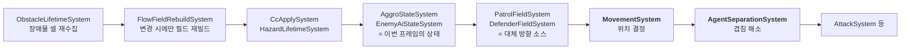
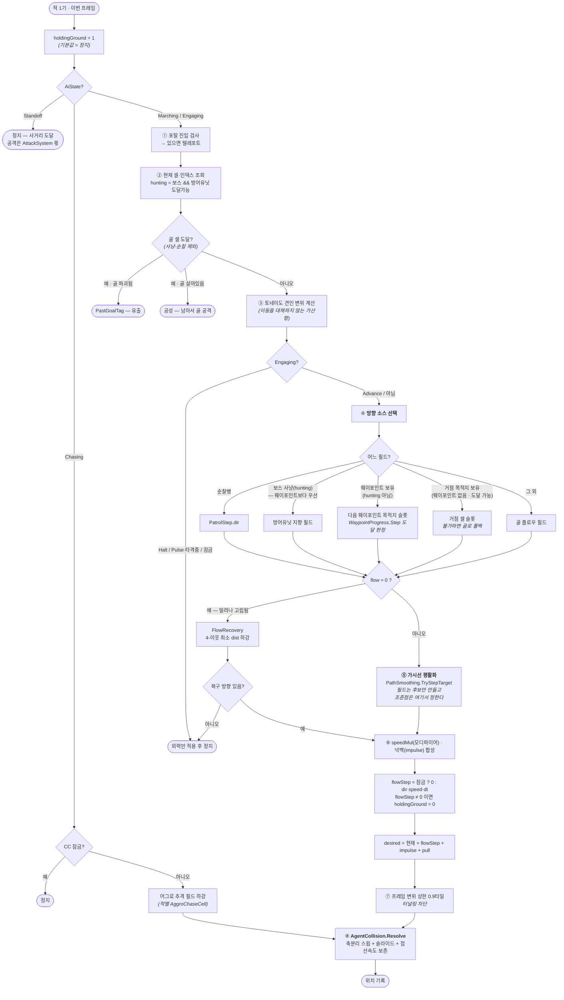
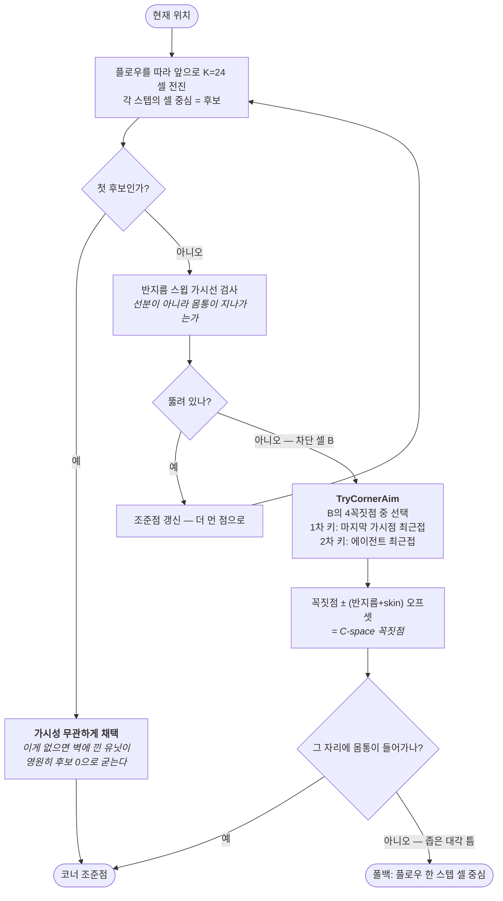
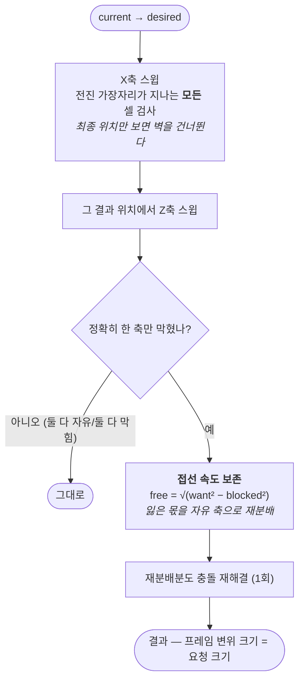
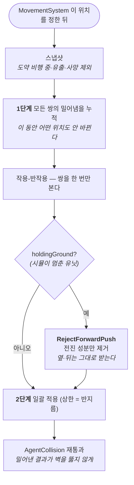

# 적 이동 알고리즘 — 의사결정 순서와 알고리즘 계보

> 이 문서는 **현재 구현이 무엇을 어떤 순서로 결정하는가**의 지도다. 설계 이력과 시행착오는 `docs/spec/continuous-agent-movement/` 에 있다.

---

## 1. 한 문장 요약

**전역은 플로우 필드(다중 소스 다익스트라)가 "어디로", 국소는 가시선 평활화가 "정확히 어느 점으로", 마지막에 축분리 스윕 충돌이 "실제로 어디까지"를 정한다.** 셋은 서로를 대체하지 않고 층으로 쌓인다.

---

## 2. 프레임 단위 시스템 순서

플로우 필드는 **적마다 계산하지 않는다.** 맵당 1벌을 굽고 모든 적이 공유한다.



**분리(Separation)가 이동 뒤에 도는 것이 계약이다.** 한 루프에 섞으면 밀어냄이 다음 적의 이동 입력이 되어 순회 순서에 결과가 의존한다.

---

## 3. `MovementSystem` — 적 1기의 의사결정



### 경로 선택 축 — 스폰 시점에 한 번 정해진다 (`waypoint-routing` unit 8·9)

`MovementSystem` 은 `WaypointFollow.pathIndex` 를 **읽기만** 한다. 어느 경로를 탈지는 그보다 앞서 스폰 시점에 한 번 정해지고, 매 프레임 다시 고르지 않는다.

경로 선택 축은 둘이다 — **좁은 쪽(개체)이 이긴다**:

```
적 SO 지정 (AttackUnitData.waypointPathIndex) >= 0        → 그것    (종의 정체성)
아니면 레인 기본 (MapDocument.spawnRoutes → GeneratedMap.RouteForSpawn(lane)) → 그것 (맵의 성질)
둘 다 없으면 -1                                            → 골 직행 (현행, 무회귀)
```

결정 지점: `BattleBridge.SpawnUnit`(레인 스폰 래퍼가 `RouteForSpawn` 을 조회) → `CreateEnemyEntity`(plain `int laneDefaultPathIndex` 하나만 받는다 — 분열 호출처는 레인이 없어 기본값 -1) → `WaypointRouting.ResolvePathIndex`(순수 함수, 우선순위 소유) → 유효 인덱스면 `WaypointFollow` 부착.

**우선순위를 호출부에서 삼항으로 풀지 않는 이유**: 그러면 "좁은 쪽이 이긴다"는 계약이 코드에만 남고 EditMode 로 고정할 지점이 없어진다. `ResolvePathIndex` 하나가 그 계약의 source of truth 다.

**지금 실제로 도는 것은 SO 지정 축 하나뿐이고, 그것을 쓰는 적은 `Enemy_Skimmer` 하나다**(`waypointPathIndex 0`). 라이브 덱 7종 전부의 `attackUnitPool` 에 있고, 등장 시점은 SO 가 아니라 **컨셉 게이트**가 소유한다(`Concept_Airstrike.minWaveNumber`, `wave-concept-blocks`).

같은 `Air` 통행층인 `Enemy_Dragon` 은 `waypointPathIndex -1` 이다 — **비행과 경로는 직교**라, 날면서도 골 직행이다(그쪽 저작 pin: `DragonBreathAuthoringTests`). 나머지 지상 적도 전부 `-1` 이다. 레인 기본 축(`spawnRoutes`)은 코드·검증까지 끝났지만 **어느 맵도 아직 저작하지 않았다** — 라이브 맵 저작(unit 10)은 `map-rework` 의 지형 변경이 끝난 뒤로 미뤄져 있다. 저작되면 그 맵의 미지정 적 전원이 레인별로 갈라지지만, 아직은 전 맵이 폴백(-1 → 골 직행)이다.

### 도달 판정 — 셀 일치에서 체비셰프 1 이내로

`WaypointProgress.Step` 의 도달 판정은 원래 정확한 셀 일치(`currentCell == waypointCell`)였다. 판당 2기인 Skimmer 에서는 문제없었지만(라이브 계측 5,295프레임, 순서 위반 0), 스웜(20기)에서는 어긋났다 — `AgentSeparationSystem` 의 축분리 스윕이 서로를 밀어내 여러 개체가 **한 칸에 동시에 수렴하지 못한다.** 밀려서 목표 칸을 스치고 지나간 개체는 `advanced` 가 서지 않아 다음 프레임에 그 칸으로 되돌아온다 — 화면에서는 버그로 읽힌다.

지금은 체비셰프 거리 **1 이내**(자기 칸 + 8이웃)면 도달로 인정한다.

⚠ **이 값은 튜닝 손잡이가 아니라 격자 위상이다.** 8이웃 격자에서 "인접 칸"의 정의가 1이지, 맵마다 다르게 저작할 값이 아니다. 저작 필드로 노출하면 순서 관리(`WaypointProgress`)가 이동 방식이나 맵 저작을 알게 되어 순수 함수 계약(계약 1 — plain 값 입력·출력)이 깨진다.

### ⑤ 평활화 내부 (`PathSmoothing`)



### ⑧ 충돌 해결 내부 (`AgentCollision`)



---

## 4. `AgentSeparationSystem` — 겹침 해소



**누적 먼저, 적용 나중**이 순서 의존을 없앤다(야코비 반복 1회). 다만 float 덧셈에 결합법칙이 없어 **누적 순서에 마지막 비트(1 ULP)가 의존**한다 — 전체 리플레이는 안전하고 스냅샷 부분 재시뮬은 위험하다. 해소(stable id 정렬)는 `battle-sim-extraction` 소관.

---

## 5. 쓴 알고리즘 (계보)

### 전역 경로

| 알고리즘 | 어디 | 이 프로젝트의 변형 |
|---|---|---|
| **다중 소스 다익스트라 → 플로우 필드**<br/>(Dijkstra map / vector flow field) | `FlowFieldBuilder` | 골이 여러 개면 전부 dist 0 소스로 동시 확산 → 각 셀이 **최근접 골**을 향한다. 적별 A\* 대신 **맵당 1벌**을 모두가 공유 — 계보는 Continuum Crowds(2006) → SupCom2 류 flow field pathfinding |
| **옥타일 거리 (8-이웃 가중)** | 비용 `{직교 10, 대각 14}` | 14/10 ≈ √2. 정수라 결정론이 보장된다. 단순 BFS 로 8-이웃을 돌리면 체비셰프가 되어 **대각이 공짜**가 되는 왜곡을 피한다 |
| **라벨 정정법 (재삽입 허용 큐)** | 우선순위 큐 대신 `NativeQueue` | 간선 가중치가 2종뿐이고 맵이 180셀 규모라 재삽입 비용이 무시된다. **처리 순서와 무관하게 같은 결과** → 결정론 유지. (Dial's bucket queue 로도 되지만 필요 없다) |
| **코너컷 방지** | `DiagonalAllowed` | 대각 이웃은 인접 직교 이웃 **둘 다** walkable 일 때만. 확산과 flow 채우기 **양쪽**에 적용 — 한쪽만 하면 벽 모서리를 관통한다 |
| **거리장 경사 하강** | `FlowRecovery` | 넉백으로 zero-flow 셀에 밀려났을 때의 복구. 4-이웃 최소 dist |

### 국소 경로

| 알고리즘 | 어디 | 이 프로젝트의 변형 |
|---|---|---|
| **스트링 풀링 / 가시선 평활화**<br/>(greedy furthest-visible-point) | `PathSmoothing.TryFurthestVisible` | 플로우 필드는 **명시 경로를 주지 않으므로** 앞으로 K셀 전진시켜 후보를 만들고 그중 가장 먼 가시점으로 직행. 8방향 양자화로 꺾여 붙던 것이 직선이 된다 |
| **C-space / 민코프스키 합**<br/>(장애물 팽창) | `TryCornerAim` 의 `corner ± (r+skin)` | 판정 형상이 **박스**라 박스⊕박스 = 박스 → 이 오프셋은 근사가 아니라 **정확한 C-space 꼭짓점**이다 |
| **스윕 AABB + 축분리 슬라이드**<br/>(collide-and-slide) | `AgentCollision.Resolve` | X 풀고 그 결과에서 Z 풀기 → 슬라이드가 공짜. 전진 가장자리가 지나는 **모든** 셀을 훑어 터널링 차단 |
| **구속면 속도 투영 (크기 보존)** | `PreserveTangentialSpeed` | 일반적인 슬라이드는 막힌 성분을 버려 실속도가 `speed·sinθ` 로 붕괴한다. 여기선 `free² + blocked² = want²` 로 **프레임 변위 크기를 복원** |

### 군중

| 알고리즘 | 어디 | 이 프로젝트의 변형 |
|---|---|---|
| **보이드 분리 (Reynolds 1987)** | `Separation.PairPush` | 겹침 깊이 비례 + 감쇠. **소프트** — 관통을 하드 블록하지 않는다(1타일 복도에서 하드 블록은 교착) |
| **위치 기반 완화 · 야코비 반복** | 누적 → 일괄 적용 | 가우스-자이델(순차 적용)이면 순회 순서에 결과가 갈린다. 프레임당 1회만 돌린다 |

---

## 6. 쓰지 **않은** 것과 그 이유

| 쓰지 않음 | 이유 |
|---|---|
| **적별 A\*** | 적 수만큼 경로를 만들고 들고 있어야 한다. 플로우 필드는 **1벌을 전부가 공유**하고, 동적 장애물에도 재빌드 1회로 대응된다 |
| **Unity NavMesh** | bake 데이터가 엔진 내부에 묶여 **엔진-프리 이식과 양립하지 않는다**([이식성 감사](../spec/continuous-agent-movement/14_portability_audit.md)) |
| **Funnel / SSFA** | 검토 후 기각. 격자에서 **대각 스텝은 변이 아니라 점 하나만 공유**해 포탈 폭이 0 이 되고, 반지름만큼 줄이면 음수가 된다. 게다가 unit 4 이후 대각이 기본 경로다 |
| **RVO / ORCA** (상호 속도 장애물) | 속도 공간 최적화가 필요하고 결정론 관리가 어렵다. 이 규모(수십 기)에는 위치 기반 분리로 충분하다 |
| **회피용 포텐셜 필드** | 오목 지형(U자 벽)에서 지역 최소값에 갇힌다. **전역 필드를 유지하는 이유가 이것** |
| **공간 분할(쿼드트리/해시 그리드)** | 동시 적 수가 수십이라 O(n²) 가 실측상 문제가 아니다. 필요해지면 그때(제약 8) |

---

## 7. 알려진 성질 (정직하게)

- **조준은 국소 판정이다.** 조준 기준이 "레이가 **처음** 막히는 셀"이라, 관찰자가 움직이면 어느 셀이 먼저 걸리는지가 바뀌어 다른 코너가 정당하게 뽑힌다. 기둥이 흩어진 구역에서 조준 진동이 남아 있다(13.4타일 주행에 총회전 1161° 실측). 이 성격 때문에 감사는 이 컨트롤러를 **Bug 계열(TangentBug)에 가깝다**고 분류했다 — 완전한 전역 최적 경로 추종이 아니다. 해소는 조준 기준을 **전역 비용 최소**로 바꾸는 별도 작업.
- **"첫 후보 무조건 채택"은 예외 규칙이다.** 교착 방지를 위해 가시성 검사를 건너뛴다. 평활화의 불변식이 아니라 **구멍을 막은 자국**이다.
- **결정론은 "같은 틱 열이면 같은 결과"까지다.** 필드 생성은 순서 무관이지만, 분리 누적은 float 결합법칙이 없어 청크 순서에 1 ULP 의존한다.

---

## 8. 값을 바꾸려면

| 무엇 | 어디 |
|---|---|
| 유닛 반지름 | `BattleBridge.agentRadiusTiles` (현재 0.25 — [unit 12](../spec/continuous-agent-movement/12_corridor_clearance.md)) |
| 평활화 전방 탐색 K | `PathSmoothing.DefaultLookahead` (24) |
| 대각/직교 비용 | `FlowFieldBuilder.CostOrtho` / `CostDiag` (10 / 14) |
| 분리 강도·상한 | `Separation.DefaultStrength` (0.5, **프레임당**) · 상한 = 반지름 |
| 프레임 변위 상한 | `MovementCellTrim.ClampDisplacement` (0.9타일) |
| 벽 여유 skin | `AgentCollision.Skin` (1e-3) — 조준점 오프셋과 **공유**한다 |
| 웨이포인트 도달 판정 반경 | `WaypointProgress.ArrivalChebyshevRadius` (1) — **튜닝 손잡이가 아니라 격자 위상**(8이웃 = 인접). 저작 필드로 노출하지 않는다 |
