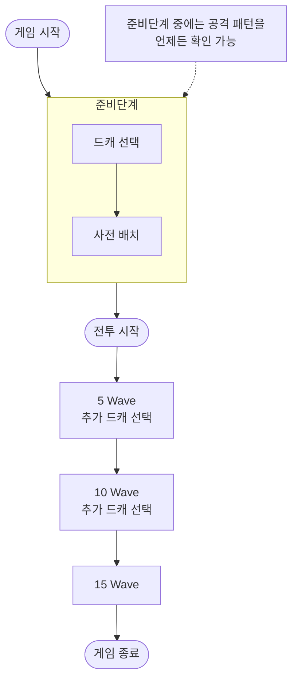

# 인게임 플로우 (스쿼드 모드)

> 팀 공유용 구조 요약. 코드 레벨이 아니라 게임 페이즈 흐름 기준.

## 전체 흐름

## 페이즈 정리

### 1. 게임 시작
- 아웃게임에서 선택한 스쿼드, 드림캐쳐 덱을 인게임에서 사용

### 2. 준비단계 *(= 드캐 선택 + 사전 배치)*
- **드캐 선택**: 드림캐처 3중 1 선택.
- **사전 배치**: 디펜더를 보드에 배치.
- 준비단계 내내 **공격 패턴(이번 전투 적 웨이브)을 언제든 확인 가능**.

### 3. 전투 시작
- 적 웨이브 진행
- 방어 유닛, 공격 유닛 모두 서로를 공격

### 4. 전투 중 추가 드캐 선택
- **5 Wave**, **10 Wave** 도달 시 각각 추가 드림캐처 선택.

### 5. 15 Wave → 게임 종료
- 마지막 웨이브까지 진행 후 종료(승/패 판정).

## 한눈에

| 단계 | 내용 |
|---|---|
| 게임 시작 | 덱 반입·맵 생성 |
| **준비단계** | 드캐 선택 → 사전 배치 *(공격 패턴 상시 확인)* |
| 전투 시작 | 웨이브 요격 시작 |
| 5 Wave | 추가 드캐 선택 |
| 10 Wave | 추가 드캐 선택 |
| 15 Wave | 마지막 웨이브 → 게임 종료 |
