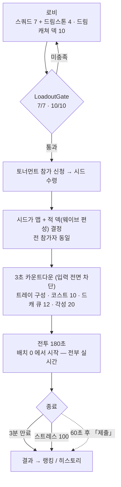

# 인게임 플로우 — 정식 플레이 기준

> 로비 START 로 들어가는 **현재 정식 경로만** 적는다. 페이즈 흐름 · 조작 동사 · 드림캐쳐
> 사용 규칙 · 값 바꾸는 곳까지. 점수 산식은 `score-formula.md`, 웨이브/맵 밸런스는
> `map-wave-balancing.md` 가 소유한다.
>
> **legacy 로 제외한 것** (이 문서에 다시 넣지 말 것): 드래프트 픽 · 기믹 리빌 페이즈 ·
> 사전 배치 30초 + START 버튼 · 스킬바 · 승/패 판정 · 점수 3축 · 튜토리얼 판.
> 앞의 셋은 코드가 살아 있지만 **꺼져 있거나 도달 불가**다 — 아래 「지금 꺼져 있는 것」 참조.

---

## 1. 한 줄

전원이 **같은 시드의 3분**을 완주하고, 그 안에서 **몇 마리를 처리했는지**로만 겨루는
비동기 스코어어택 디펜스.

---

## 2. 흐름



**판이 끝나는 통로는 둘이다.** `complete`(3분 만료) · `stress_full`(스트레스 100 = 마음 파괴).
`submitted`(유저 제출)는 **허용되지만 공식 게임 절차로 세지 않는다**(사용자 결정 2026-08-22) —
언제든 빠져나갈 수 있는 탈출구이지 판의 결말이 아니라서 위 도표에 점선으로 뒀다.
따라서 `BattleBridge.EndMatch` 호출부는 정확히 **3곳**이다.

**넷째 호출부를 만들지 말 것.** 어느 쪽 통로든 결말은 같다 — 승패 표기 없이 그때까지의
처치 수를 제출한다. 「이러이러하면 판을 끝낸다」를 하나 더 붙이는 순간 그게 곧 패배 조건의
부활이다(`score-formula.md` 와 같은 계약). 설계 이력은 `../spec/heart-stress-axis/`.

---

## 3. 전투 중 동사 4개

| 동사 | 조작 | 대가 |
|---|---|---|
| **배치** | 하단 트레이 드래그 → 배치 가능 타일 | 코스트 + 유닛별 배치 쿨타임 |
| **퇴근** | 유닛 선택 → 퇴근 | **시간**(쿨타임 동안 그 자리가 빈다) + 재배치 시 코스트 재지불. 각성 0 |
| **드림캐쳐** | 유닛 선택 → 손패 → 탭 즉발 / 드래그 조준 | 각성치 |
| **웨이브 당김** | 좌하단 도크 **탭 1회** = 다음 웨이브 즉시 투입 | 없음. 단 **정리한 뒤로 N회**까지만 |

- 당김은 **가속이 아니라 스케줄 편집**이다. 전투 타이머는 당겨지지 않는다 — 몰아 불러
  빨리 끝내는 보상은 없다. 상한은 「정리한 뒤로 몇 번 얹었나」라 필드를 비우면 리셋된다.
- 퇴근에 각성을 주지 않는 이유: 주면 배치↔퇴근 반복이 게이지 파밍이 된다.

---

## 4. 설계 지향 7축

1. **판에서 지지 않는다 — 판정 권한은 유저에게.** 감점도 없다. 놓친 적이 점수도 각성치도
   안 주는 것, 그게 페널티의 전부다. UI 어휘는 「포기」류 금지, 「제출」 고정.
2. **개인 유불리를 계속 깎아낸다.** 맵·웨이브 편성·공용 액티브 2장이 시드로 전원 동일.
   개인 선택 공간은 전부 판 밖(스쿼드 7 + 스톤 4 + 덱 10). 당김 상한도 **적 덱** 소유라
   전원 같은 값을 받는다 — 로드아웃으로 옮기면 「내 덱이 남보다 많이 당긴다」가 된다.
3. **죽음과 회수를 자원으로 — 사리기가 손해가 되게.** 적 처치와 아군 사망이 각성치를 주고,
   퇴근의 대가는 코스트가 아니라 시간이다.
4. **얕고 예측 가능한 덱 감성(CR식 순환).** 부착형은 호스트가 죽어야, 액티브는 쓰면 큐 맨 뒤로.
   이 순환이 「액티브만 쓰기」를 구조적으로 차단한다 — 큐를 돌리려면 부착을 소비해야 한다.
5. **판내는 전술만, 숫자는 판 밖.** 드림캐쳐는 규칙·행동을 바꾸고 스탯을 올리지 않는다
   (튕김 +1 · 지속 · 범위 · 타겟팅 O / 「공격력 +n%」 X). 체급은 드림스톤이 공급한다.
6. **공급은 3분에 다 소화 못 할 만큼 넘친다.** 그래야 당김이 「더 받기」가 아니라
   「무엇과 무엇을 겹칠 것인가」가 된다. ← **미검증**, 아래 「미결」 참조.
7. **손은 계속 바쁘되 침착할 수 있게.** 게임은 안 멈춘다. 카드를 **잡고 있는 동안만**
   슬로모. 열어두기가 공짜 보험이 되지 않게 「열림」이 아니라 press~release 에 묶었다.
   슬로모는 **뷰 전용** — 시뮬 결정론 불변.

> **마음은 판정에 관여하되 점수에는 관여하지 않는다.** 부서지면 그 자리에서 판이 끝나지만
> (`stress_full`), 끝나는 방식이 다를 뿐 점수는 여전히 처치 수 하나다 — 남은 체력이 점수에
> 섞이지 않는다. 3분을 버틴 판과 2분에 터진 판은 **같은 잣대**로 줄 세워진다.
>
> 마음 체력은 화면에 «스트레스 0~100»(차오르는 값)으로 보인다. 악몽을 처치하면 내려간다.
> 상세는 `score-formula.md` · `../spec/heart-stress-axis/`.

---

## 5. 드림캐쳐 사용 방식

```
유닛 선택 (보드 유닛 탭 · 트레이 소진 셀 탭)   ← 각성 항아리는 안 눌린다(판독면)
   ↓  손패 자동 등장 (게이지 부족해도 dim 으로 보인다)
카드 탭    → 선택한 그 유닛에 즉발 부착
카드 드래그 → 임의 대상 조준 (유닛 · 타일 · 적) — 액티브도 이 경로
   ↓  잡고 있는 동안만 슬로모
사용 후 손패 유지 + 빈 슬롯 재딜인 → 쓸 수 있는 카드 0장이면 자동 닫힘
```

- **큐 12장** = 내 덱 10 + 이번 판 공용 액티브 2(스킬 롤에서 옴, 전원 동일).
  매치 시드로 Fisher-Yates 1회 셔플. 배치 진입마다 새로 구성한다.
- **순환**: 부착형 = 호스트 사망 시 큐 맨 뒤 / 액티브 = 사용 즉시 맨 뒤 / **퇴근은 회수만**.
  「인수인계」를 선언한 카드(퇴직위로금)가 붙어 있으면 그 유닛의 **다른** 카드가 큐 앞으로 당겨진다.
- **부착 제한**: 카드가 클래스/유닛 id 제한을 선언하면 안 맞는 유닛은 드래그 중 붉은 틴트.
- 게이지는 상한을 넘으면 **소멸**한다.

---

## 6. 디폴트 덱 10장

| 카드 | 언제 | 무엇을 |
|---|---|---|
| 비수 | 공격마다 | 대상에게 추가 투사체 피해 |
| 부메랑 | 공격마다 | 날아갔다 돌아오며 스치는 적 전부 피해 |
| 광란 | 공격마다 | 자기 공격속도 중첩 (상한 있음 · 짧은 TTL) |
| 바운스샷 | 항상 | 투사체가 근처로 튕김(감쇠 없음) · **레인저 전용** |
| 스턴메이커 | N번째 공격마다 | 맞은 적 기절 |
| 불꽃팽이 | 주기 | 주위를 도는 화염구 · 스치면 피해 |
| 불나방떼 | 주기 | 주변 적에게 다발 발사 |
| 잿불 | **적을 처치하면** | 그 자리에 불씨 장판 |
| 퇴직위로금 | **이 유닛이 퇴근하면** | 지연 후 자기중심 폭발 |
| 실드수면 | **실드가 깨지면** | 주변 적 소수 수면 |

**성격**: 10장 전부 부착형(Squad·Active 0장), 부착 축 전부 `All`(바운스샷만 클래스 제한).
트리거는 「공격마다」 3 · 「주기」 2 · 「N번째」 1 · **사건형 3**(처치 · 퇴근 · 실드 파괴) · 상시 1.

> 수치는 여기 적지 않는다 — 시트가 정본이고 에셋이 그 사본이다. 카드 문안도 formatter 가
> 이기므로 에셋 `description` 은 폴백일 뿐이다.

---

## 7. 시너지 예시

**A. 「공격마다」 3장을 한 유닛에 — 자기 증폭 루프**
광란 + 비수 + 부메랑(부착 상한 3을 정확히 채운다). 광란이 공속을 올린다 → 공격 횟수가 는다
→ 비수·부메랑이 더 자주 켜진다 → 그 공격이 다시 광란을 쌓는다. 원래 공속이 빠른 레인저에
올리고 바운스샷까지 얹으면 한 발이 여러 마리에 닿는다.
*대가*: 광란 TTL 이 짧아 표적이 끊기면 무너진다 → **적이 몰릴 때만** 진가.
즉 「당길까」와 「몰빵할까」가 같은 판단이 된다.
*리스크*: 각성을 한 유닛에 몰아넣는 것이라, 그 유닛이 죽으면 3장이 한꺼번에 큐 맨 뒤로
가서 손패가 통째로 갈린다.

**B. 처치를 장판으로 환전 — 밀집 처리 축**
잿불 + 불나방떼. 잿불은 「처치하면」이라 **마무리 타를 얼마나 자주 만드느냐**가 전부인데,
불나방떼가 정확히 그걸 대량 생산한다. 마무리 → 장판 → 뒤따르는 적이 밟고 탐 → 또 마무리.
길목·합류 지점에 놓아야 장판이 재사용되므로 **카드가 배치 위치 판단을 바꾼다**.
3분 처리량을 늘리는 방법이 「단일 표적 딜」이 아니라 「밀집 처리」로 이동한다 — 1킬 1점과 같은 방향.

**C. 손해를 공격으로 바꾸는 두 장**
- 퇴직위로금 × 퇴근 — 대가만 있던 동사가 공격이 된다. 덤으로 같은 유닛의 다른 카드가 큐
  앞으로 당겨져 손패 회전까지 앞당긴다.
- 실드수면 × 실드셔틀 — 실드를 주는 유닛이 판에 없으면 영영 안 켜진다. **카드 덱이 스쿼드
  편성을 규정하는** 교차 시너지.

---

## 8. 값 바꾸는 곳

| 값 | 위치 |
|---|---|
| 제한시간 · 당김 상한 · 마음 최대치 | `Scripts/Data/Decks/Deck_*.asset` (`timerDurationSec` · `maxPullsPerClear` · `goalStabilityMax`) |
| 코스트 시작/상한/리젠 | `Data/Config/DefaultCostConfig.asset` |
| 자동 시작 카운트다운 · 인트로 페이즈 토글 2종 | `Data/Config/BattleConfig.asset` |
| 각성 게이지/비용/손패 크기/부착 상한/슬로모 | `Data/Dreamcatcher/AwakeningConfig.asset` |
| 덱 크기 · Squad 상한 | `Data/Dreamcatcher/DeckRuleConfig_Default.asset` |
| 디폴트 덱 구성 | `Data/Dreamcatcher/DreamcatcherDeck_Default.asset` |
| 적별 각성 보상 · 안정도 피해 | `Data/Enemies/*.asset` (`awakeningReward` · `stabilityDamage`) |
| 아군 사망 각성 보상 | `Data/Defenders/*.asset` (`awakeningReward`) |
| 제출 개방 시점(P1) | `BattleBridge.SubmitUnlockSec` — **코드 상수**. 튜닝 확정되면 저작으로 내릴 것 |

유닛 스탯과 드림캐쳐 카드는 **시트가 정본**이다. SO 만 고치면 로비 진입 임포트가 되돌린다.

---

## 9. 지금 꺼져 있는 것

| 항목 | 상태 | 되켜는 법 |
|---|---|---|
| 기믹 리빌 페이즈 | `gimmickEnabled: 0` | `BattleConfig` 값 하나 |
| 사전 배치 30초 + START | `placementPhaseEnabled: 0` → 3초 자동 시작 | `BattleConfig` 값 하나 |
| 각성 항아리 탭 | `JarTapEnabled = false` | `AwakeningGaugeView` 스위치 |
| 드래프트 픽 | 로비 `LoadoutGate` 가 START 를 막아 **도달 불가**. 남은 진입은 테스트 모드·BattleScene 직접 Play | — (legacy) |

**배치 페이즈는 「진입」 자체를 건너뛰지 않는다.** 트레이 슬롯 구성 · 코스트 리셋 · 쿨타임
리셋 · 드림캐쳐 큐 구성이 전부 그 신호에 달려 있어서, 통째로 건너뛰면 전투 내내 트레이가
빈 채로 남는다. 꺼진 것은 **창의 길이와 입력 가능 여부**뿐이다.

---

## 10. 미결 (튜닝/검증 대기)

- **공급량** — 「기본 진행만으로 3분 내 전량 소화 불가」가 실제로 저작됐는지 미검증.
  지향 6번 축 전체가 이 전제 위에 있다.
- **당김 상한 N** — 봇 워크벤치 없이 체감 어림값.
- **드캐 비용이 균일하다** — 「가치는 적용 범위로 가른다(개별 싸게 / 스쿼드 비싸게)」가
  현재 값에도 디폴트 덱 구성(Squad 0장)에도 안 실려 있다.
- **아군 사망 각성 보상이 적 처치와 거의 같다** — 「사망이 더 크게」가 사실상 없어
  지향 3번 축(죽음=자원)이 체감되기 어렵다.
- **시작 코스트** — 배치 창이 사라졌는데 시작/상한 값은 그대로라 첫 웨이브 전 배치 여력이
  0 에서 시작한다.

---

## 이어서 읽을 곳

| 궁금한 것 | 문서 |
|---|---|
| 점수 · 종료 · 마음 | `score-formula.md` |
| 맵 로테이션 · 웨이브 knob · 결정론 | `map-wave-balancing.md` |
| 적이 어떻게 움직이나 | `enemy-movement-algorithm.md` |
| 당김 설계 이력 | `../spec/wave-pull-revival/` |
| 패배 제거 설계 이력 | `../spec/three-minute-kill-race/` |
| 드림캐쳐 사용 방식 설계 이력 | `../spec/dreamcatcher-awakening-hand/` · `../spec/dreamcatcher-use-flow/` · `../spec/selection-hand-attach/` |
