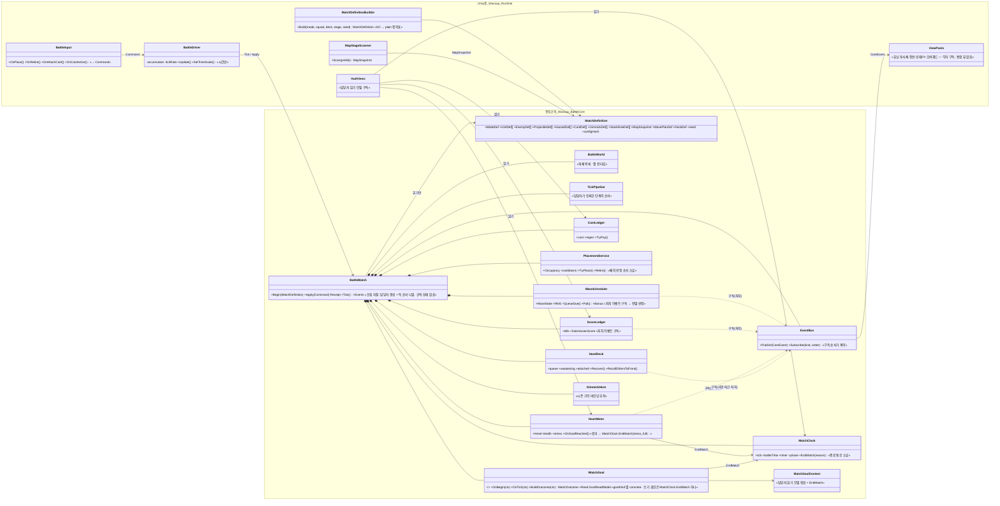
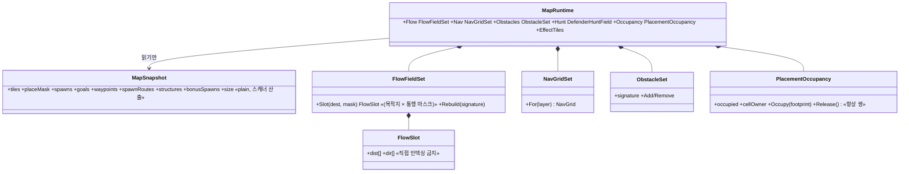
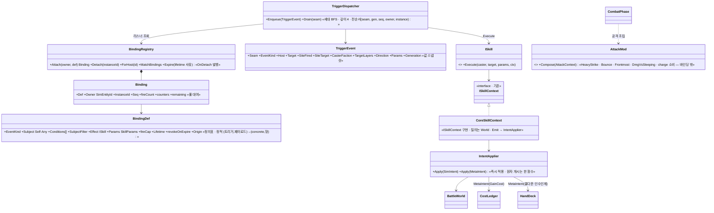
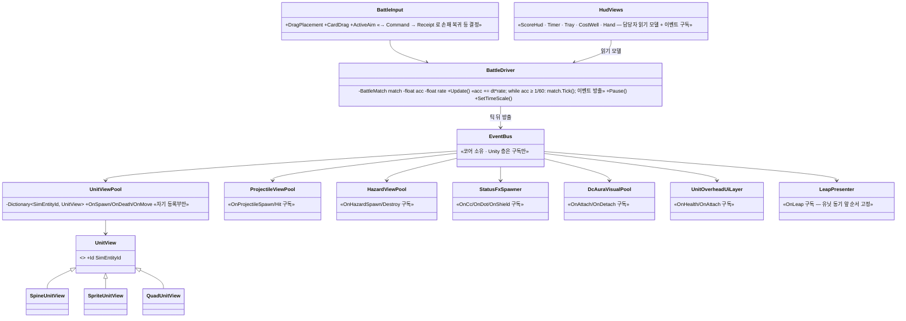

# 핵심 클래스 UML — 전투 코어와 Unity 층

> 초안 2026-09-22. 이름은 제안이며 unit 0 에서 확정한다. 화살표는 **의존 방향**(코어 ← Unity 층, 코어 → Skills/UnitAi). 코어 안에서 UnityEngine 타입은 컴파일되지 않는다.
> 값 타입·순수 함수(`SkillMath` · `AttackReach` · `ModifierMath` · `FootprintMath` · `GridMath` · `FlowFieldBuilder` · `PathSmoothing` · `AgentCollision` · `Separation` · `TargetPersistence` · `KillAttribution` · `ShieldMath` · `DotTick` · `HeatMath` · `StressMath` · `MatchSeed` · `WavePatternGenerator`)은 그대로 salvage 하므로 그리지 않는다.

## 1. 경계와 조립 지점 — 매니저는 없다

- **`BattleBridge` 는 어디에도 없다.** 369 메서드 + 직렬화 필드 91 은 unit 0 귀속표대로 위 담당자 중 하나로 가거나 삭제된다. 「어디로도 못 가는 메서드」 = 설계 결함 신호.
- 담당자는 **상태 + 규칙 + 자기 틱 단계 + 자기 이벤트**를 소유한다. `BattleMatch` 는 만들고 순서를 나열만 한다.
- 순서 의존(처치 → 전멸 판정, 골 도달 → 붕괴 → 보너스 제안)은 `EventBus` 구독 순서로 고정한다. 한 함수가 두 담당자를 차례로 부르지 않는다.
- 마음 체력은 `HeartMeter` 가 든다(마음 개체가 아니다 — 「마음 N개 공유」 이사 비용 0).
- `IMatchGoal` 은 매치 모드(별첨 `match-mode-design.md`)가 정한 목표 concrete(`KillScoreTimed` · `WaveClear` · `TimeAttack`). 담당자들은 모드를 모르고, 목표는 담당자 읽기 모델로 「끝났나 / 점수가 얼마인가」 둘만 판정한다. `ModeDef` 는 `MatchDefinition` 에 실려 담당자 파라미터(시계·웨이브 원천·기믹 풀·배치/드림캐쳐 수량)를 정한다.

## 2. 개체 모델

```mermaid
classDiagram
    class BattleWorld { +Units List~Unit~ +Projectiles List~Projectile~ +Hazards List~Hazard~ +Fields List~FieldCarrier~ +Pickups List~Pickup~ +Resignations List~Resignation~ +Map MapRuntime +Find(SimEntityId) +Spawn*() +Destroy*() «id 오름차순 · 풀 대여» }
    class Unit { +Id SimEntityId +Kind UnitKind +Faction +Def +Position float3 +HitRadius +Dead bool +Deploying bool +PastGoal bool }
    class UnitKind { <<enum>> Defender Enemy Patrol Structure BlockingHazard }
    class Health { +value +max +ScaleMax() }
    class ShieldSlots { +Absorb() +Sum() «FIFO» }
    class ModifierSet { +Slots +Effective EffectiveStats +dirty «병합 키 4축» }
    class CcState { +slots[5] +IsLocked() +BossImmune }
    class DotSet { «(origin, element) 2축» }
    class AttackState { +targetMask +targetLayers +interval +hitDelay +committedTarget +lock +shape +patternSlots }
    class MoveState { +radius +lastMoveDir +holdingGround +waypointProgress +chaseField }
    class AiStatus { «UnitAi 결정을 저장만» }
    class Footprint { +anchor +size «방어유닛만» }
    class Detection { +range +hunting +grace }
    class Aggro { +capacity +held +target }
    class BindingList { +Bindings List~Binding~ +DamagedCounter }
    class ProgressiveStates { +UltimateLeap? +Cocoon? +LethalTimer? +Charge +LastRun? «중단 정책 표 동봉» }
    class Projectile { +Id +Def +Movement +Payload +Owner +Target +pos +pierceBudget +hitRecords }
    class Hazard { +Def +originCell +radius +restDuration +targetLayers }
    class FieldCarrier { +Kind AllyBuff·Pull·Portal +cell +cell2 +range +duration }
    class Pickup
    class Resignation
    Unit *-- Health
    Unit *-- ShieldSlots
    Unit *-- ModifierSet
    Unit *-- CcState
    Unit *-- DotSet
    Unit o-- AttackState : 공격자만
    Unit o-- MoveState : 이동체만
    Unit *-- AiStatus
    Unit o-- Footprint
    Unit o-- Detection
    Unit o-- Aggro
    Unit *-- BindingList
    Unit *-- ProgressiveStates
    BattleWorld *-- Unit
    BattleWorld *-- Projectile
    BattleWorld *-- Hazard
    BattleWorld *-- FieldCarrier
    BattleWorld *-- Pickup
    BattleWorld *-- Resignation
```

- 「컴포넌트가 있나」 분기는 **정책 값**(`Def.AttackPolicy` 등) 또는 nullable 부분(`o--`)으로. 배치 중·사망·궁극기 제외는 `Unit` 의 bool 셋을 한 술어 `IsTargetable()` 로 묶는다(현행 `WithNone` 14곳의 단일화).
- 거점·길막 장판은 `Unit` 의 종류다(현행 아키타입 동형).

## 3. 맵 런타임

## 4. 틱 파이프라인 · 커맨드 · 이벤트

```mermaid
classDiagram
    class TickPipeline { +Run(ctx) «phase 순서가 계약» }
    class ITickPhase { <<interface>> +Run(TickContext) }
    class CommandPhase { «phase 0 · 동기 · Immediate seam» }
    class FieldPrepPhase { «장애물→흐름장 · 어그로 · 모디파이어 적용 · CC · 존 · 주기 → [Periodic]» }
    class DeathConvergePhase { «사망 표시 수렴 · 배치 활성화» }
    class AiMovePhase { «도발 부여 · UnitAi · 거점 목적지 · 이동 · 분리» }
    class TickProjectilePhase { «효과 틱 · 투사체 · 스탯 만료/집계 · 스택 · 열기/피로 · 픽업 · 사직서» }
    class CombatPhase { «공격 → [Attack] → 피해 → [Death] → 후처리 → 소멸 → [Lifecycle] → 경계 → [Threshold] → 궁극기 · 순간이동» }
    class OwnerSteps { «담당자가 각자 등록: WaveScheduler.Step · CostLedger.Step · PlacementService.Step · HeartMeter.Step · GimmickHost.Step · IMatchGoal.Evaluate · MatchClock.Step — 순서는 TickPipeline 이 나열» }
    class FlushPhase { «CoreEvent 플러시 · 세대 초기화» }
    class TickContext { +World +State +Def +dt +Dispatcher +Outbox }
    class Command { +Kind +unitDef +cell +facing +cardId +host +skill +targetCell «struct» }
    class Receipt { +accepted +reason RejectReason }
    class CoreEvent { +Kind +tick +a SimEntityId +b SimEntityId +SiteFired +SiteTarget +faction +amount «값 스냅샷 · 뷰 전용 20종» }
    class Site { +pos float3 +originBody «0 = 칸» }
    TickPipeline o-- ITickPhase
    ITickPhase <|.. CommandPhase
    ITickPhase <|.. FieldPrepPhase
    ITickPhase <|.. DeathConvergePhase
    ITickPhase <|.. AiMovePhase
    ITickPhase <|.. TickProjectilePhase
    ITickPhase <|.. CombatPhase
    ITickPhase <|.. OwnerSteps
    ITickPhase <|.. FlushPhase
    CommandPhase --> Command
    CommandPhase --> Receipt
    FlushPhase --> CoreEvent
    CoreEvent *-- Site
```

- `[…]` 는 트리거 seam(§5). 캐스트 seam 은 캐스터 제거로 없다.
- 매치 규칙은 한 phase 가 아니라 **담당자별 단계**다. `TickPipeline` 은 순서만 든다 — 옛 `TickBattleFrame` 처럼 한 함수가 드레인 20개를 차례로 부르는 형태를 만들지 않는다.
- 슬로모·정지는 `BattleDriver` 가 `Tick()` 호출 횟수로 만든다. `dt` 는 항상 1/60.

## 5. 트리거→발동 (rev 3)

- 감지자(공격·피해·소멸·경계·주기·커맨드)는 `TriggerEvent` 를 **값으로 채워** 넣는다. 드레인 시점 재질의 없음.
- 정적 표(`DcSkillRouting` 후계)는 `BindingDef` 를 만들 때 한 번 읽히고 프리뷰(`DcRangeCatalog`)가 같은 표를 읽는다.

## 6. Unity 층 상세 — 통합 뷰 없음

- 뷰 등록부(`_defenderByTile` 등 11종)는 코어 담당자(`PlacementService`·`BindingRegistry`·`HandDeck`)로 이사하고, 각 뷰 풀은 `SimEntityId → 자기 뷰` 사전만 갖는다. Entities 누수 24파일은 키 타입 치환으로 끝난다.
- 뷰 간 순서가 필요한 곳(도약 연출이 유닛 위치 동기 **앞**)은 구독 순서로 고정한다 — 옛 `LateUpdate` 순서 계약의 후계.
